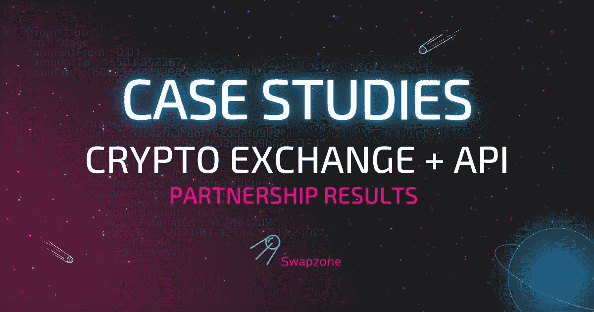

# 一个加密工具—两个有利可图的解决方案:Swapzone 案例

> 原文：<https://medium.com/coinmonks/case-one-crypto-tool-two-profitable-solutions-7ff0c255d12b?source=collection_archive---------12----------------------->

> **合作伙伴:**一家主要的加密货币交易所
> 
> **资产初始金额:** 500
> 
> **月流量:** 386 000
> 
> **使用期限:** 4 个月
> 
> **实施领域:**桌面交换和移动应用

# 第 1 部分:应用于 B2C

**所做的事情:**合作伙伴在他们的加密交换平台*(桌面和移动应用)*中实现了 Swapzone API，以及他们自己在主流程中的 API。

**Swapzone API 执行了两个功能:**

*   扩大交换报价的数量
*   确保主要资产的平稳不间断运行

应合作伙伴的要求，我们改进了“获取费率”和“创建交易”方法，以提供更多定制和过滤所需费率的方式，并方便地创建交易。

[**查看完整的 API 文档**](https://documenter.getpostman.com/view/16362858/UVXokDS6#898f2264-7286-41a4-8843-bf143a67a6ab)

*(我们热切地为合作伙伴添加便利的功能，以便快速、轻松地将我们的产品整合到任何特定流程中)*

# 资产数量的增加

REST API 自动将合作伙伴连接到 500 多项附加资产(总计超过 1000 项),这些资产内置于交易所的界面中，无需花费上市程序的成本和时间。

## Terra 2.0 和 Terra 经典案例:

由于 Swapzone 是第一个支持 LUNA 2.0 和 LUNC 的 exchange 服务，因此它也立即为其合作伙伴提供了这些资产:所有更新都在我们这边，并通过 API 即时传输。

这是一个很好的机会，不仅可以扩大资产的数量，还可以从新的趋势硬币和代币中“撇去精华”。

> **合作伙伴 10 天炒作结果:**
> 
> 72 笔 LUNA 和 LUNC 交易，共计 3032 LUNA 和 104 128 000 LUNC
> 
> (由于漫长而昂贵的上市程序，可能已经损失或少得多)

# 备份技术

在任何计划内或计划外的技术维护情况下，Swapzone API 都会取代合作伙伴的 API，因此交易所不会失去任何客户和资金。

## Monero (XMR)关闭情况:

rypto 硬币和代币的基础设施在保持足够的性能方面相当复杂——硬币可能在任何时候因外部原因被关闭或与交换提供商断开，从而导致损失和客户不满。

如果硬币或代币是受欢迎的或炒作的资产，损失可能相当大。

由于不同的情况，我们的合作伙伴在三个月内用 Swapzone API 备份了他们的 XMR 事务(流行的资产之一)几次。

> **三个月备份 API 结果:**
> 
> 来自 XMR 的 331 笔交易，总计 2857 XMR
> 
> XMR 的 227 笔交易，总计 5124 XMR
> 
> (可能由于技术困难和硬币基础设施的临时关闭而丢失)

# 佣金无损失:额外费用(加价)

这种整合还确保了合作伙伴不会失去任何收入的可能性——由于加价，可以为衍生资产收取额外费用，以弥补所有佣金的不足。这对外部用户来说是不明显的(额外的费用只是基本佣金的很小一部分)——客户看不到任何额外的费用，服务的声誉也不会受到影响。

**对于这个交易提供商来说，额外的费用可以确保合作伙伴获得与平时相等的交易佣金，并从通过 Swapzone API 持有的每笔交易中获得与自己相同的收入——合作伙伴没有失去任何盈利的可能性。**

[开始行动，提高您的利润](https://swapzone.io/partners/exchange-api)

# 第 2 部分:B2B 应用

**所做的事情:**swap zone API 也嵌入到合作伙伴的推荐 API 中，通过稳定的服务、合格的技术支持和大量的资产来加强其附属解决方案。

**好处:**

*   白标解决方案—合作伙伴销售一个补充的 API 作为自己的推荐工具，并获得所有的好处。这里没有提到 Swapzone，因为该 API 是无缝的本地集成的。
*   API 产品获得了新的竞争优势——变得更加稳定，表现出更好的性能，包括在 Swapzone 端提供的强大的客户支持，以及扩展的资产列表。

# 总体结果:

> 可用资产: **1000** (通过 Swapzone API 实现+ 500)

由于合作伙伴使用 Swapzone API 来扩展资产和备份技术问题的数量(主流程使用其自己的 API)，API 确保的**额外**利润等于:

> 月营业额:**61.6 BTC**
> 
> 月利润:**02464 BTC**
> 
> (合作伙伴未披露 B2B 结果和总体外汇利润)

**印象深刻？Swapzone 将您的利润和客户保持率提升到一个新的水平！**

> 交易新手？试试[加密交易机器人](/coinmonks/crypto-trading-bot-c2ffce8acb2a)或者[复制交易](/coinmonks/top-10-crypto-copy-trading-platforms-for-beginners-d0c37c7d698c)