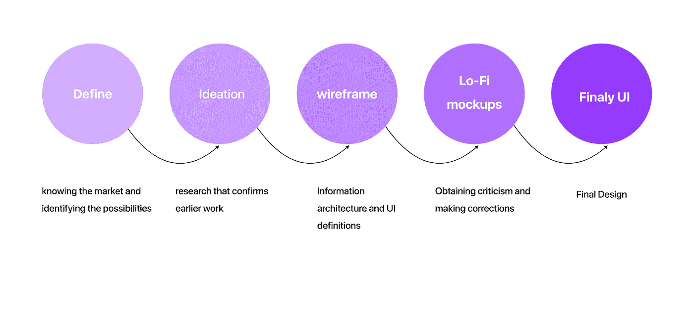

# 案例研究:NFT 公约响应登陆页面设计

> 原文：<https://medium.com/coinmonks/case-study-an-nft-convention-responsive-landing-page-design-839b9547a406?source=collection_archive---------14----------------------->

## 我做这个项目是为了建立我的作品集，因此这个案例研究向你展示了我的视觉设计过程。

Responsive Mockups

# 前言

任务是想出一个事件并为其创建一个登陆页面。我可以选择是否将活动与现有品牌或我们可以创造的品牌联系起来！

> 交易新手？在[最佳密码交易所](/coinmonks/crypto-exchange-dd2f9d6f3769)上尝试[密码交易机器人](/coinmonks/crypto-trading-bot-c2ffce8acb2a)或[复制交易](/coinmonks/top-10-crypto-copy-trading-platforms-for-beginners-d0c37c7d698c)

我选择的利基是 NFT 事件！

现在我知道你的想法了。考虑到我当时也在场。我不知道举办了什么类型的活动，进行了什么样的活动，目标人群是谁，甚至不知道 NFT 到底是什么！

**接受挑战！**

所以，马上，我打算在这个作业中做以下事情-

1.  拓宽我的视野，更多地了解这个新行业。
2.  理解众多的网络和移动用户界面原理和响应设计。
3.  了解如何找到并重新创造有意义的灵感(而不是重新制造轮子)

有了先决条件和规则，我开始了 Fintech 探索之旅。

**是哪个方向？**

我遵循了一个基本框架，但在每个阶段都小心翼翼地来回走，通过反馈来强化和验证我的设计选择。

DESIGN PROCESS

**我们去哪里？-定义**

在开始任何实际工作之前，我特意决定创建自己的独立事件，原因如下:

1.  我可以创建自己的风格指南。
2.  我将能够指定我的用户组，这将指定事件的声音(基于我想要迎合的观众类型)
3.  我将有更多的自由来摆弄界面。

# 问题陈述-

说到 NFT，我相信很多人都害怕，害怕，或者只是对它不感兴趣。

因为我在这种情况下，我想解决这个问题，我认为像动漫展这样的会议将是一个很好的开始！NFTS 和金融事件总是被认为是无趣的，只有那些参与该行业的人才表示感兴趣。

如果活动可以变得更吸引人，术语可以变得更简单，气氛可以变得更轻松和平易近人，会怎么样？

一个能让 NFTS 不那么可怕的全面公约。年轻的成年人、有设计背景的人和各种背景的投资者将是目标市场。

除了一些付费活动，我想在第一天就开放免费入场(例如:某些讲座、研讨会、设立展示区和颁奖典礼)。

我受到允许免费入场的大学研讨会的启发，因为我认为这是一个非常好的系统，原因如下:

1.  通过提供免费访问获得了更广泛的受众。我相信这将是一个很好的起点，因为提高金融知识是我们整个社会努力的目标。
2.  通过提供“免费试用”，你可以激起人们的兴趣，让他们付费并注册其余的服务。
3.  提供卖点，并通过提供对阵容的一瞥来说服公众内容是高质量的。

**让我们开始探索——构思。**

我从学习金融基础开始，并概述了对项目定义的 5w 和 1H 的潜在回应。

为了获得一些知识和灵感，我还决定研究许多 NFT 会议和网站。这里有几个例子:

【https://influencermarketinghub.com/nft-events/ 

A small snip of the inspirations I took

以下是我迄今为止对研究的一些最终观察:

对许多人来说，NFTS 总体上相当令人生畏和强大。

尽管 NFTS 有严肃性，但设计语言仍然可以是友好的和有趣的。

选择绿色、蓝色和灰色等较冷的颜色通常是流行的(更干净、更时尚，象征着成长和信任)。然而，使用橙色和紫色等更大胆的色调可以传达出成熟和活力。

为了营造更加友好、开放和包容的氛围，字体样式可以是全局无衬线字体。为了保持金融科技的美感，你可以选择正式的衬线字体，但应该远离装饰性字体。

添加一个线框赋予它形状。

初级 CTA 相当明显:转换和注册。此外，这个 CTA 需要在我的网站的每个组件中强调。对此，我有一些建议，包括:

1.  在品牌合作伙伴方面，真实性
2.  背书和统计数据形式的社会证据
3.  网络方面的优势以及演讲者和材料方面的展示机会质量

**信息架构**

**英雄部分:**该部分包括主要标题、活动的简要总结以及鼓励注册的主要 CTA。

**社会证明:**这一部分的主要目标是提供以往与会者、主持人和活动的统计数据，以传达一种规模感。由于客户评价是真实的客户反馈，它们也可以作为社会证明。

**专题部分:**将作为“我为什么要参加？这适合我吗？这将使他们更容易理解公约的美国药典。

**合作伙伴品牌:**为了充分定义品牌的覆盖范围，增加注册的合法性和可能性，我选择在未来部分之后立即添加此部分。

**演讲者:**本部分提供了关于阵容和每位演讲者的详细信息。这将有助于与会者更多地了解演讲者，并试图与他们建立联系。

议程:议程部分提供了活动的时间表和议程大纲，以便参与者可以提前制定计划。

# 风格指南

创建了一个线框之后，我开始制作我的风格指南。我选择蓝色、粉色和紫色是基于对色彩心理学的理解。

**打样——原型和实体模型**

在我的迭代过程中，主要考虑了以下准则:

包括图像，以通过遵循简明传达的配色方案
信息来减少图形中的文本数量
一致性

因为它只是一个登陆页面，所以不需要太多的原型制作。但是你可以在这里 **和**查看这个页面 [**的简单滚动原型，留下你的评论和反馈吧！**](https://www.figma.com/proto/W9VR5CTeSDNnmTqkzKdde5/NFT-INDIA?page-id=89%3A377&node-id=93%3A19&viewport=727%2C396%2C0.05&scaling=min-zoom)

你可能会在 [**LinkedIn**](https://www.linkedin.com/in/darisi-hemanth-kumar-7bb075175/) 和 [**Instagram**](https://instagram.com/hemanth.kumar.10?r=nametag) 上发现我很简单，我是一名秘密设计代理人。

> 加入 Coinmonks [电报频道](https://t.me/coincodecap)和 [Youtube 频道](https://www.youtube.com/c/coinmonks/videos)了解加密交易和投资

# 另外，阅读

*   [如何在 Uniswap 上交换加密？](https://coincodecap.com/swap-crypto-on-uniswap) | [A-Ads 评论](https://coincodecap.com/a-ads-review)
*   [加密货币储蓄账户](/coinmonks/cryptocurrency-savings-accounts-be3bc0feffbf) | [YoBit 审核](/coinmonks/yobit-review-175464162c62)
*   [Botsfolio vs nap bots vs Mudrex](/coinmonks/botsfolio-vs-napbots-vs-mudrex-c81344970c02)|[gate . io 交流回顾](/coinmonks/gate-io-exchange-review-61bf87b7078f)
*   [CoinFLEX 评论](https://coincodecap.com/coinflex-review) | [AEX 交易所评论](https://coincodecap.com/aex-exchange-review) | [UPbit 评论](https://coincodecap.com/upbit-review)
*   [AscendEx 保证金交易](https://coincodecap.com/ascendex-margin-trading) | [Bitfinex 赌注](https://coincodecap.com/bitfinex-staking) | [bitFlyer 审核](https://coincodecap.com/bitflyer-review)