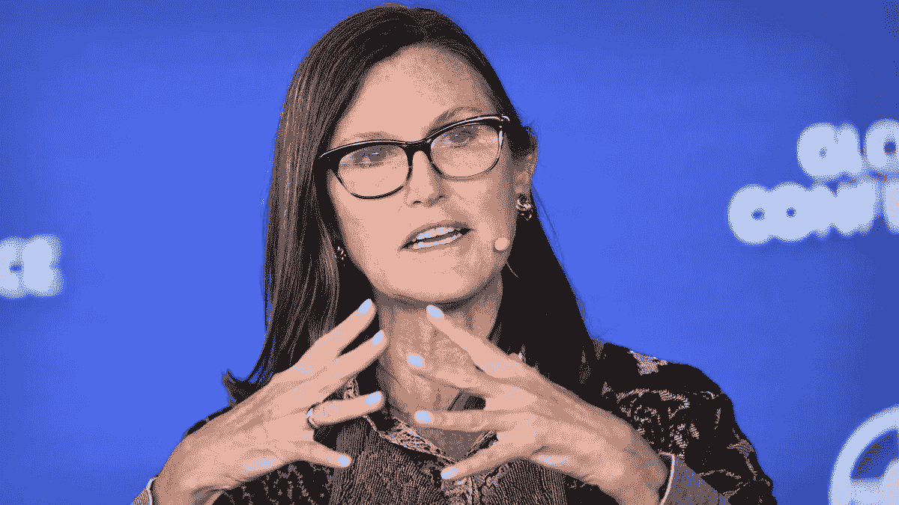

# 凯西·伍德坚持她对比特币(100 万英镑)的预测

> 原文：<https://medium.com/coinmonks/cathie-wood-insists-on-her-prediction-for-bitcoin-1m-787b89040498?source=collection_archive---------22----------------------->

尽管 FTX 崩溃，加密货币市场持续低迷，**Ark Invest**创始人兼首席执行官**Cathie Wood**坚持她的预测，即到 2030 年 [**比特币将达到 100 万美元。**](https://bitnewsbot.com/what-will-the-price-of-bitcoin-be-by-2030/)

此外，她似乎并没有被灰度的比特币信托(GBTC)的价格下跌所困扰，因为她的公司**额外购买了 176，945 股。**

# 不管发生什么事都乐观

FTX 加密货币交易所令人震惊的崩溃加剧了该行业此前的负面事件，并增加了投资者的疑虑。即使是最乐观的参与者也认为，市场恢复元气需要时间。

然而，Ark Invest 的 Cathie Wood 不在其中。在最近接受彭博采访时，她重申了自己的预测，即比特币正朝着每枚价值 100 万美元的方向发展。

事实上，她认为这种失败可能是有益的，因为它们表明了行业中有价值的活动是什么:

> “有时候你需要经历一场危机，看看谁是幸存者。比特币闻起来像一朵玫瑰。”

# 兴奋将会回来

伍德认为，当前形势的唯一不利因素是大型机构的兴趣降低。然而，她相信他们很快就会意识到主要加密货币的优势，并接受它。

Ark Invest 的高管总结道，对 BTC 的热情将在未来几年回归，这意味着它将在 2030 年达到里程碑。

# 以太坊的大规模采用

她还对以太坊持乐观态度，指出它可能会在未来几年被大量机构采用。

# 方舟投资公司增加了对 GBTC 的投资

由于加密货币的持续寒冬，GBTC 股票的估值大幅下降。它们目前的交易价格约为 8.40 美元，与上月相比下跌了 27%。

然而，Ark Invest 继续扩大其持股，最近购买了超过 176，000 股股票，价值约 150 万美元。一周前，Ark 购买了价值 27.3 万美元的股票。这令人意外，因为它发生在 FTX 灾难导致的严重市场动荡之中。

灰度的 GBTC 目前的交易价格比 BTC 现货价格低 42.7%。它在 11 月 18 日创下了该基金历史上最大的折扣，当时该利率达到了 45%。GBTC 是最大的比特币基金，管理着超过 635，000 个 BTC，按照当前价格计算，相当于近 105 亿美元。

*原载于 2022 年 11 月 25 日*[*【https://bitnewsbot.com】*](https://bitnewsbot.com/cathie-wood-insists-on-her-prediction-for-bitcoin-1m/)*。*

> 交易新手？尝试[加密交易机器人](/coinmonks/crypto-trading-bot-c2ffce8acb2a)或[复制交易](/coinmonks/top-10-crypto-copy-trading-platforms-for-beginners-d0c37c7d698c)