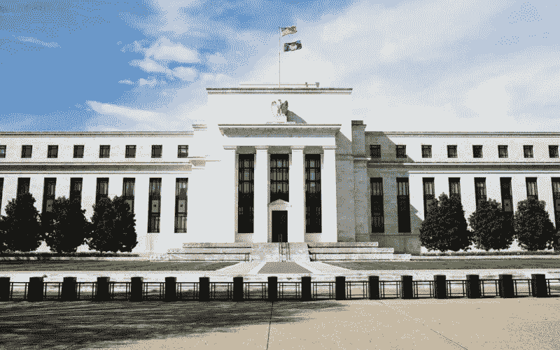

# CBDC:政府集中资金

> 原文：<https://medium.com/coinmonks/cbdc-government-centralized-money-43d81423b38d?source=collection_archive---------7----------------------->

辐射是一种原始的人类活动。自远古以来，我们的祖先就在狩猎-采集部落之间交换物品，甚至在游牧社会中也是如此，后来在更大程度上，当定居生活方式对农业和畜牧业来说是必要的时候也是如此。

经济发展以贸易为基础，为此，货币是必要的。

我们来看看钱的定义。货币是任何资产或商品，通常被经济主体接受为交换的支付手段，同时也履行记账单位和价值储存的职能。

在取代了物物交换之后，货币成为了一种交换手段。它开始被石头、贝壳、盐、银、金或其他被大多数人接受为价值代表的商品所代表。那么铸造硬币就是货币的技术进步。后来，纸币作为信用的一个标题是另一个进步。目前，数字或电子货币的发行是世界上最广泛使用的现代用途。

当它没有商品支持时，它就是法定货币，没有保持比率的储备，即发行的货币带有债务的对应物，正如自 20 世纪 70 年代初以来发生的那样，当时金本位在美国被废除，然后被复制到世界其他地方。

# 中央银行和货币管理

货币不仅是由民族国家发行的，而且目前，对于大多数世界贸易来说，也是如此。在一些次要的情况下，在某些情况下，贸易是通过易货进行的，即一个经济主体用服务或货物支付给另一个经济主体，但这并不是最常见的。

中央银行(美国的美联储)是大多数国家充当货币当局的机构，负责管理法定货币，设计和执行国家的货币政策。

[世界上所有的资金和市场都在一个可视化系统中](https://www.visualcapitalist.com/all-of-the-worlds-money-and-markets-in-one-visualization-2020/)

目前的支付系统大多是数字的，用于电子货币转账，很少用于纸币或铸造硬币。例如，流通中的实物美国货币只有[总货币供应量](https://www.federalreserve.gov/releases/h6/current/default.htm)的十分之一，其余以电子形式存在于各种银行存款中。

在央行(如美联储)拥有账户的实体只有私人和公共商业银行以及其他金融机构。公民和企业不能在美联储开户。

为了理解货币体系是如何运作的，让我们假设“ABC 银行”在美联储有 10 亿美元的储备。在白天，它发放贷款和吸收存款。这些贷款最终会被存入其他银行。一天结束时，所有这些转账都“结算”，这意味着如果“ABC”总共借出 2 亿美元，收到 1.5 亿美元，他们在美联储的账户余额将减少 5000 万美元，系统中的一个或多个其他银行的余额也将增加 5000 万美元。

人们花的钱(除了现金)不是央行的钱。它只存在于你的商业银行或其他机构的账本中。如果一个人向另一个人转账 1000 美元，两个账户的余额都会改变，但中央银行不会发生任何变化。个人账户余额有升有降，但他们的银行彼此持平，与美联储完全无关。

# 中央商务区是统治者的优势

中央银行数字货币(CBDC)是由中央银行发行的数字格式的货币，用计算机代码编程，其有效性用加密技术保护。它们是数字令牌，类似于公共加密货币，具有国家信用货币的价值。

今天使用的数字或电子货币不是 CBDC，因为它没有登记在区块链的账本中，而是登记在数据库中。

许多人倾向于将 cbdc 与 stablecoins 混淆，stable coins 是与法定货币的市场价值挂钩的代币，用开放源代码算法编码，在公共、无许可和分散的区块链上运行，而 cbdc 是许可的区块链的加密货币，集中在一个权力机构。

目前有几个民族国家正在发展自己的社区发展中心，进展程度不一。在美国，CBDCs 正在接受研究，美联储发布了一份文件:[货币与支付:数字化转型时代的美元](https://www.federalreserve.gov/publications/files/money-and-payments-20220120.pdf)。两个国家已经推出了它们的 CBDCs，尼日利亚推出了 e-Naira，巴哈马推出了 Sand Dollar。中国的 CBDC——电子 CNY——非常先进，已经被部分市民使用。这里可以看到全球情况:[今日央行数字货币状况](https://cbdctracker.org/)或者更好这里:[央行数字货币追踪器](https://www.atlanticcouncil.org/cbdctracker/)。

我将列举 CBDCs 的一些特征:

*   在消费者层面，可以消除交易的任何中介成本和税收，从而实现快速、无摩擦的资金转移和交易。
*   电子注册为监管机构打击洗钱、逃税、恐怖融资和其他犯罪活动提供了强有力的武器。
*   罪犯和恐怖分子的资金可以立即被冻结。
*   它们是可编程的，允许当局以他们认为“对社会有益”的任何方式限制购买、支付和收款。例如，如果配给变得必要，当局可以对购买实施每周限制，或者如果他们需要激活经济，建立一个时间限制来花费资金，即到期的钱([约翰·梅纳德·凯恩斯](https://www.wikiwand.com/en/John_Maynard_Keynes)的梦想)。
*   可编程货币，公民可以根据自己的判断奖励好的行为，或者惩罚坏的行为。
*   税收和财富再分配可以自动化。普遍基本收入、福利支出、刺激支出可以通过算法实现。
*   交易可追溯性，以及钱包持有者何时、何地、花了多少钱的数据，为决策者提供了有价值的见解。

正如你所看到的，对公民来说似乎没有任何好处，(或者至少我看不到)，因为发行国完全控制了货币的使用和处置，并且比当前的货币体系更有效(在这个意义上)。

糟糕的加密安全设计会让黑客加倍花费，即重复使用已经花费的钱，从而增加货币基础。

因此，CBDC 允许个人和公司在央行持有账户，取代现金，不需要像当前系统那样的中介。

# 控制作为主要目标

CBDCs 为社会工程提供了前所未有的机会，这是向技术统治迈出的一大步。

正在为中央银行做准备的统治精英们非常清楚它们的极权主义潜力，如果它们不仅仅作为货币来使用的话，它们就不会那么有效，但它们将会像今天的法定货币一样有效。

纸币或现金具有匿名性、无条件可替代性和不可没收性的特征，因此本质上削弱了政府权力，事实上也削弱了社会控制。

政策制定的标准可以通过人工智能算法实现自动化，从而最大化统治者所做决策的结果。

进步的政治话语应该是这样的:“*我们拥有的关于人的数据集越准确和完整，我们就越有能力改善人类生活*”。

不进入意识形态讨论的领域，货币不受政治干预的概念提出了一个更普遍的问题，即经济和政治领域之间的关系。共产主义将二者统一起来，而自由意志主义则寻求相反的东西，将金钱与政治控制分开。金钱和政府都是社会中协议和权力的模式。

在这种民族国家的背景下，当中央集权征服了金钱和财产，我们就有了共产主义，当金钱和财产征服了中央集权，我们就有了寡头政治。

在现代，民族国家之外的控制很少，或者更准确地说，是中央权力。国家和金钱塑造了几乎所有的社会组织模式。

以这样或那样的方式，中央集权(或早或晚)会导致极权主义和腐败。

中央集权主义威胁的答案是建立一个去中心化的社区，这就是去中心化的数字货币、加密货币(去中心化、公共、无许可和无信任网络的原生标志)获得突出地位的地方。

# 结论

一个 CBDC 能在一个公共的、分散的区块链上发展起来吗，比如像卡尔达诺？

是的，事实上，它可能是一个非本地协议，如 stablecoins(类似于 CBDCs)，在不同的区块链开发，如以太坊的 USDT 或 USDC，或很快在卡尔达诺的 DJED。但是从你在这篇文章中读到的一切，你会明白这不会成为现实，因为中央银行将希望他们自己的私人和授权的网络来实现他们真正的控制目的。

包括数字货币、生物识别和高科技监控在内的第四次工业革命将向世界展示一个反乌托邦时代的加速深刻变革，这使得它们更难被同化和停止。

我们必须将 CBDCs 理解为更广泛的进步意识形态的一部分，在数据环境中，信息就是力量。

分散加密经济的发展可以为极权主义的威胁提供一个平衡的解决方案。区块链技术还不成熟，才 13 岁。

这是一种实验性的技术创新，鼓励少数人参与，一些人认为这是一种风险投资，另一些人认为这是一种真正有价值和实用的工具，他们才是真正使用它的人，无论是在经济上还是在社会上。

*本文由我署名，原载于*[*【AdaPulse】*](https://adapulse.io/cbdc-government-centralized-money/)*。*

[liberlion.com](http://liberlion.com/)

> 交易新手？尝试[加密交易机器人](/coinmonks/crypto-trading-bot-c2ffce8acb2a)或[复制交易](/coinmonks/top-10-crypto-copy-trading-platforms-for-beginners-d0c37c7d698c)