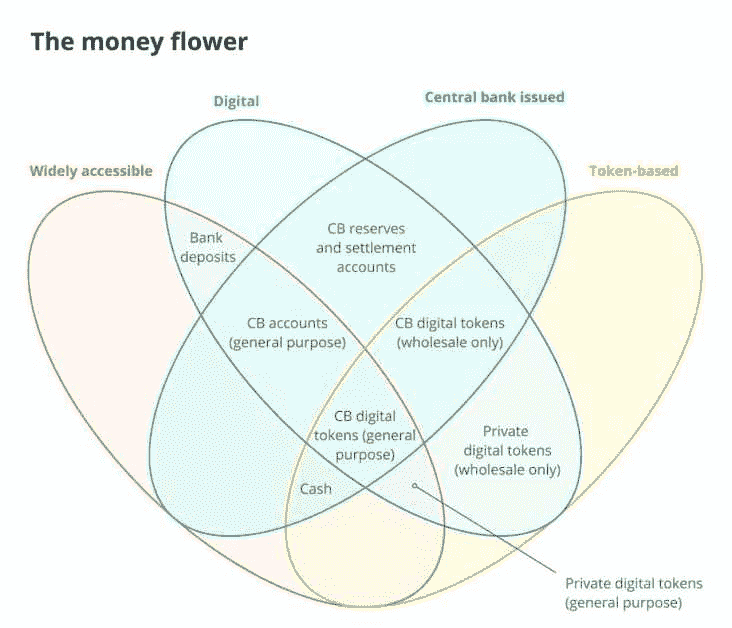
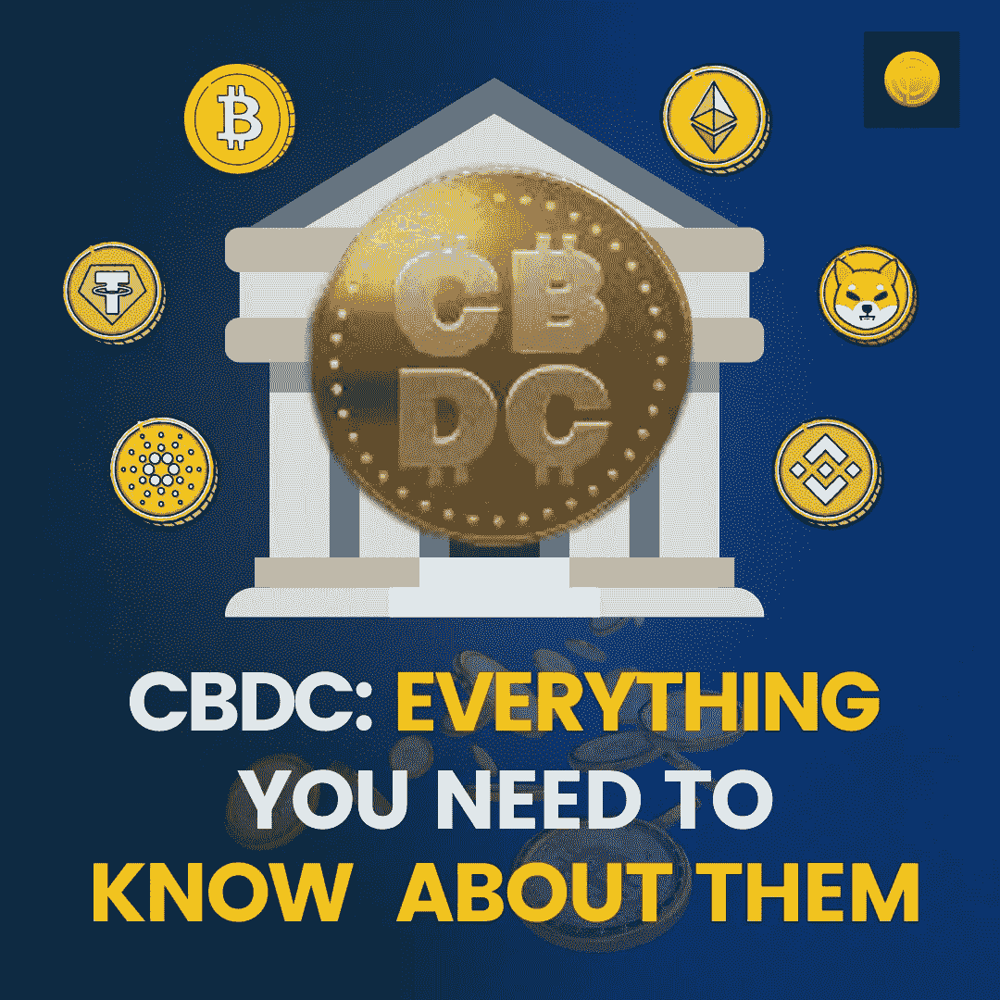

# CBDCs:你需要了解的一切

> 原文：<https://medium.com/coinmonks/cbdcs-everything-you-need-to-know-about-them-6c8041811597?source=collection_archive---------39----------------------->

Stablecoins 最近变成了一个投资天堂，世界各地的政府都认为这是一个挑战，并一直在准备对策，以阻止它们被用于汇款和交易目的。在这一过程中，中央银行或中央支持的数字货币在篡夺其崛起方面发挥了至关重要的作用。

# 什么是 CBDCs？

CBDCs 是由政府创造的电子货币，工作方式类似于纸币。然而，唯一的不同点是它们的数字存在、透明度和问责制，这使它们完全不同于纸质/法定货币。

# CBDCs 的意义是什么？

各种形式的加密货币彻底改变了金融的面貌。只要敲一下钟，你就可以随时随地汇款，几乎不收任何费用。想象一下用纸币和中央金融系统做同样的事情。

实际上，所有连接的银行网络要花几天时间才能就服务请求达成一致并进行处理。同样的主要原因是每个银行生态系统都有一个独立的生态系统，不能公开地互操作。除此之外，数据传输被隔离在层次结构的各个层之下，这进一步增加了流程的复杂性。

加密货币不是以这种方式工作的。相反，它们的网络节点是开放分布的，推动了去中心化，信息在所有节点上实时共享。因此，验证区块链的状态和执行事务变得非常容易。

> 交易新手？试试[密码交易机器人](/coinmonks/crypto-trading-bot-c2ffce8acb2a)或者[复制交易](/coinmonks/top-10-crypto-copy-trading-platforms-for-beginners-d0c37c7d698c)

也就是说，这并不意味着加密货币突然从兔子洞里出来了。数字代币可以追溯到 90 年代。当时，是电子现金和电子黄金简化了支付。然而，随着时间的推移，由于过时的技术，他们未能留下任何重要的印记。

但在 2008 年全球金融衰退期间，银行继续无节制地救助违约机构。这几乎在全球金融体系中制造了一场骚动，因为钱开始凭空被印出来。

为了应对同样的问题，一位名叫中本聪的匿名开发人员发布了一份白皮书，提出了一种点对点(p2p)交易，使用区块链作为底层技术，使用密码学作为提高安全性的手段。比特币白皮书发布后，随着公民意识到全球金融体系的低效，世界陷入混乱，最棒的是他们有一个绕过这个体系的替代方案。

随着时间的推移，加密货币的采用成为主流，世界各地的人们发现使用加密货币汇款更加方便和划算。因此，他们开始用国际汇款的密码代替法定汇款。

因此，政府采用了一种旁路机制，即人们可以使用 CBDCs 并以闪电般的速度进行交易，而不是使用以波动性和匿名操作著称的加密货币。目前，几乎所有国家都在参与启动 CBDCs。在这场竞争中，中国不可避免地获得了正面优势。他们的人民币已经在解决支付问题。

# CBDCs 的核心特征是什么

1.  CBD 应该是容易兑换的，这一点已经在全球得到了保证。你可以很容易地将一种 CBDC 兑换成另一种中央银行发行的货币，甚至是法定货币。
2.  通过现金支付的可能性也是 CBDCs 的一个重要方面。
3.  CBDCs 确保在线和离线交易都可以使用它们来完成。
4.  向世界各地汇款的成本应该很低。
5.  CBDCs 必须是安全的和防黑客的。为了做到这一点，政府已经将加密技术整合到他们的运作中。

# CBDCs 如何作为一个生态系统存在？

CBD 遵循金钱花一样的生态系统。(一)发行人(二)存在或形式(三)可及性(四)技术。

在金钱花经济中，收款人通过基于金钱的媒介检查支付是至关重要的。由于数字代币或 CBDCs 是由政府推出的，因此他们可以很容易地对其进行验证，并在各种操作领域(如阴影、非阴影)下对支付进行分类。阴影是没有好的目的使用金钱；然而，非阴影表示出于伦理目的对使用进行分类。

# CBDCs 的类型

# 通用 CBDCs

这些 CBDCs 由一般公众使用，并且它们可以在任何时间点被跟踪。通用 CBDCs 的目的是创建一个无纸化社会。

# 仅批发 CBD

仅批发 cbdc 是储备 cbdc，由银行保管以处理付款。一般来说，这些 CBDCs 主要是为了消除流动性风险。

# [CBDCs 的利弊](https://blog.coindhan.com/2022/02/17/cbdcs-to-go-mainstream-in-2022/)

# 赞成的意见

*   利用 CBDCs 很容易实现政府政策和货币透明度。
*   使用 CBDCs，客户和银行可以直接连接。
*   当 CBDCs 用于支付时，不存在第三方风险，因为银行非常重视处理交易。
*   CDBDs 还有助于提高金融包容性。

**缺点**

*   集中的
*   银行可以控制你如何处理你的资金。或者简单地说，用户在使用 CBDCs 时可能会失去主权。
*   当使用 CBDCs 时，用户的隐私将受到损害。
*   如果一个国家在外汇市场上的主权被另一个国家削弱，外汇市场可能会受到 CBDCs 的极大影响。

