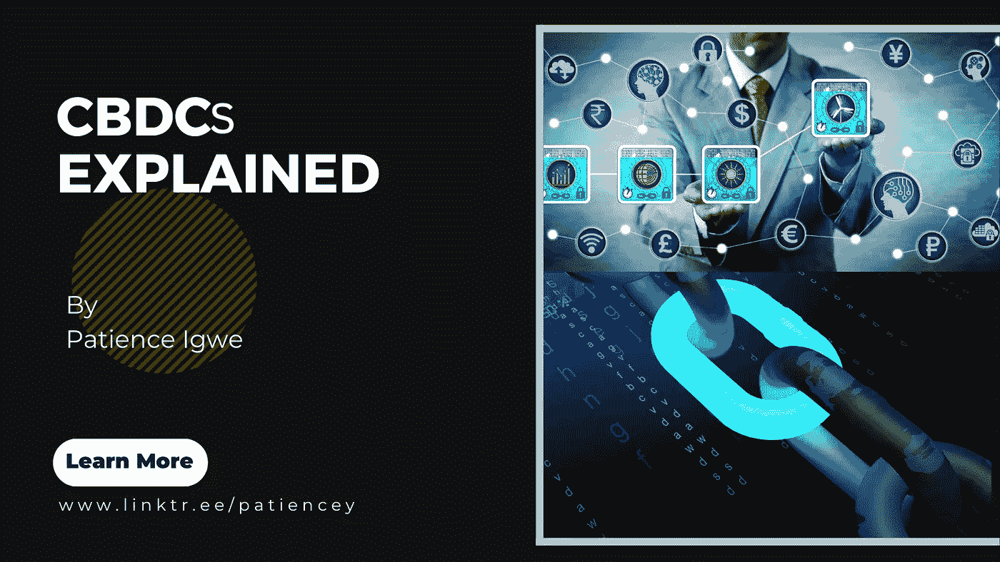
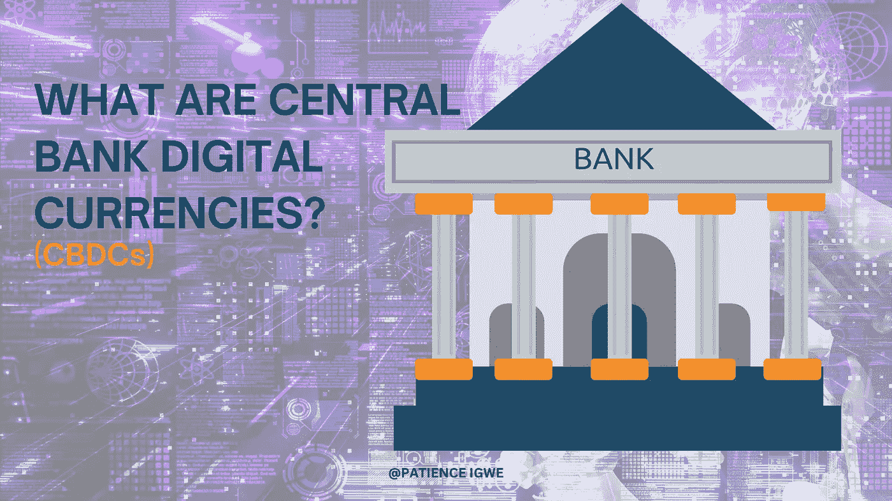
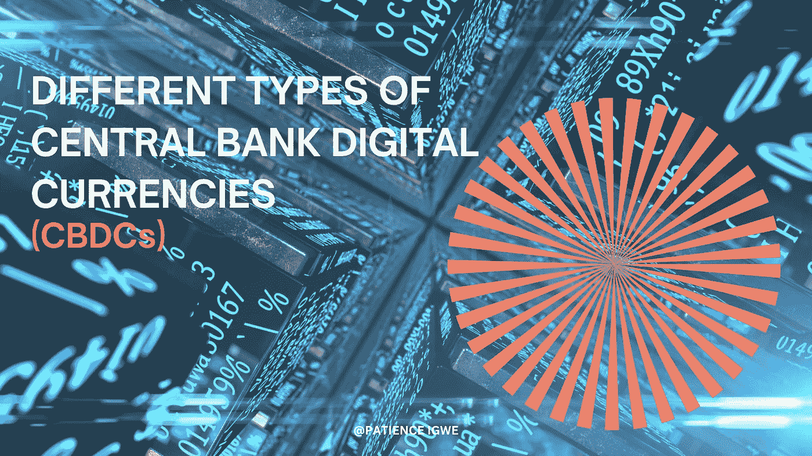

# 中央银行数字货币(CBDCs)解释-第 1 部分。

> 原文：<https://medium.com/coinmonks/cbdcs-explained-bc468cfb0dda?source=collection_archive---------14----------------------->

Evolution of Central Bank Digital Currencies (CBDCs)

货币从硬币到纸币的起源和演变已经不是什么新闻了，尤其是现在历史即将被改写，因为各国央行已经认识到现金对全球经济的不适当的危险，因此推出了央行数字货币([cbdc](https://www.imf.org/en/News/Articles/2022/02/09/sp020922-the-future-of-money-gearing-up-for-central-bank-digital-currency))。

# 什么是央行数字货币(CBDCs)？

What are Central Bank Digital Currencies (CBDCs)?

CBDC 仅仅意味着中央银行数字货币。CBDCs 背后的举措是比特币等数字货币进步的结果。

[比特币](https://www.investopedia.com/terms/b/bitcoin.asp#toc-the-bottom-line)是第一种成功的加密货币，它旨在促进跨境交易，消除第三方支付，并验证一种不可信的媒介。

注意:比特币不是第一种加密货币，但它是第一种成功的加密货币，这就是为什么它通常被称为所有加密货币之父，因此，大多数其他加密货币都将比特币模型作为构建它们的垫脚石。

联邦政府已经看到这些数字资产(加密货币)的大规模采用有所增加，这些数字资产已经成为法定货币的替代品(显然是在 Covid 期间和现在)。

不幸的是，这些数字货币非常不稳定，对于希望保持货币相关性的经济体来说，可能不是最佳选择。因此，他们决定将这一趋势推向高潮，创造自己的数字货币。

像中国、巴哈马、瑞典等几个国家已经在他们的国家推出了 CBDCS，我们知道它是否会在全球被采用只是时间问题。

## **CBD cs 的独特功能**

与加密货币不同，✅将得到政府的完全支持

✅:他们将在央行和用户之间架起一座桥梁(让用户可以直接访问央行)

✅:他们尽量减少不断向经济中注入现金。

✅:他们鼓励无现金经济，等等。

✅ CBDCs 旨在解决大多数加密货币未能解决的一个主要问题:“波动性”。

现在让我们考虑一下 CBDCs 的主要好处/优势:

**cbdc 的优势**

✅低成本支付系统:这将方便个人和客户通过智能手机向企业转账，而无需持有银行账户。

CBDC 的好处是可以确保人们在获得金融服务时能够体验到新的视角。也就是说，你甚至不需要拥有一个银行账户来拥有金钱

✅建立信任:CBDCs 将使人们对区块链技术产生信任，特别是因为他们的目标是解决波动性问题。

在这里，你会确信，你的资金不会因为新闻、趋势或影响者的帖子而付诸东流。

✅是一种有价值的资产:这意味着人们可以拥有 CBD 作为投资，并对未来的收益有所预期。

✅最大限度地降低高洗钱率和公共资金的不断消失:与可以被轻易窃取而不留痕迹的现金不同，cbdcs 是数字资产，可以跟踪任何发送到的地址。

在洗钱的情况下，它被发送到的地址将明显地证明是谁洗钱。

✅进入数字经济/金融包容性:通过创建数字基础设施，允许数字世界中的健康竞争，CBDCs 可以促进竞争。

此外，我们可以看到在农村地区，由于这样或那样的原因，许多人很少或根本没有机会进入银行系统。CBDCs 填补了这一空白，为大规模采用创造了空间。它的必要条件是一部智能手机。

这些以及更多的都是 CBDCs 的核心优势，但是我们都知道任何有优势的东西也一定有它自己的劣势。因此，让我们来考虑 CBDCs 的一些劣势。

**cbdc 的缺点**

✅隐私问题:隐私就是一切，这就是为什么不管你赚多少钱，保护好隐私能让你安心。昨天，我们讨论了 CBDCs 可能会降低洗钱和欺诈的水平，因为它们拥有分配给它们的数字地址。

这意味着，你的隐私是不安全的，因为它的地址也可以被追踪，资金被计算，如果不小心，可以很容易地提取资金，没有所有者的允许，这是最不安全的。

✅高度竞争和银行系统的崩溃:如果从现金向 CBDCs 转移的资金大量增加，使个人能够直接进入中央银行而不是商业银行。这可能导致银行竞争，甚至银行系统的崩溃。

我的意思是，谁不想进入中央银行呢？🤷

但是，这意味着许多银行可能没有必要的资金继续运营，这可能导致其中一些银行倒闭，幸运的是，这并不影响所有不同类型的 CBD，因此:

**cbdc 的类型**

Types of Central Bank Digital Currencies (CBDCs)

因此，有两种不同类型的 CBDCs:

✅Retail 中央商务区和

✅Wholesale CBDCs

**零售商业中心**

就像零售这个名字一样，这些 CBD 主要面向大众，促进交易的可用性、匿名性和可追溯性。

它们促进了金融包容性的机会，因为个人可能不一定需要拥有银行账户才能使用这些 CBDCs。

**批发跟单信用证**

另一方面，这类 CBD 通常可以在银行和中央银行等金融机构之间进行交易。

这仅仅意味着世界各地的中央银行可以通过批发 CBD 相互沟通。

它们通常速度很快，也允许跨境交易。

此外，一般来说，商品依赖型发展中国家提倡使用无现金经济，个人可以在商品依赖型发展中国家储存现金以外的资金。

因此，尽管零售中央银行汇票将在全国范围内被普遍接受为法定货币，但批发中央银行汇票也将被全世界其他中央银行接受为法定货币。

现在让我们考虑一下 CBDCs 和加密货币之间的一些异同。

**cbdc vs 加密货币(异同点)**

我们已经讨论了 cbdc 以及它们现在如何运行，我们将快速了解 cbdc 及其与加密货币的主要相似之处和不同之处，因此:

***相似之处***

1.  CBDCs 和加密货币的主要相似之处在于它们都是数字产品。
2.  他们倡导无现金社会
3.  据说 CBDCs 采用了区块链的概念，尽管它们还没有像加密货币一样被完全定义。

这些是 CBDCs 和加密货币之间的主要相似之处。现在，让我们考虑一下他们的不同之处。

***差异***

✅区块链三难困境，即去中心化、安全性和可扩展性在加密货币中是显而易见的，不像 cbdcs 有一些政府控制的元素。

✅加密货币提供个人匿名，不像 cbdcs 可能与用户的银行账户或注册电话号码相关联。

✅加密货币非常不稳定，不能用作国家储备。另一方面，CBDCs 被设计为一种有价值的资产，具有抗波动性，有机会成为国家的储备。

这些以及更多，是 CBDCs 和加密货币之间的核心异同。

因此，在了解了 cbdc 的概念、它们的特征、优点和缺点以及它们与 Crypto 的相似性/差异之后，是否真的应该考虑 cbdc，毕竟最重要的事情是尽可能随时随地安全地进行交易？

你对此有什么看法？

我会在评论区等你。

## 关于作者

Igwe Ihuoma Patience 是一名自学成才的创意和特定行业内容作家，也是一名加密货币爱好者，拥有 2 年多的经验和不断发展的区块链空间的知识。

我擅长内容创作、文案撰写、字幕管理、视频编辑和手机图形设计，我教其他人如何在加密货币和区块链领域起步，我的目标是让区块链的学习和更新易于任何人理解。