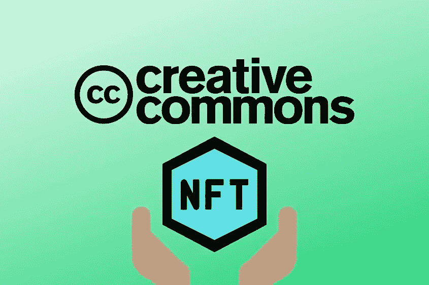

# CC0 NFT 项目搞什么鬼？

> 原文：<https://medium.com/coinmonks/cc0-nft-projects-explained-6f87756e6743?source=collection_archive---------6----------------------->

# CC0 是什么？

“知识共享零”被称为 cc0。简单地说，它本质上意味着艺术作品或其他创造性作品的作者已经放弃了其中的所有知识产权。这在预定的时间段后自动发生，但是如果创作者选择立即放弃他们的知识产权，这也可能发生。你可能听说过某些东西被认为是“公共领域”，允许任何人使用该知识产权创作内容。这仅仅是说明内容是 cc0 的另一种方式。

例如，莎士比亚的所有原创作品都是 cc0 版本，属于公共领域。夏洛克·福尔摩斯和文森特·梵高的艺术品也是如此。

# cc0 和 NFT 有什么关系？

越来越多的创作者选择将他们 NFT 项目背后的知识产权立即公之于众。你可能想知道为什么，这是否对创始人和代币持有者都有利。答案是，“看情况”，就像生活中所有明智的答案一样。

在我看来，最大的好处是，如果我拥有一辆 CC0 NFT，我就拥有了一切。这并不意味着我是知识产权的所有者；相反，没有人是。没有人，不是项目的创始人，不是艺术家，不是我。我，或者其他任何人，都不能买卖它。最初的代币/资产是剩下的所有物。

然而，价值在哪里？价值不就在 IP 里吗？是的，不。知识产权无疑有很大的价值。迪士尼通过出售以其角色为特色的玩具和电子游戏赚了一大笔钱。如果是 cc0，他们仍然可以这样做，但他们无法阻止其他人出售具有相同角色的玩具，这可能会损害他们的利润。考虑到有很多客户在等着向迪士尼支付知识产权许可费，让他们制作内容 cc0 实际上没有意义。

在网络 3/NFT 领域，品牌建设仍处于起步阶段。cc0 最棒的一点是，它给了任何想利用内容来扩大品牌创意和商业自由的人。这是一把双刃剑，因为它可以被创作者用来制作一些有价值和酷的东西，从而推动宇宙的发展，但它也可以被不诚实的人用来损害品牌的声誉。从某种意义上说，这是一个免费的。

但是这不就是 Web3 应该有的样子吗？徒劳无功？一个不可信的、分散的网络？我们真的不应该给这些巨大的、中央集权的组织对我们知识产权的控制权和所有权。他们最终可能会购买并转售我们的知识产权，就像 web2 巨头处理我们的数据一样。这是 cc0“固定”的。他们不能再买卖知识产权，因为它已经不存在了。这些只是我们的代币，我们实际上拥有它们。

# 那非功能性测试的缺点是什么？

NFT 项目保留知识产权并给予所有者完全的商业权利并没有什么不好。有许多好的理由支持这一策略。因为他们增加了他们拥有的知识产权的价值，而不仅仅是潜在的/原始的令牌，这鼓励了团队和 NFT 持有者扩大品牌。它使代币持有者能够通过将他们的非专利技术再许可给其他想要使用他们的知识产权生产东西的人来分享利润。

此外，它有助于球队和 NFT 所有者的品牌和知识产权保护。比方说，明天将发行一个包含一些令人惊叹的 CC0 艺术品的收藏。它可能不会引起太多的兴趣，也不会被广泛传播。一个不诚实的人可能会出现，“偷走”艺术品和想法，然后用新的名字出版，疯狂地营销，并从所有的原创作品中获利。此外，最初的创造者将没有追索权(法律上)。不过，要在公众舆论法庭上打赢这场官司可能很难。维护知识产权会给他们(法律)保护。

此外，在没有一个集中团队负责的情况下开发一个品牌也很有挑战性。这很难，但并非不可能。一个团队制作并执行路线图，一个创意总监规划特许经营。这是一个努力的目标，但是请记住，这与 CC0 项目并不矛盾。有许多项目已经向公众提供了他们的内容，同时还在朝着他们为项目设想的特定未来前进。然而，如果团队意识到他们拥有他们正在创造的产品，并且在任何时候都不能被不良行为者接管，那么激励团队可能会更简单。

这里是一些 NFT 项目的 IP ' CC0 ' ed:blit maps/blit nauts，Mfers，CrypToadz，Loot，名词，Chain Runners 和 Timeverse 的永恒人物。

对大多数人来说，当我们购买 NFT 时，知识产权不是我们想的事情。我们认为我们很开心，买了一个 jpeg，加入了一个社区，等等。最有可能的是，这是创建和持有 NFT 的主要动机。然而，对于协作、分发和模块化来说，开放一个人的 NFTs 的权利是一个有趣的方面。

> 交易新手？试试[加密交易机器人](/coinmonks/crypto-trading-bot-c2ffce8acb2a)或者[复制交易](/coinmonks/top-10-crypto-copy-trading-platforms-for-beginners-d0c37c7d698c)