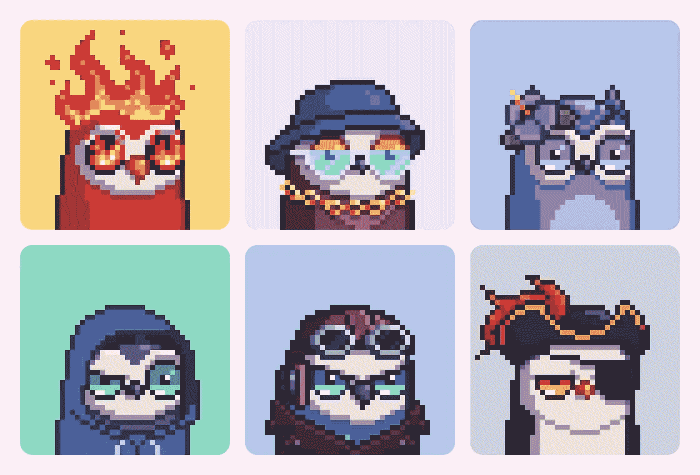
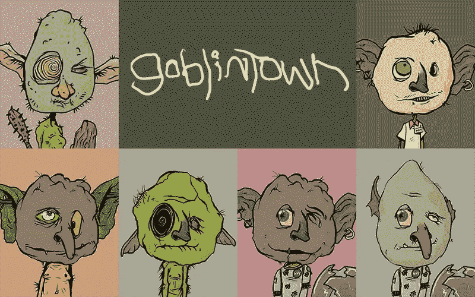
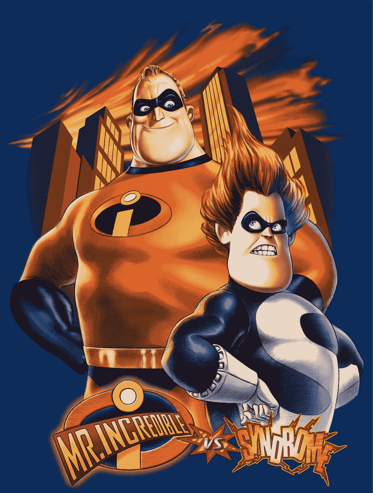

# 如果每个人都是 cc0，cc0 就不起作用

> 原文：<https://medium.com/coinmonks/cc0-wont-work-if-everyone-is-cc0-96b17f950170?source=collection_archive---------41----------------------->

When Moonbirds switched to cc0 abruptly, it raised a few eyebrows and questions.

好了，大家，围过来在 NFT 世界里沉思一下。

让我告诉你什么是现在最热门的。

知识共享零或 cc0 现在风靡一时。

以前是 10k 算法生成的 NFTs。

然后 PFPs。

然后 Ai 生成的艺术 NFTs。

现在，进入零版权时代。

cc0 表示没有人拥有任何 IP。

任何人都可以自由构建、创造和使用 NFT 的形象/名称。

坦率地说，这是一个激进的新概念，并不新鲜，但在现代网络世界中却以某种方式呈现出一种新的形式。

有哪些流行的 NFT 是 cc0？

XCOPY，迪冈，格兰特·云，名词，戈布林顿。

甚至凯文·罗斯也突然宣布，最近比较成功的 NFT 之一“月鸟”将采用 cc0。

甚至没有询问其现有的社区或甚至背后的坚实的推理。

GoblinTown came out of nowhere and took the NFT world by storm.

你能用 cc0 NFT 做什么？

这意味着你可以合法地拍摄戈布林顿·NFT 收藏的任何照片，并做任何你想做的事情。

创建一个新的 10K 人工智能生成的 NFT 系列作为副产品，并将其命名为“妖精的孩子”。

打造自己的汉堡品牌，名为“妖精汉堡”。

或者甚至是一个叫做“妖精魅力”的新彩妆线。

这是合法的，而且事实上，是受到鼓励的。

为什么？

如果每个人都以品牌为基础并传播信息，理论上，随着时间的推移，品牌会发展得更快更强。

真的是这样吗？

也许吧，但这是一个刚刚出现的新概念。

我认为这对一些人来说会有用，但如果其他所有 NFT 系列都这样做，它就失去了魅力和效果。

想想吧。

如果大家都是 cc0，cc0 就不行了。

对于那些足以回忆起 2004 年《超人特工队》的人来说。

Syndrome had a point: “when everyone’s super, no one will be”

超级恶棍综合症想通过让街上的每个人都能接触到小发明和超能力来报复不可思议先生。

这样，当每个人都有超能力时，就没有人是特别的了。

在某种程度上，当每个人都超级的时候，没有人会超级。

想象一下。

每一个新推出的 NFT 系列都是一个 cc0 项目。

每个 NFT 会有足够的人手吗？

有太多的知识产权需要创造，太多的知识产权需要建设，太多的知识产权需要处理。

这将导致市场供过于求。

供给太多需求不够会怎么样？

价格会下跌，人们会失去兴趣，恶性循环随之而来。

cc0 是一个新颖的概念，但我们必须小心不要夸大其词，否则它会像到来一样很快夭折。

-

你知道 cc0 是什么吗？

-

#创业#商业#创业#成长#成功#社交媒体#文化#网络 3 #战略#黑客# cc0 #版权#月光鸟#知识产权#炒作# eth # btc #密码#黑客#市场#供应需求

> 交易新手？试试[加密交易机器人](/coinmonks/crypto-trading-bot-c2ffce8acb2a)或者[复制交易](/coinmonks/top-10-crypto-copy-trading-platforms-for-beginners-d0c37c7d698c)