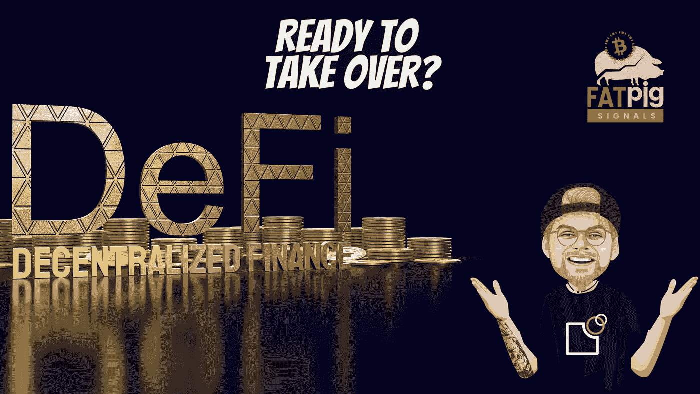

# CeFi vs . DeFi——世界的巨大机遇？

> 原文：<https://medium.com/coinmonks/cefi-vs-defi-a-huge-opportunity-for-the-world-57d92a9766c9?source=collection_archive---------17----------------------->

关于加密市场崩溃的一个细节很少受到关注:没有一个 DeFi 平台受到影响。很难说那有多大。

DeFi 是“分散金融”的缩写，通常指通过区块链上的智能合约执行的金融服务。他们在最近的加密崩溃中扮演了一个特殊的角色，这一点还远未被完全理解。