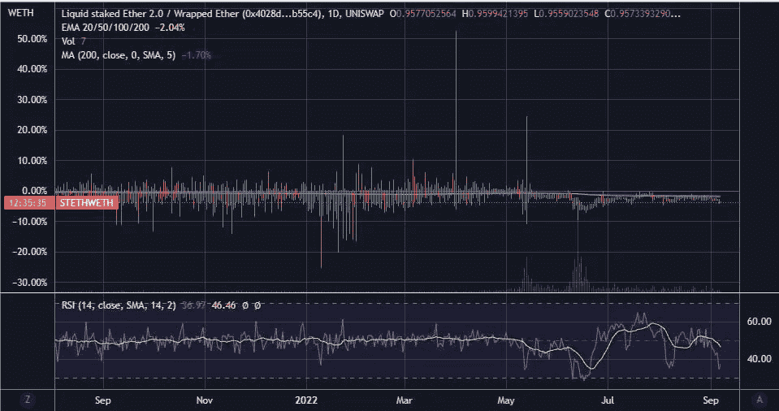

# 庆祝以太坊与 stETH 的故事合并，因为这一资产成为今年的头条新闻！！

> 原文：<https://medium.com/coinmonks/celebrating-the-ethereum-merge-with-a-steth-story-as-this-asset-made-headlines-this-year-8251338ddc75?source=collection_archive---------12----------------------->

# 使用锁定池锁定以太坊信标链

我一直想知道一个人如何能在以太坊的信标链上下注，人们说他们加入了赌注池，他们在那里存款并锁定他们的以太网以获得赌注奖励。但是，只有在以太坊的信标链中激活提取存放的 ETH 时，该锁定的 ETH 才能解锁。

# stETH，流动的 ETH 资产代表锁定在利多金融的赌注池中的 ETH

今年关于 stETH 的新闻不断闪现，stETH 失去了与 ETH 和 CEFI 借贷平台的联系，[因此面临流动性紧缩问题](https://decrypt.co/102812/celsius-liquidity-crunch-lido-staked-ethereum-steth)。

很快，我了解到 stETH 是流动的 ETH，由那些将他们的 ETH 锁定在 Lido Finance 的赌注池中的用户接收。对于用户来说，这是一种获得赌注回报的简单方法，无需设置需要锁定 32 ETH 的验证器节点(显然成本很高),也无需维护节点的硬件和软件性能以避免削减的损失。

[Image Source](https://lido.fi/)

***Slashing 是对验证者的惩罚，如果他们恶意行为或没有跟上所需的正常运行时间性能，就拿走他们的一部分股份。*

用户只需要在利多金融的平台上锁定他们想要的任何数量的 ETH，该平台将使用用户的资金来建立他们自己的信标链验证器节点。

然后，Lido Finance 向他们的 ETH 储户奖励一部分验证者奖励，从节点基础设施运行和维护的管理费用中提成。

ETH staking module in [Lido Finance’s Platform](https://lido.fi/)

# stETH depeg 今年导致了 Celsius 流动性问题的开始

与此同时，即使 ETH 储户通过 Lido Finance 的 staking pool 将他们的 ETH 锁定在 Beacon Chain 中，他们也可以按锁定的 ETH 比例获得等量的 stETH，他们可以在 DEFI 中自由使用这些 stETH，除了可以出售和交易 stETH 之外，还可以借出他们的 stETH 和以他们的 stETH 抵押品为抵押进行借贷。

然而，几个月前，stETH 失去了与 ETH 的联系，导致现在已经破产的 CEFI 平台 Celsius 出现问题。

似乎发生的情况是，由于 Celsius 将大多数客户的 ETH 存款锁定在 Lido Finance 上，该平台无法满足客户的大额 ETH 提款请求。

在像 Aave 这样的 DEFI 协议中，大多数 Celsius 客户的资产被锁定为抵押品，随着资产的价值下降并低于 ETH，Celsius 出现了无法为其客户的资产存款提取同等价值的 ETH 的问题。

我还怀疑，Celsius 存放在 DEFI platforms 的 stETH 抵押品可能发生了一些清算，该平台用其 stETH 抵押品借入资产。

[Tradingview chart](https://www.tradingview.com/x/zAZ2Sh5p/). stETH is 0.957 to WETH, meaning it’s still lower than the value of WETH, which is nothing but wrapped Ethereum. From the period of June 6th to June 17th stETH experienced a major depeg from ETH and WETH

# 今年制造新闻的 stETH depeg 电视剧让我认识了丽都金融

嗯…所有这些有趣的 stETH 戏剧让我熟悉了丽都金融。我发现有趣的是，即使 stETH 是代表锁定在利多的 ETH 的液体 ETH，它也失去了与 ETH 的联系。

[Coingecko](https://www.coingecko.com/en/coins/lido-staked-ether). stETH is 0.958 ETH, its price peg is not fully restored to ETH, but this is no cause for worry because every stETH out there is come only after locking up ETH in Lido Finance Platform

这主要是因为在曲线融资中，许多 stEtH 被替换为 ETH，最终导致 ETH/stEtH 池中出现巨大的不平衡，该池由 ETH 的 20%和 stETH 的 80%组成。

这使得 Curve 调整 stETH 的价格低于 ETH 的价格，以吸引交易者以更低的价格购买 stETH，这是一种使 Curve 中稳定的 coins 资产平价的机制。

曲线融资是最重要的 Defi 协议之一，对稳定的信贷和资产(如 stETH)具有很高的流动性。那里的交易活动有助于确定稳定的货币和其他资产的价格。

# stETH 仍然是 DEFI 中最受欢迎的流动性 ETH 资产

嗯，现在这确实是一个老故事，因为以太坊信标链即将被激活，但我仍然分享一个基于以太坊的加密故事，庆祝[以太坊向 POS 链](https://www.publish0x.com/investing-and-trading/grand-event-this-month-for-ethereum-with-the-merge-happening-xxzzvwd)过渡的倒计时，发生在 9 月 10 日和 15 日之间的任何时间！！

*你可以在这篇文章中读到这一切-:*

[以太坊本月将举行盛大活动，合并即将开始，它将转变为一个销售点连锁店！！](https://www.publish0x.com/investing-and-trading/grand-event-this-month-for-ethereum-with-the-merge-happening-xxzzvwd)

我可以想象，许多 stEtH 持有人担心 stEtH 对 ETH 的永久依赖，因为当时 UST 的死亡螺旋崩溃在加密投资者的脑海中记忆犹新。但 stETH 的价值最终等于 ETH，因为流通中的每一个 stETH 都代表着锁定在丽都金融平台上的等量 ETH。

***所以，斯泰斯的传奇还在继续……***

在以太坊合并的这一季，我打算写一些更多基于以太坊的文章，谢谢你的阅读！！

> 交易新手？尝试[加密交易机器人](/coinmonks/crypto-trading-bot-c2ffce8acb2a)或[复制交易](/coinmonks/top-10-crypto-copy-trading-platforms-for-beginners-d0c37c7d698c)