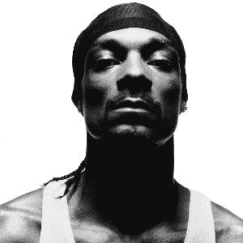
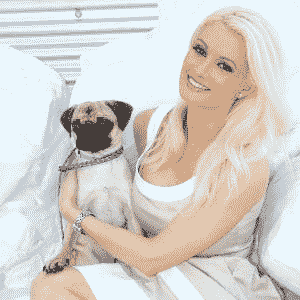

# 元宇宙名人:虚拟现实中的五大名人

> 原文：<https://medium.com/coinmonks/celebrities-in-metaverse-top-5-famous-persons-in-virtual-reality-a8d6e101f94f?source=collection_archive---------39----------------------->

什么是元宇宙？

元宇宙是一个虚拟数字领域的网络，让人们可以使用虚拟角色在 3D 环境中联系、玩游戏、安排会议、聊天和闲逛。人们对 NFT 和元宇宙越来越感兴趣，特别是自从脸书首席执行官马克·扎克伯格和他的公司 Meta 之后。加密行业不再是技术专家和游戏玩家的专属。一些名人和有影响力的人已经在虚拟世界中建立他们的品牌，尽管元宇宙仍然是一个相对较新的想法。根据最近的 IZEA 调查，56%的有影响力的人表示他们已经在使用元宇宙。

这篇文章列出了虚拟现实中的 5 大名人。

**史努比狗狗**

在位于区块链的以太坊平台 Sandbox 上，说唱歌手 Snoop Dogg 正在创建一个 Snoopverse。他购买了一处房产，将用于购物、泳池派对、艺术和车展以及虚拟音乐会。此外，他在加州的巨大豪宅的电脑复制品也将存放在那里。去年 12 月，一名 NFT 收藏家在史努比·道格的虚拟世界中购买了一块虚拟地产，花了 45 万美元买下了住在这位说唱歌手隔壁的机会。

**帕丽斯·希尔顿**

Roblox 以巴黎希尔顿开发的名为巴黎世界的岛屿为特色。游客们可以在岛上进行水上摩托之旅，沿着长廊漫步，还可以观看她贝弗利山住宅的电脑化改造，里面有一座狗舍。但是，当然，游戏的货币，罗布克斯，必须花在这些活动上。

**桑帕约萨拉**

萨拉·桑帕约(Sara Sampaio)是维多利亚的秘密(Victoria's Secret)的前模特，她支付了 25 以太坊(Ethereum)，或当时的 71445 美元，在沙盒平台上购买了一个虚拟的私人岛屿。

斯塔尼斯拉斯·瓦林卡

顶级的元宇宙和 NFT 市场，独家举办了一场拍卖，这位瑞士网球运动员购买了一个私人虚拟岛屿。买卖发生在沙盒平台上。

迈克尔·维拉蒂

巴黎圣日耳曼队(PSG)的中场球员马尔科·维拉蒂也在沙盒上买了一个专属的虚拟岛屿。

> 交易新手？尝试[加密交易机器人](/coinmonks/crypto-trading-bot-c2ffce8acb2a)或[复制交易](/coinmonks/top-10-crypto-copy-trading-platforms-for-beginners-d0c37c7d698c)