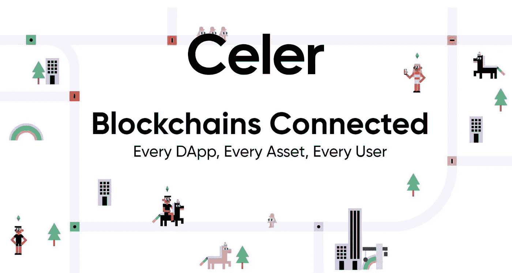

# Celer Network:多元化多区块链生态系统的优势

> 原文：<https://medium.com/coinmonks/celer-network-benefits-of-a-diverse-multi-blockchain-ecosystem-c518f8c667b7?source=collection_archive---------50----------------------->

**和******一样激动人心，赛乐网络(CELR)的加密货币在交易速度上可以说是差强人意。Celer Network (CELR)加密货币是一种智能设计的第 2 层扩展解决方案，可处理离线交易。****

**此外，Celer 平台为智能合同和支付提供简单、快速、安全的离线交易。这个项目是使用基质框架开发的第一批项目之一，也是圆点生态系统的一部分。在研究整个网络时，其创始人设想的主要目标是释放区块链的全部潜力，并通过一些富有成效和更有效的输出来彻底改变分散的应用程序。**

# **Celer Network (Celr)加密货币的四个要素是什么？**

****以下是赛乐网络(CELR)加密货币的四个主要元素:****

1.  **cOS-它是提供工作流的网络的核心**
2.  **cRoute-这是一种通过简化网络内的路线来提高运营能力的机制**
3.  **信道——它是在网络中传输事务的信道**
4.  **Capps 是一个生态系统应用层，用于扩展和用户隐私。**

**这个平台使用一个 POS(**)共识变体，称为 DPOS(Delegated Proof stage)。使用这里提到的算法，用户还可以下注硬币以获得奖励，同时将验证交易的责任转移给代表。****

> ****在[**procommun.com**](https://procommun.com/2022/05/technology/celer-network-celr-enjoy-the-benefits-of-a-diverse-multi-blockchain-ecosystem/)上阅读更多此类有趣的加密文章****

****Celer Network (CELR)加密货币持有者也将提供流动性代币，并因此获得一些奖励。Celer Network (CELR) [**加密货币**](https://procommun.com/2022/05/news/crypto/biden-signs-executive-order-on-cryptocurrency-youtube/) 的要点是，整个平台允许任何区块链存在的两层扩展。因此，该项目覆盖了广泛的市场，增加了完整的流动性潜力，并增加了产品的覆盖面、可靠性和适应性。****

# ****谁创造了 Celer Network (Celer)加密货币？****

****Celer Network (CELR)加密货币由一个由不同工程师组成的强大团队于 2018 年创立，他们拥有一些令人难以置信的技术和专业经验。Celer Network (CELR)加密货币的四位联合创始人都拥有加州大学伯克利分校和麻省理工学院等著名大学的计算机科学博士学位。他们都有在一些知名科技公司工作的经历。****

*   ****莫东博士是算法博弈论和协议开发方面的专家。此外，他还教授关于智能合同的综合课程。他曾在 Veriflow 担任产品经理和开发工程师。****
*   ****刘俊达博士也毕业于加州大学伯克利分校，然后在 2011 年与谷歌合作，为他们的数据中心创建基础设施。2014 年，他成为 Project Fi 移动服务的创始人之一。之后，他还在 Android Tech 担任技术经理。****
*   ****李晓珠博士在普林斯顿接受教育。在赤脚网络公司担任软件工程师之前，他曾在微软实习。他还出版并广泛阅读了涉及分布式系统、存储、网络和数据管理的学术著作。****
*   ****梁庆凯博士拥有麻省理工学院的学位。他曾在麻省理工学院 LIDS 实验室(信息和决策系统实验室)、贝尔实验室和谷歌担任软件工程师实习生。此外，他的研究还侧重于网络系统中的学习和控制问题，即敌对网络中的在线学习算法。****

# ****是什么让 Celer 网络(Celer)成为加密货币？****

****赛勒网络(CELR)加密货币是一个网络化的系统，而不是一个独立的区块链。相反，该平台运行在未来和现有的区块链之上。开发人员还关注可伸缩性，以提高加密区块链的吞吐量。Celer Network (CELR)的加密货币创始人相信，内部解决方案不会给全球未来 [**分散的区块链**](https://procommun.com/2022/04/technology/ios-token-iost-an-ultra-fast-decentralized-blockchain-network/) 带来结果。所以他们也提出用外链平台来解决问题。****

****Celer Network (CELR)加密货币架构的四个级别均匀划分，为客户提供多种优势。这种加密的优点包括:****

*   ****减少交易延迟。****
*   ****外链合同零佣金。****
*   ****小额支付佣金减少。****
*   ****可用的外链模型和更多。****

> ****原载于****

> ******加入 Coinmonks [电报频道](https://t.me/coincodecap)和 [Youtube 频道](https://www.youtube.com/c/coinmonks/videos)获取每日[加密新闻](http://coincodecap.com/)******

# ******另外，阅读******

*   ******最好的比特币[硬件钱包](/coinmonks/hardware-wallets-dfa1211730c6) | [BitBox02 回顾](/coinmonks/bitbox02-review-your-swiss-bitcoin-hardware-wallet-c36c88fff29)******
*   ******[block fi vs Celsius](/coinmonks/blockfi-vs-celsius-vs-hodlnaut-8a1cc8c26630)|[Hodlnaut 审核](/coinmonks/hodlnaut-review-best-way-to-hodl-is-to-earn-interest-on-your-bitcoin-6658a8c19edf) | [KuCoin 审核](https://coincodecap.com/kucoin-review)******
*   ******[Bitsgap 审查](/coinmonks/bitsgap-review-a-crypto-trading-bot-that-makes-easy-money-a5d88a336df2) | [Quadency 审查](/coinmonks/quadency-review-a-crypto-trading-automation-platform-3068eaa374e1) | [Bitbns 审查](/coinmonks/bitbns-review-38256a07e161)******
*   ******[加密复制交易平台](/coinmonks/top-10-crypto-copy-trading-platforms-for-beginners-d0c37c7d698c) | [Coinmama 评论](/coinmonks/coinmama-review-ace5641bde6e)******
*   ******[印度加密交易所](/coinmonks/bitcoin-exchange-in-india-7f1fe79715c9) | [比特币储蓄账户](/coinmonks/bitcoin-savings-account-e65b13f92451)******