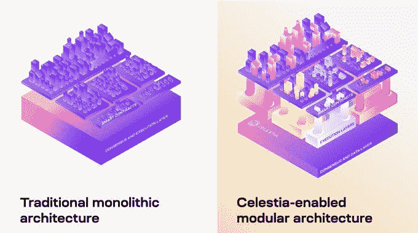
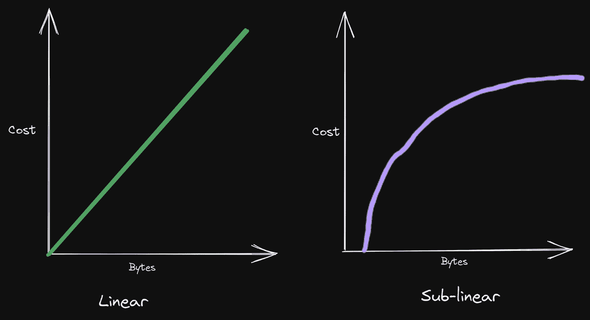
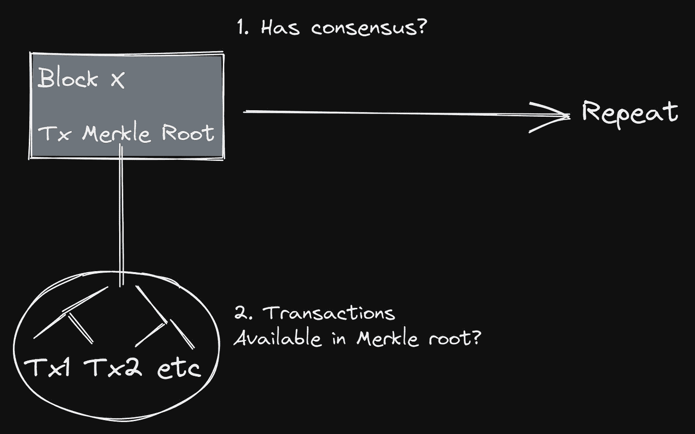
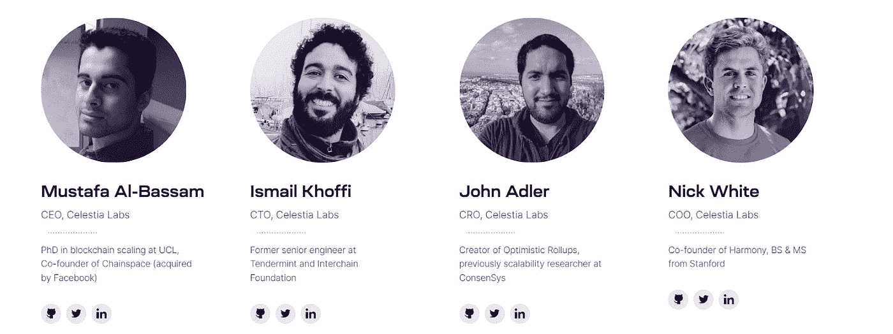

# Celestia:通向模块化区块链的未来之路

> 原文：<https://medium.com/coinmonks/celestia-a-pathway-to-the-future-of-modular-blockchains-bb35d2425a9?source=collection_archive---------7----------------------->

区块链是分布式、分散的计算机，通过节点网络处理交易并保存全球总账。为了确保保持这种分散，必须保持对低硬件要求的需求。

要完全理解这种说法，我们必须首先探究气体/秒对于 EVM·区块链的意义。

Gas/second 是对节点跟上链的硬件要求的粗略估计。它的应用越来越复杂，因为它的存在是为了从以太市场价值中分离出运行一个操作的计算成本。无论价格波动如何，运营的天然气成本(即所需能源)保持不变。气的成本不能变；但是，每单位气体所代表的乙醚量可以。因此，如果乙醚的价格暴涨，网络可以减少每种气体所代表的乙醚的数量，以保持气体的成本不变。

查看任何给定网络上的交易数据会发现，这些交易消耗静态确定量的气体。这种天然气是用区块链的本国硬币购买的，每单位天然气支付的硬币数由费用市场决定，该市场独立于硬币/美元市场，并由天然气需求决定。

我将使用以太坊的 EIP-1559 作为例子来进一步解释这一点。

以太坊改进提案(EIP) 1559 是 2021 年的升级，改变了以太坊计算和处理网络交易费用(称为“燃气费”)的方式。

现在，EIP-1559 取消了以太坊用于计算天然气费用的拍卖系统，代之以基本费用机制，确保你现在支付基本费用，然后你可以给矿工小费，而不是只向矿工支付费用。

对于 EIP-1559，在区块超过 50%满后，基本费用将增加和减少 12.5%。这意味着它是专门设计的，目标是 50%的网络天然气使用量，其中基本费用增加到 50%以上，低于 50%。

最高费用是为您的交易支付的全球总金额。其计算方法为(基本费用+优先费用)x 用气量。

目前，以太坊的最大气体流量为 2.26 米/秒。并列来看，Polygon PoS 的最大气体流量约为 9.4 米/秒，而其竞争对手 BSC 的最大气体流量约为 31 米/秒。

同样，这些不是可伸缩性度量；它们只是表示一个链可以处理的最大吞吐量。因为天然气的需求/供应比率不相关，所以它与每个网络的天然气费用没有 1:1 的关系。也就是说，实现的网络 TPS 完全取决于网络上正在处理的事务的复杂性。

如果我们看一看以太坊的区块空间的需求/供给比率，我们会发现它比任何其他的都要高。由于权力下放和网络效应所带来的更高的安全性，需求很高，而由于权力下放的社会契约，供应很低，这是通过限制硬件要求来实现的。

如果需求/供给比超过 1，那么费用就会上涨，除非增加额外的供给。然而，仅仅增加块大小和减少块时间不足以保持分散化。

……这就是模块化区块链命题发挥作用的地方。

这些过程可以划分到不同的网络中，而不是依赖于一个单一的整体链来处理所有的共识、数据可用性和执行需求。

*   执行层快速处理事务，
*   然后使用一个简明的证明来验证在共识层上的这种链外执行，并且
*   执行过程中使用的原始事务数据保存在数据可用性层，这样任何人都可以重建状态。

因此，共识层的块空间(可用 gas)在每个事务中的使用效率更高，因为它仅用于验证涵盖许多事务的简洁证明。通过限制气体吞吐量(或分片)，该模型允许共识层和数据可用性层高度分散，同时通过外包执行实现更大的规模。

模块化区块链旨在解耦区块链的各个层(执行层、共识层等)，允许广泛的组合。它将块的核心功能划分为子组件，这些子组件同时使用相同的验证集层层叠加，从而提高了安全性、可伸缩性和分散性。

我的首选方法是将模块化堆栈分为四层:

*   数据可用性—确保 tx 数据广泛可用
*   共识——确定事务的排序
*   定居——强化全球国家
*   执行—利用单独的状态转换(处理事务)

所以，这有什么大不了的？

现在，最流行的区块链都是单片的。铁板一块的区块链，从本质上来说，需要处理很多权衡。这通常被称为“区块链三元悖论”

根据区块链三元悖论，网络只能实现三个关键特征中的两个:去中心化、安全性和可扩展性。

BTC 和瑞士联邦理工学院符合前两个标准，但在可扩展性方面存在问题。Solana 目前似乎优先考虑可伸缩性。这三个链都是单片的，不幸的是，如果不增加额外的层(卷)就不能满足所有三个要求。塞莱斯蒂亚进来了。

**什么是 Celestia？**

Celestia，原名 LazyLedger，是第一款模块化区块链，可以轻松部署新的区块链。它将主权区块链从整体架构的束缚中解放出来，允许他们按照自己的方式灵活自由地进行建设。

Celestia 打算将所有核心区块链功能划分到不同的层，以实现分散化、安全性和可伸缩性的三重优势。

*   分散化是通过降低用户运行节点和验证网络的成本来实现的。Celestia 结合了数据可用性采样(DAS)的使用，允许节点(如轻型节点)验证数据的可用性。
*   通过优先考虑分散化和使链更能抵御攻击来实现安全性。因为 DAS 不会被诱骗接受不可用的数据，所以它也是一种防御 51%攻击者的防御机制。
*   可伸缩性是通过使用使能技术实现的，如欺诈证明(乐观汇总)、有效性证明(zk 汇总)和数据可用性采样(高效)。

Celestia 的可扩展性解决方案是管理一个整体链的功能子集，以避免网络拥塞。

这是独一无二的第 1 层区块链，其唯一目的是对交易进行排序，并确保发布的数据可用。通过采用这种方法，Celestia 实现了以前的区块链设计无法比拟的可扩展性、灵活性和互操作性。它能够随着网络中用户(轻型节点)数量的增加而扩展。

与其他协议不同，Celestia 做对了一件事:它不在底层执行。

相反，它引入了数据可用性层，该层支持高效扩展，并允许 L2 汇总为事务执行数据采样。

*汇总是第 2 层扩展解决方案，旨在为应用程序提供更具成本效益的平台，同时保持安全性和分散性。汇总执行自己的事务，同时依赖其他区块链来获得共识和数据可用性，从而规定了事务费用。*

共享数据可用性层是集群的重要组成部分，因为集群内的链必须验证链的数据可用性，以便检查集群内所有其他链的状态是有效的和已知的(包括通过欺诈/ZK 证明)。

Celestia 提供了设计和构建链式集群的基本组件:模块化数据可用性层。集群位于这一层之上，在执行层上。它是链状集群、模块化数据可用性和共享安全层的基础。

Celestia

为此，Celestia 不是一个连锁集群，因为它缺乏一个智能合同环境。甚至没有一个足够小的环境来运行像比特币脚本这样简单的东西。

它只处理协议和数据可用性。它是一个巨大的数据库，节点不需要存储所有的数据；他们只是简单地取样。

Celestia 的块验证工作方式与当前其他区块链截然不同。它的块可以在亚线性时间内被验证。这意味着吞吐量随着亚线性成本增长而增加，而不是线性成本增长。

The Modular World — Maven 11

这是可能的，因为 Celestia 的轻客户端不验证交易；它们仅确保每个块具有一致性，并且块数据可用于网络。

The Modular World — Maven 11

轻型节点下载小块数据的随机样本，而不是整个块。通过从一个块中随机抽样数据，可以从概率上验证该块是完整的。网络节点越多，DA 采样能力越好，DA 吞吐量越高。

因此，Celestia 将块验证的问题简化为数据可用性验证，我们可以使用数据可用性采样高效、廉价地完成这一工作。因此，基于塞莱斯蒂亚的区块链不依赖诚实多数假设来验证国家。它只需要确保块中的事务数据是可访问的。

Celestia 只提供共识和数据可用性，因此任何结算层都可以使用，只要 Celestia 可以将可用交易数据的 Merkle roots 发送到结算层合同。这意味着汇总可以使用任何结算图层。例如，以太坊是一个很好的结算层，拥有庞大的开发者生态系统、用户和流动性。对于那些不想从零开始构建生态系统的人来说，这是非常理想的。

Celestia 的另一个显著特点是开发人员能够创建自己的执行上下文。它提供按需共识和安全性，允许任何人构建区块链，而无需承担建立新共识网络的成本。它本质上是 Web3 云计算。

开发人员可以完全控制他们的堆栈，因为 Celestia 不强制任何执行逻辑。CosmosSDK 在启用 VM 不可知论时普及了这一点。这允许执行环境的多样性，例如 FuelVM、SVM、EVM 和许多其他环境。

**团队:**

看了这个团队的背景，Celestia 很可能不是一群人试图创造一个新的 L1 并从中获利的故事。相反，这是那些真正了解这些系统中的瓶颈在哪里以及如何解决它们的人的结论。

扎基是 Tendermint 的研究总监和 Cosmos 的开发主管，是 IBC 背后的关键人物之一，而约翰·阿德勒发明了乐观汇总，以太坊最成功的扩展解决方案。当这个领域的许多最聪明的头脑都停留在等离子上时，约翰找到了解决的方法。

Celestia 计划占领区块链私人和企业市场的很大一部分，这可能会终结永无休止的 L1 故事。他们正在建设一个数百万区块链人并行奔跑的未来。每个用例都有一个区块链。

该团队获得 A+。

> 交易新手？试试[加密交易机器人](/coinmonks/crypto-trading-bot-c2ffce8acb2a)或者[复制交易](/coinmonks/top-10-crypto-copy-trading-platforms-for-beginners-d0c37c7d698c)