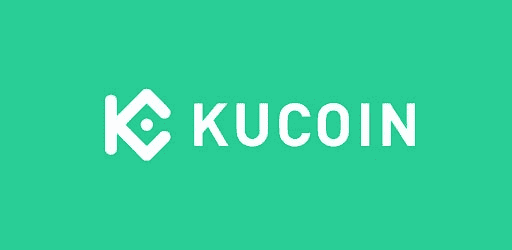
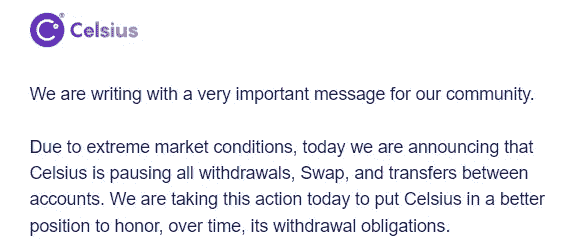
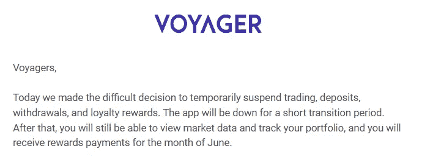
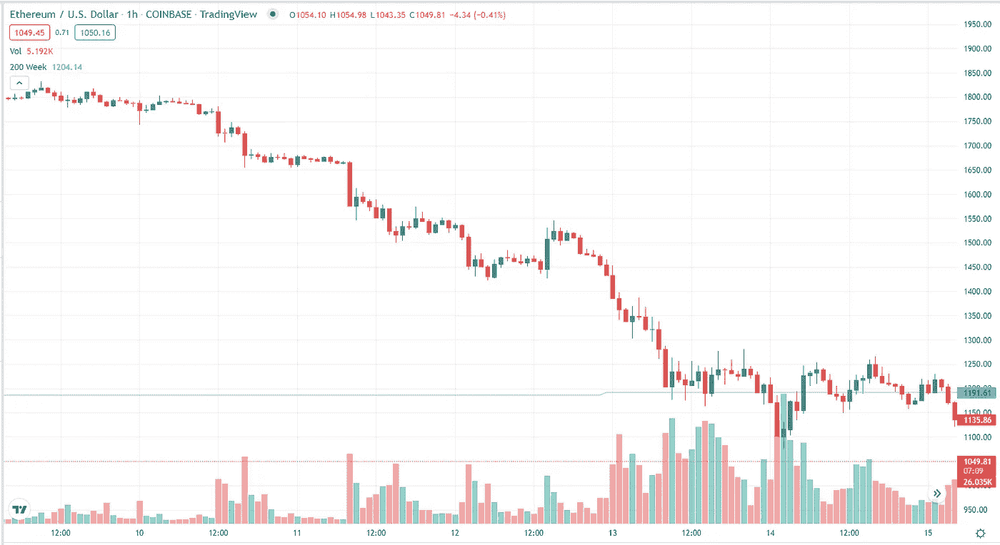
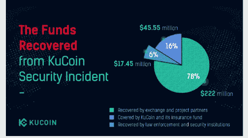

# Celsius，BlockFi，CoinFlex，现在的 Voyager……ku coin 到底有多安全？

> 原文：<https://medium.com/coinmonks/celsius-blockfi-coinflex-now-voyager-how-safe-is-kucoin-4a7bede052ad?source=collection_archive---------0----------------------->

The next domino or a winning bet?

在过去的几周里，我们看到了前所未有的传染病在主要平台和基金的加密市场中蔓延，似乎阻止了提款甚至申请破产。只是看看一些最大的玩家——Celsius、BlockFi 和 Voyager——让我们来看看一个快速的时间表…

**2022 年 6 月 12 日**——Celsius 创始人兼首席执行官 Alex Mashinsky 在推特上表示 Celsius 没有问题，并指责其他人传播 FUD 病毒:

**2022 年 6 月 13 日:** Celsius 向其用户发送备忘录，称他们正在冻结所有取款:

**2022 年 6 月 13 日**:为了让用户放心，BlockFi 发推称一切运行正常:

**2022 年 6 月 14 日**:航海家发布了一份[新闻稿](https://www.newswire.ca/news-releases/voyager-digital-provides-update-on-asset-and-risk-management-822816646.html?iterable_campaign_id=4466428&iterable_campaign_name=%5BBlast%5D%20%5BEmail%5D%20-%20Promo%20email%206/15&Iterable_template_id=6071455)，表示他们“资本充足，处于一个很好的位置，能够度过这个市场周期，保护客户资产。

**2022 年 6 月 17 日**:航海家号发布了另一份[新闻稿](https://www.prnewswire.com/news-releases/voyager-digital-signs-term-sheet-for-us200-million-and-15-000-btc-revolving-line-of-credit-with-alameda-research-301570656.html)报道称，他们与阿拉米达研究公司签署了 2 亿美元和 1.5 万美元 BTC 信用额度的条款清单。

**2022 年 6 月 21 日**:block fi 发推文宣布，他们也从 FTX 获得了 250 美元的循环信用贷款:

**2022 年 7 月 1 日:** Voyager 向其用户发出通知，交易、存款、取款和忠诚度奖励将暂停:

# 传染是真实的，但 FUD 可能不是……或者可能是？

因此，在 twitter 和 discord 上关注许多不同的 CeFi 和 crypto 交换平台后，传染病肯定正在发生，或者至少围绕传染病的 FUD 肯定正在发生。也许每个平台现在都被要求提高透明度，人们会问更多关于如何/是否利用杠杆、资金是否涉及算法稳定性的问题，或者换句话说，基本上是平台的收益是如何产生的，以及这些方法如何获得高收益。

> 交易新手？试试[加密交易机器人](/coinmonks/crypto-trading-bot-c2ffce8acb2a)或者[复制交易](/coinmonks/top-10-crypto-copy-trading-platforms-for-beginners-d0c37c7d698c)

加剧当前 FUD 水平的是信息的快速周转，人们在某一天被告知传播 FUD 阻止提款(就像马辛斯基的情况一样)，然后几乎不到一天之后…冻结所有提款。我相信马辛斯基的意图是欺骗投资者吗？不。事实上，看看$ETH 在他激烈的推特交流中，似乎 Celsius 关闭其提款的真正原因是因为价格行动正在这样做:

我相信他在为他的公司和用户拼命奋斗吗？是的。然而，人们的意图不一定等同于信任，在这些情况下发生的事情会导致人们失去信心，即使是由于任何人都无法控制的力量，如$ETH 在不到 48 小时内下跌了-40%。

# 库科恩是下一个吗？

就在最近的 7 月 2 日，几个不同的著名加密影响者发出警报，KuCoin 可能已经破产，人们应该撤回他们的资金:

为什么警报会响？主要是因为这条推特:

如此大规模的流动性流失，人们立即认为这是银行挤兑的信号，但事实上，这后来被证实是一次库币到库币的钱包转账:

这一系列事件(在不到 24 小时的时间内发生)导致了连锁反应，许多人试图同时从 KuCoin 提取他们的所有资金，但却面临着漫长的等待时间和网络拥塞……这最终导致了更多的 FUD。

# 那么库科恩现在处于什么位置呢？

显然，没有人能说出事情的长期发展，但在撰写本文时，KuCoin 从未阻止提款，据我所知，没有确凿的事实证明他们资不抵债。KuCoin 的首席执行官兼创始人 Johnny Lyu 也在推特上写道:

事实上，我能找到的唯一可靠信息显示了 KuCoin 的不同表现——就在上个月，他们通过 B 轮融资筹集了 1.5 亿美元，使他们的总估值达到 100 亿美元。(客观来看，在 2018 年的首轮融资中，他们筹集了 2000 万美元。)除了提高估值之外，KuCoin 还公开宣布，7 月 1 日/2 日的 FUD 之前的*和 6 月 12 日的*之后的*危机开始蔓延，尽管市场崩盘，他们仍在扩张和招聘:*

我个人认为这是一个非常好的迹象，表明他们能够在熊市增加员工，而许多其他平台(即[比特币基地](https://www.cbsnews.com/news/coinbase-layoffs-cryptocurrency-sell-off-brian-armstrong/)、[双子星](https://techcrunch.com/2022/06/02/gemini-lays-off-10-of-workforce-as-the-crypto-revolution-enters-its-contraction-phase/))都在大幅减少员工。

# KuCoin 安全吗？

首先让我们把这里缩小一点。回到 2020 年 9 月，Kucoin 经历了有记录以来最大的一次黑客攻击，估计损失了 2.8 亿美元。回应？由于他们的快速和周密的反应，他们能够追回大约[84%的被盗资金，并用自己的资金支付剩余部分，导致没有用户在事件中遭受任何损失。](https://news.bitcoin.com/kucoin-boss-on-strategy-after-hack-we-chose-to-act/)":

与其他重大安全漏洞和黑客攻击相比，KuCoin 从未真正错过任何机会，难怪它如此受欢迎，目前已跻身加密货币现货交易所前五名。此外，KuCoin 承诺在即将发布的 2022 年 H1 评估报告中变得更加透明:

这些都是积极的迹象，有助于建立信任和信心。但正如我之前提到的，我怀疑的一面告诉我，我们以前听过这个故事(即 BlockFi，Voyager，Celsius)，当然，叙事总是有可能迅速改变。

还有一点要提的是我在 KuCoin 的个人经历——如果你关注了我之前的[篇文章](https://www.publish0x.com/jaik83/psa-check-your-addresses-and-enable-as-many-ways-as-possible-xmmeglv)，早在 12 月，我在 KuCoin 上犯了一个新手错误，试图通过 polygon 而不是 ERC20 进行 USDC 存款。这个错误导致我的资金进入了可怕的加密无人区。起初我吓坏了，因为我听说过许多人无法追回数千美元错误转账的恐怖故事，在与 KuCoin 的客户服务快速聊天后，我终于能够将我的资金放回钱包，这让我大大松了一口气。KuCoin 没有花钱从加密领域的一个常见错误中吸取教训，而是保释了我并给了我退款。对我来说，这让我更加尊重 KuCoin 的商业行为，我想 2020 年黑客攻击的受害者也有同样的感受。

# TLDR，关键要点

当我看到不同的推特上流传着一些围绕库科恩的 FUD 时，我也感到震惊，但进一步挖掘，很明显这些谣言是没有根据的。KuCoin 的反应迅速而果断，似乎自成立以来一直如此。

库币有可能下跌吗？对于完美风暴来说，当然是，但你可以从根本上说，任何集中交易。有没有迹象表明在不久的将来会这样？我认为没有，如果你有任何相反的证据，我会很有兴趣听听。事实上，我能找到的所有信息都指向相反的方向，即 KuCoin 正在增长，而且事实上增长速度很快。

有兴趣亲自尝试一下 KuCoin 吗？考虑使用我的推荐代码:【https://www.kucoin.com/ucenter/signup?rcode=r3GKBZX】T2 来支持我和我的博客。我以前写过关于 KuCoin 的文章，它们有很多很酷的功能，比如增选采矿、交易机器人和新的[学习和赚取](https://www.kucoin.com/blog/learn-and-earn-with-kucoin-rewards-hub-2.0)计划。如果你看一看他们的[公告](https://www.kucoin.com/news/categories/announcements)，页面，就会发现*不断有*新事物出现，伴随着新的竞争、促销、上市和赚钱机会。

一如既往，感谢您的阅读，并确保在 twitter 上关注我，以接收我所有的最新更新:[https://twitter.com/CryptosWith](https://twitter.com/CryptosWith)

声明:这些信息都不是财务建议，只是我在网上随便找的一个人的推测。请考虑这纯粹是教育和娱乐的目的。像往常一样，请做你自己的研究或联系财务顾问，找到什么投资可能最适合你。