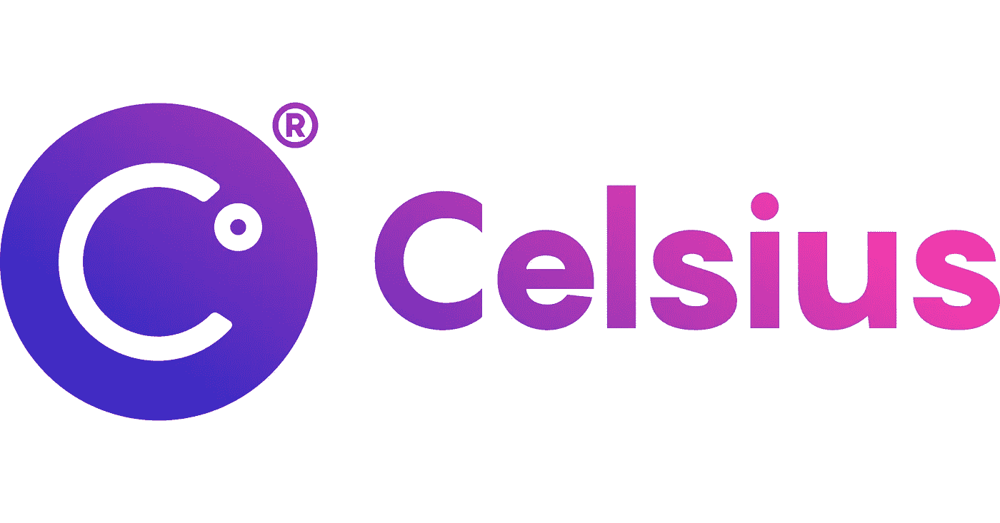

# 第三部分:破产

> 原文：<https://medium.com/coinmonks/celsius-part-3-bankruptcy-7a985a9ce77a?source=collection_archive---------24----------------------->

在我们上个月报道的 Celsius 新闻的更新中，CeFi 平台现已正式申请第 11 章破产。此外，该公司的资产负债表上有一个 12 亿美元的漏洞，令人怀疑它是否有可能东山再起。

像 Voyager 和 Vauld 一样，他们最近也申请了第 11 章破产，Celsius 的举动将允许该公司在重组过程中保持运营。

“在今天提交申请之前，Celsius 上月做出了艰难但必要的决定，暂停其平台上的取款、掉期和转账，以稳定其业务并保护其客户。如果没有停顿，加速提款会让某些客户——那些首先采取行动的人——获得全额付款，而让其他人留下来，等待 Celsius 从非流动性或较长期资产配置活动中收获价值，然后才能获得恢复，”——Celsius 的声明

Celsius 报告说，它手头有 1.67 亿美元的现金，并将继续冻结客户的提款，同时它将采取必要的步骤来完成第 11 章的重组过程。

“对于我们的社区和公司来说，这是一个正确的决定，”Celsius 的联合创始人兼首席执行官亚历克斯·马辛斯基说。

虽然看到 Celsius 试图东山再起可能令人振奋，但该公司是否能成功度过这个无所不包的加密冬天令人怀疑。破产申请披露了一些有关 Celsius 及其财务状况的严重危险信号。

据报道，当该公司正在寻找解决其财务困难的方法时，FTX 加密交易所退出了收购 Celsius 的潜在交易的谈判，指出 Celsius 的资产负债表上有“20 亿美元的漏洞”。”— Coindesk

Celsius 现已向 Aave、Compound 和 Maker 等 DeFi 协议偿还了近 7.16 亿美元的债务。结果，他们收回了近 14 亿美元的资产，其中大部分是包装好的比特币(wBTC)和锁定作为贷款抵押品的押品以太(stETH)。

> 交易新手？试试[加密交易机器人](/coinmonks/crypto-trading-bot-c2ffce8acb2a)或者[复制交易](/coinmonks/top-10-crypto-copy-trading-platforms-for-beginners-d0c37c7d698c)

首先，Celsius 的商业模式是不可持续的，随着最近的市场低迷，这种模式不可避免地崩溃了。只有时间才能证明，陷入困境的 CeFi 平台能否摆脱这种局面，并为其数百万用户做正确的事情，这些用户有理由担心再次看到自己的钱。

感谢您的阅读。

看看我在推特上未经过滤的想法:

【https://twitter.com/wasifmrahman 

在 LinkedIn 上关注我的职业生涯:

 [## Wasif Rahman -美国纽约布鲁克林|职业简介| LinkedIn

### 我觉得用第三人称谈论自己有点奇怪，所以请原谅这种直接的语言。我在……

www.linkedin.com](https://www.linkedin.com/in/wasifmrahman/) 

我对媒体的另一个想法是:

 [## 瓦西夫·拉赫曼-中号

### 阅读瓦西夫·拉赫曼在媒介上的作品。Web 3 德根 Ex Populus 营销伙伴关系总监。每天…

medium.com](/@wasifmrahman) 

阅读第 1 部分:持续崩溃的 Web 3 崩溃

 [## 第一部分:持续崩溃的 Web 3 崩溃

### 如果你今天还没有检查你的加密文件夹…帮你自己一个忙，走出去，触摸一些草和呼吸…

medium.com](/coinmonks/celsius-and-the-web-3-crash-that-keeps-crashing-7fe9bc5427fd) 

阅读第二部分:亚历克斯·马辛斯基的傲慢

 [## 第二部分:亚历克斯·马辛斯基的傲慢

### 亚历克斯·马辛斯基(Alex Mashinsky)是 Celsius 的创始人，他以憎恨银行而闻名。在最近的一集，著名的互联网…

medium.com](/coinmonks/celsius-part-2-the-hubris-of-alex-mashinsky-9cd594bf61c) 

来源:

[https://www . coin desk . com/business/2022/07/14/celsius-files-for-chapter-11-bankrupcty/](https://www.coindesk.com/business/2022/07/14/celsius-files-for-chapter-11-bankrupcty/)

[https://www . coin desk . com/business/2022/07/14/celsius-acknows-12 b-hole-in-balance-sheet/](https://www.coindesk.com/business/2022/07/14/celsius-acknowledges-12b-hole-in-balance-sheet/)

[https://www . Business wire . com/news/home/20220713005911/en/Celsius-Network-Initiates-Financial-registration-to-stabilized-Business-and-maximized-Value for All-Stakeholders](https://www.businesswire.com/news/home/20220713005911/en/Celsius-Network-Initiates-Financial-Restructuring-to-Stabilize-Business-and-Maximize-Value-for-All-Stakeholders)

 [## 随着加密贷款机构 Celsius 申请破产，储户的希望越来越小

### 四面楚歌的加密贷款公司 Celsius Network 周三晚间表示，该公司已申请破产，这进一步打击了…

www.washingtonpost.com](https://www.washingtonpost.com/business/2022/07/13/crypto-bankruptcy-celsius-depositors/) 

> 加入 Coinmonks [电报频道](https://t.me/coincodecap)和 [Youtube 频道](https://www.youtube.com/c/coinmonks/videos)了解加密交易和投资

# 另外，阅读

*   [Bookmap 评论](https://coincodecap.com/bookmap-review-2021-best-trading-software) | [美国 5 大最佳加密交易所](https://coincodecap.com/crypto-exchange-usa)
*   [加密交易机器人](/coinmonks/crypto-trading-bot-c2ffce8acb2a) | [造币评论](https://coincodecap.com/coingate-review)
*   最佳加密[硬件钱包](/coinmonks/hardware-wallets-dfa1211730c6) | [Bitbns 评论](/coinmonks/bitbns-review-38256a07e161)
*   [新加坡十大最佳加密交易所](https://coincodecap.com/crypto-exchange-in-singapore) | [收购 AXS](https://coincodecap.com/buy-axs-token)
*   [红狗赌场评论](https://coincodecap.com/red-dog-casino-review) | [Swyftx 评论](https://coincodecap.com/swyftx-review)