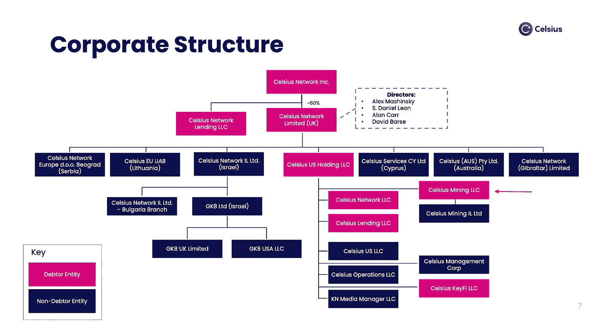
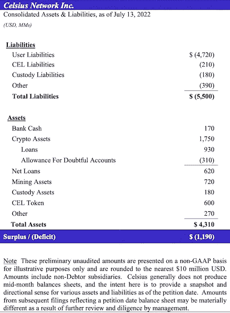

# Celsius 的重组和智能合同超级优先级

> 原文：<https://medium.com/coinmonks/celsius-reorganization-smart-contract-super-priority-16300a63c3ff?source=collection_archive---------22----------------------->

作者:[哈利勒·布莱恩特，法学博士](https://www.linkedin.com/in/khalil-bryant-a64a33111/)

本文以 Celsius 提出的重组为视角，讨论了在与加密相关的破产背景下智能合同的超级优先权。

第一部分为那些不熟悉破产程序的人提供了一些关于第 11 章破产的一般背景信息。如果你已经理解了破产的原因和方式，请跳到第二部分。第二部分解释了 Celsius 的商业模式和导致其破产的事件。第三部分探讨了 Celsius 有争议的重组计划。第四部分最后思考了智能合同如何比其他债权人享有超级优先权，包括被视为无担保债权人的客户。

# **I. Ch。11 破产又名重组**

*答:我们为什么需要破产？*

破产程序是美国经济的支柱。

美国经济是一个基于债务的货币体系。

例如，当你把钱存入银行的储蓄账户时，你实际上是把钱借给了银行，并期望这笔钱会产生利息。然后，银行将你的存款借给债务人，或者用这笔钱进行投资，期望获得正回报。银行从你的贷款/投资中获得的回报的一部分会以利息的形式给你。这个例子说明了我们经济中的所有交易都是基于债务的。

基于债务的货币体系的支持者认为，它们更具竞争力，资本流动更大，从而促进了创新和经济增长。

但如果没有破产，违约的债务人就没有救济，债权人也很难解决对共同债务人的冲突索赔。因此，借钱会变得极其昂贵，因为债务人不想在没有追索权的情况下借钱，债权人也不想在没有保护的情况下放贷。在基于债务的货币体系中，当资本成本变得高得令人望而却步时，创新就会受阻，经济就会衰退。破产程序有助于避免这种结果。

第一条，第八条，第十一款。美国宪法第 4 条授权国会制定“关于破产主题的统一法律”，自 1800 年最初的[破产法](https://fraser.stlouisfed.org/title/bankruptcy-act-1800-5846)以来，已经有了某种形式的立法破产程序。根据最高法院，破产程序的目的是"[解除诚实的债务人沉重的债务负担，并允许他重新开始，摆脱因商业不幸而产生的义务和责任。](https://supreme.justia.com/cases/federal/us/292/234/)“目前，美国破产法规定了六种不同类型的破产，包括第 11 章破产，也称为重组。

*B .重组的一些基本方面*

重组是为公司或合伙企业等公司实体保留的破产程序。其目的是允许破产企业重组其资本结构，以最大限度地提高债权人和投资者的回报。

一般来说，重组使破产债务人有机会作为"[债务人占有](https://www.law.cornell.edu/uscode/text/11/1107) " (DIP)继续经营其业务(即使这需要借入更多的资金)，直到重组计划提交法院批准。重组计划规定了债务人将如何在一段固定时间内继续经营其业务或清算其资产以清偿其债务。

作为 DIP，现有管理层或所有权充当公司资产的受托人，并继续支付重要费用，如工资和贸易/供应债务。DIP 融资是向申请破产保护的陷入困境的公司提供的一种融资形式。根据 [364(c)](https://www.law.cornell.edu/uscode/text/11/364) 的规定，提供 DIP 融资的债权人享有许多特权，包括债务人资产上的担保权益，优先于所有其他债权(即超级优先权)。这是为了补偿 DIP 债权人借钱给已经陷入困境的公司。

重组的另一个重要方面是根据 [362](https://www.law.cornell.edu/uscode/text/11/362) 的自动中止，冻结分割前债务，并禁止现有债权人在重组进行期间就他们所欠的钱与破产债务人联系。自动中止对重组过程至关重要，因为它使债务人能够深呼吸并专注于手头的任务。

保护债权人利益的一种方式是禁止优惠待遇。根据[第 547](https://www.law.cornell.edu/uscode/text/11/547) 条，受托人或 DIP 被允许收回在破产申请前 90 天内发生的某些转让，即所谓的“优先转让”。这项法令的目的有两个:1)确保破产前的财产不会耗尽，2)确保债权人得到公平和平等的待遇。

就本条而言，债权人之间的优先权是重组中值得注意的最后一个基本方面。考虑优先级最简单的方法是用一条规则来表示单行——不要跳过！(…除非你是一个短期债权人。)这个不可跳过的规则，也被称为“绝对优先规则”，见于 [1129(b)(2)](https://www.law.cornell.edu/uscode/text/11/1129) 。

概括地说，有两种类型的债权人:有担保债权人和无担保债权人。有担保债权人的贷款是有抵押的，或由属于债务人的特定资产担保的。因此，如果债务人未能偿还贷款，债权人有权扣押其担保权益所涵盖的资产。相比之下，无担保债权人是借钱给债务人的一方，除了债务人的合同还款义务之外，没有任何东西支持贷款。如果债务人未能偿还无担保贷款，那么债权人对债务人有合法的索赔权。

在单行中，有担保债权人总是排在无担保债权人之前。在有担保的债权人之间，谁先备案或完善谁就在前面。无担保债权人被分组在一起，根据其债权的性质进行分类，并由 [1102](https://www.law.cornell.edu/uscode/text/11/1102) 下的无担保债权人委员会代表。在对索赔进行分类时，目标是确保情况类似的索赔得到平等对待。尽管其优先权低于所有有担保债权人，但无担保债权人委员会通常由七个最大的无担保债权人组成，并对重组计划的方向具有重大影响。

DIP creditors get to violate the NO SKIPPING rule

DIP 债权人享有对债务人资产的所有其他债权的超级优先权，这意味着不可跳过规则不适用于他们。每当债务人重整旗鼓或清算资产时，破产债权人首先从剩余的资产中获得偿付。换句话说，他们被允许排在所有有担保和无担保债权人的前面。请记住，这是公平的，因为他们承担了最大的风险，继续向一家已经陷入困境的公司提供资金。

随着第 11 章破产程序的一般背景信息的方式，文章现在将转向摄氏温度。

# 二。摄氏温度的下降

*A .摄氏网络概述*

Celsius Network Inc .成立于 2018 年，是一家加密借贷平台。其[关键业务部门](https://cases.stretto.com/public/x191/11749/PLEADINGS/1174907182280000000001.pdf)是 1)零售利息存款账户、借贷服务和托管服务，2)机构借贷服务，3)比特币挖掘，以及 4)部署。

零售利息存款账户被称为[赚取计划](https://celsius.network/earn)，它模仿传统银行，允许用户存入加密货币，然后由 Celsius 借给零售和机构借款人，为用户带来回报。截至 4 月份，这项服务仅提供给合格投资者，此前[美国监管机构迫使 Celsius 禁止非合格投资者使用该功能](https://www.coindesk.com/business/2022/04/12/celsius-bans-us-non-accredited-investors-from-earning-crypto-rewards/)。

被称为[借款计划](https://celsius.network/crypto-loans)的零售借贷服务允许用户将加密货币作为抵押品进行存款，并获得美元或加密货币作为回报。像其他 DeFi 应用程序一样，用户必须超额抵押，这意味着他们必须用比贷款更有价值的抵押品来支持贷款。这保护了 Celsius 免受资产价格波动的风险。贷款的利率是基于支持它的抵押品的价值。

当用户在 Earn 或 Borrow 程序中发布他们的密码作为抵押品时，该密码的监护权将转移到 Celsius，他们可以随心所欲地使用它。用户可以选择接受奖励或者以平台自带代币 [CEL](https://celsius.network/cel-token-explained) 的形式赚取利息，从而获得更高的回报和利息折扣。在巅峰时期，Celsius 为储户提供高达 18%的利息回报。

零售保管服务细分市场本质上是一种钱包服务，让用户将他们的加密货币存储在一个安全的位置，同时保留对它的保管，而不是为了赚取收益。

Celsius 的机构借贷部门允许机构客户(如对冲基金和做市商)以根据客户信誉设定的利率借入资金。

比特币采矿部门是 Celsius 的摇钱树，通过其子公司 Celsius Mining LLC 运营。Celsius 自称是该国最大的比特币开采公司之一，目前有超过 43，000 台钻机在运行。令人印象深刻的是，这仅占其目前拥有的 80，500 套钻机的一半。今年早些时候，Celsius 曾计划让矿业子公司 T3 上市，但由于最近的财务困境，该公司很快放弃了这一计划。尽管如此，该公司报告称，计划到 2023 年，Q2 的钻机数量将增加到 112，000 台。

[Celsius Network Inc. Corporate Structure](https://cases.stretto.com/public/x191/11749/PLEADINGS/1174907182280000000001.pdf) w/ Red Arrow Indicating Celsius Mining LLC

部署部门将资产部署到各种 DeFi 协议(如 AAVE、化合物、MakerDAO)中，目的是产生收益。它还参与 CeFi 平台上的市场中立交易。

[截至今年 5 月，它向客户放贷超过 80 亿美元，管理着 120 亿美元的资产。](https://www.coindesk.com/business/2022/06/16/how-crypto-lender-celsius-overheated/)

*B .屎是怎么打到风扇上的*

这一切都始于 Terra Luna 的崩溃，它在 4 月开始的加密市场上引起了多米诺骨牌效应。由于 Celsius 战略的一个主要原则是将其资产部署和投资于其他平台以产生收益，其他加密平台的突然崩溃相应地导致其资产的总价值崩溃。3 月至 7 月间，Celsius 的数字资产持有量从 146 亿美元降至仅 17 亿美元。资产价值的急剧下降，加上用户试图提取资产的普遍恐慌[迫使 Celsius 出于流动性考虑，于 6 月 12 日](https://bitcoinist.com/lending-platform-celsius-freezes-withdrawals/)冻结了用户奖励、提取和转账。仅仅一个多月后，Celsius 申请了 Ch。11 债权人的保护。

[Celsius Balance Sheet showing deficit of $1.2 Billion](https://pacer-documents.s3.amazonaws.com/115/312902/126122257414.pdf)

[Celsius 首席执行官 Alex Mashinsky 认为，问题在于公司发展得太大太快](https://www.bloomberg.com/news/articles/2022-07-14/crypto-lender-celsius-files-for-bankruptcy-in-cash-crunch)。随着用户涌入该平台，产生更高收益率的需求上升，导致该公司进行风险越来越大的投资。除了在 Terra Luna 的投资失败，Celsius 在 staked Eth，stETH 的投资也失败了。Celsius 的大量资产也被用于各种 DeFi 申请，作为贷款的抵押品。[另一个致命的问题是，USDT 的发行人 Tether 清算了一笔给 Celsius](https://www.coindesk.com/business/2021/10/07/tether-has-lent-1b-to-celsius-network-report/) 的 10 亿美元贷款。在一份法庭文件中，[公司承认其资产负债表](https://www.coindesk.com/business/2022/07/14/celsius-acknowledges-12b-hole-in-balance-sheet/)上有一个 12 亿美元的漏洞，在只有 43 亿美元资产的情况下欠了 55 亿美元。

# 三。Celsius 有争议的重组计划

到目前为止，Celsius 的重组方法已经遇到了流血的呼吁。

许多账户被锁定的客户对 Celsius 尚未解冻他们的资产感到不安。但是，[根据 Celsius 的法律顾问](https://cointelegraph.com/news/celsius-lawyers-claim-users-gave-up-legal-rights-to-their-crypto)的说法，这些投诉都被置若罔闻，因为 Earn and Borrow 计划的服务条款明确规定资产所有权转移给 Celsius。另一个与锁定资金相关的问题是，Celsius 是否会选择收回根据 547 禁止特惠待遇条款申请破产前 90 天内进行的某些交易。

此外，Celsius 声称，由于加密市场目前处于低迷状态，客户更愿意等待加密冬天的结束，而不是立即收回他们的资金。假设，作为重组的一部分，该公司计划继续部署这些锁定资产，以产生收益来偿还债务。另一种选择是客户以极低的折扣收回资产。目前，即使那些持有 Celsius 零售保管服务钱包的人也无法提取或转移他们的资产，尽管该产品的服务条款从未将所有权转移给 Celsius。

比特币基地在最近的一份表格 10Q 中提出了类似的主张，称:

> “因为托管[原文如此]持有的加密资产可能被视为破产财产的财产，在破产的情况下，我们代表客户托管的加密资产可能会受到破产程序的影响，这些客户可能会被视为我们的一般无担保债权人。”

换句话说，如果比特币基地申请破产，资产由比特币基地保管的客户将是最后一个收到资产的人。

同样，Celsius 的法律顾问质疑托管服务的用户是否应该受到与 Earn 和 Borrow 程序用户不同的待遇。零售客户对此很不满意，因为保管服务和赚取和借贷计划都被宣传为独立的产品。本月初，代表约 1.8 亿美元索赔的监护权索赔人聘请了法律顾问，并起诉 Celsius 要回他们的钱。

尽管 Celsius 被广泛认为是一个加密贷款平台，但它现在正在加倍巩固其作为主导比特币矿商的地位。[其重组计划的大部分集中在通过扩大运营中的钻井数量来增加比特币采矿部门的收入](https://fortune.com/2022/07/19/celsius-network-bankruptcy-crypto-pay-back-customers-mine-bitcoin/)。由于其矿业子公司在其第 11 章申请中也被列为债务人，Celsius 必须获得法院对相关费用的批准。

[在第一次破产听证会上，Celsius 要求法院批准 500 万美元用于完成其采矿设施的建设，并支付海关当局扣留的采矿钻机的关税](https://www.coindesk.com/policy/2022/07/19/celsius-lays-out-mining-focused-reorganization-plan-at-first-bankruptcy-hearing/)。据 Celsius 的法律顾问称，采矿部门每天开采 14.2 BTC，预计到 2022 年底开采 10，100 BTC。

周二，[法院不顾债权人和司法部](https://www.forbes.com/sites/emilymason/2022/08/16/celsius-gets-permission-to-sell-mined-bitcoin-claims-lenders-lining-up/?sh=326af3cc5438)的反对，批准 Celsius 出售新铸造的 BTC，称这是该公司自行决定的商业决定。重要的是，收益将与公司的现金管理系统分开。

尽管法院到目前为止一直支持 Celsius 的计划，但对该计划的有效性仍有疑问。Celsius 的采矿计划雄心勃勃，希望到 2023 年开采 15，000 BTC。去年，Celsius 仅开采了 3114 BTC。

在本周的听证会上，负责此案的法官强调了尽快解决与监护权申请人的纠纷的必要性。

# 四。智能合同超级优先级

Celsius 的破产引发了许多新问题，包括如何对待欠 DeFi 申请人的债务，以及相对于其他债权人由智能合同管理的债务。

智能合约是用计算机代码编写并在区块链上执行的自动执行合约。

智能合约有很多好处，比如交易双方之间不需要中介或信任。因为它们是自治的，一旦规定的条件得到满足，契约就被强制执行。

另一方面，智能合约的缺点是智能合约风险；也就是说，智能合同的安全性取决于底层的计算机代码。如果有一个错误的条件，代码是不安全的，或者有任何其他需要以某种方式改变合同，这可能是非常困难和昂贵的。

听起来很像雇佣律师哈哈

在 DeFi 应用程序中，智能合约允许在没有任何监督的情况下执行交易。但是，在破产背景下，这是有问题的，因为它导致了对 DeFi 债权人的优惠待遇。

陷入困境的加密公司必须在任何人之前还清债务，因为不这样做将导致贷款违约，他们失去资产。换句话说，受智能合同管辖的债务相对于其他债权人享有超级优先权，因为智能合同的自主性质使得债务不可避免。智能合同的这一特点使得传统的破产保护(如自动中止和禁止优惠待遇)失效。

例如，在破产前一个月，Celsius 向 DeFi 申请支付了超过 9 亿美元的债务，同时客户账户被冻结。

许多批评家断言这是不公平的优待。其他人认为，有必要在申请后保持公司资产的价值，特别是考虑到支持贷款的抵押品的价值比相应的债务更有价值。

在我看来，智能合约享有这种超级优先权的一个问题是，它们是加密公司债务结构的一个组成部分，但很大程度上没有被报道。

寻求高收益的加密公司可能会相互勾结，以牺牲客户为代价进行高风险的地下交易，不幸的是，直到高风险的努力适得其反时，他们才会暴露出来，就像他们对 Celsius 所做的那样。而且即使一旦暴露，这些智能合约仍然能够享有相对于其他债权的超级优先权，包括客户作为无担保债权人的债权。

换句话说，他们会跳过这条线。

DIP 债权人可以跳过这条线，因为他们向一家已经陷入困境的公司提供融资。对于破产前签订的智能合同所管辖的债务合同，没有同样的正当理由。

总而言之，对有意义的密码监管的需求比以往任何时候都更加重要。

或许在整个过程中，所有冠冕堂皇的秘密人物都在高呼“WAGMI”(“我们都会成功”)，这实际上是一个以散户投资者为代价的内部笑话。

不幸的是，crypto 的一些最大的巨头已经选择放弃 WAGMI 叙事，但也许这应该是可以预见的。屎打在粉丝身上，最终目的是生存。你必须活下去，以迎接下一场战斗。

重组的美妙之处在于，它给那些伸手摘星的公司一片可以依靠的乌云。

但是，如果我们不小心，失败的密码巨头可能真的会倒在建立他们的客户的坟墓上。

当前和即将到来的加密破产浪潮将继续提出许多新问题，并为管理数字资产开创一些开创性的先例。

> 交易新手？试试[加密交易机器人](/coinmonks/crypto-trading-bot-c2ffce8acb2a)或者[复制交易](/coinmonks/top-10-crypto-copy-trading-platforms-for-beginners-d0c37c7d698c)