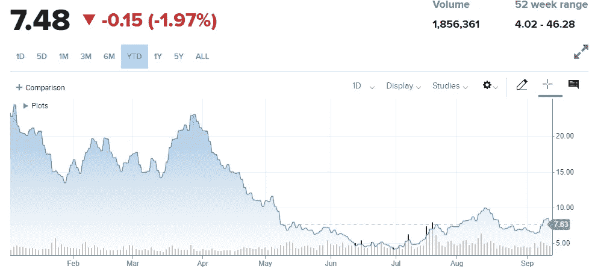

# Celsius 更新——比特币挖矿能拯救 Celsius 的储户吗？

> 原文：<https://medium.com/coinmonks/celsius-updates-can-bitcoin-mining-save-celsius-depositors-45d2c70f3d08?source=collection_archive---------7----------------------->

嘿，伙计们，作为 6 月[日](https://www.cnbc.com/2022/06/13/crypto-lender-celsius-pauses-withdrawals-bitcoin-slides.html)Celsius 破产申请的受害者之一，我认为最近有一些有趣的发展值得强调，也有一些希望的曙光值得关注。首先，让我们回顾一下最近几周发生的一些与 Celsius 相关的事件。

# 摄氏度“像”一个庞氏骗局

Coindesk 在 9 月 7 日发表了一篇相当[的谴责文章，指出摄氏温度除了从根本上无法产生收入来支付他们宣传的收益之外，还可能人为地夸大了他们本地$CEL 令牌的健康和价格，因此使用新用户的存款来支付现有用户的收益。](https://www.coindesk.com/policy/2022/09/07/celsius-misled-investors-about-financial-health-vermont-regulator-alleges/)

我知道“庞氏骗局”和“庞氏经济学”这两个词在秘密领域很容易被提起，但我不同意所有失败的项目都是庞氏骗局这一事实。例如，Terra Luna 的崩溃，我认为是因为算法支持的稳定硬币的根本缺陷，或者换句话说，是一个破碎的系统——而不是因为庞氏骗局。然而，在 Celsius 一案中，如果这些指控是真的，它们就符合庞氏骗局的定义。

# 泄露了甲板上所有人的电话

更近的是，9 月 8 日[泄露了一个内部会议](https://www.youtube.com/watch?v=40-w9r7WSKM)的音频电话。至于首席执行官亚历克斯·马辛基对摄氏温度的态度，可以用一句话来概括:

> **“百事申请了两次破产，对吧？它会让百事可乐的味道变得不那么好吗？”德尔塔申请破产了，对吧？你不飞达美航空是因为他们申请破产了吗？”**

换句话说，似乎马辛斯基正在将此视为更大更好地重建 Celsius 的有机过程的一部分——该计划被称为“开尔文计划”或“Celsius 2.0”。一些员工在会议中提出的一个问题是，这项任务有多艰巨，因为许多用户已经对 Celsius 失去了大量信任，更具体地说，是对 Alex Mashinsky 本身失去了信任。Mashinsky 的回答很像是一种“如果你建立了它，他们就会来”的态度，提到如果他们建立了足够好的产品，Celsius 就可以再次被信任。

“开尔文”计划围绕着建立托管服务的想法——听起来类似于比特币基地托管中心或 T2 托管中心。这与 Celsius 之前报道的建立 BTC 矿业部门 Celsius Mining LLC 形成了鲜明对比。

# 摄氏矿业有限责任公司

如果你读过我在[上一篇关于 Celsius 崩溃的文章](/coinmonks/observations-from-celsius-legal-plan-6439620f264c)，你会记得有一些关于 Celsius 利用其矿业子公司来帮助自己摆脱困境的猜测。基本上，通过使用$BTC 矿工，他们希望它有足够的利润来生产[“2022 年生产 10，100 个比特币，现在每天开采 14.2 个比特币。”](https://www.cryptotimes.io/celsius-presents-a-reorganization-plan-focused-on-mining/)

这一想法无疑获得了许多储户的青睐，并被作为一种可行的方案来讨论，以弥补人们的损失:

该计划的细目包括以下内容:

1.  假设 Celsius 的资产负债表上有 30%的漏洞，人们将能够收到一个锁定时间的相应金额，更具体地说，他们在 Celsius 上持有的加密货币的剩余 70%。时间锁已经到位，以防止另一次银行挤兑。
2.  其余 30%的存款将被转换为 Celsius Mining，LLC 的股权或部分所有权，所有存款人合起来最终相当于该矿业公司至少 51%的所有权(或换句话说，多数所有权)。

# BTC 矿业公司的利润有多高？

完全披露，我是北美最大的比特币采矿公司之一$RIOT 的股东，已经有一年多了，以每股 50 美元左右的价格愚蠢地购买了接近 ATH 的股票(就像我说的，我肯定不是交易员)，目前每股价值不到 8 美元:

我不认为这个图表表明了矿业公司可能盈利，也可能不盈利，因为显然价格与加密货币市场的健康密切相关。我对 Riot 和其他矿业公司的假设是，一旦加密货币市场进入全面牛市模式，矿业公司的价格也会大幅上涨。

或者，重要的是要考虑如果$BTC 处于熊市中，采矿的利润会有多高。有一个死亡螺旋效应要认识到，许多矿业公司不得不抛售美元 BTC，以保持运行，这可能会开始一个循环，甚至更多的美元 BTC，因为抛售压力可能会导致进一步的价格倾销。

# 结论

话虽如此，目前似乎唯一可行的选择是要么公司清算(Celsius 将解散，并将他们能够出售的任何东西返还给客户)，要么 Celsius Mining，或者如他们在泄露的电话中所讨论的那样，将 Celsius 转变为一个托管计划。虽然至少在未来几年内(或至少在下一轮牛市到来之前)矿业公司可能不会再次看到梦幻般的挤兑，但在我看来，作为一名长期投资者和霍德勒，我宁愿这样做，也不愿可能什么都得不到，或再次信任马辛斯基的托管服务。

如果 Celsius 继续用股权偿还储户，那么我希望他们会负责任地这么做。我个人更希望马辛斯基不再参与其中，原因很简单，我不相信他会对我的资金负责。如果你一直在跟踪关于另一家矿业公司的[pool 的新闻，比如 Celsius，由于](https://www.poolin.com/)[破产问题](https://www.pymnts.com/cryptocurrency/2022/crypto-insolvencies-spread-as-top-bitcoin-mining-pool-halts-withdrawals/)他们不得不冻结提款，并且有人怀疑他们也像 Celsius 一样可能利用用户的资金作为资本来获得进一步的收益。

对于充满希望的前进道路，你有什么不同的建议吗？如果是这样的话(或者如果你对 Celsius 选择的前进方向有更多的问题或担忧)，我强烈建议你让无担保债权人官方委员会(【https://twitter.com/CelsiusUcc】)的人知道，或者至少我会通读他们的推文，因为有许多想法正在流传。

一如既往，再次感谢你的阅读，如果你还没有，请在这里和 twitter 上关注我，获取我所有的最新更新:[https://twitter.com/CryptosWith](https://twitter.com/CryptosWith)

免责声明:本文中的任何内容都不是财务建议。请自行研究和/或联系财务顾问，找出最适合你的投资。

> 交易新手？尝试[加密交易机器人](/coinmonks/crypto-trading-bot-c2ffce8acb2a)或[复制交易](/coinmonks/top-10-crypto-copy-trading-platforms-for-beginners-d0c37c7d698c)