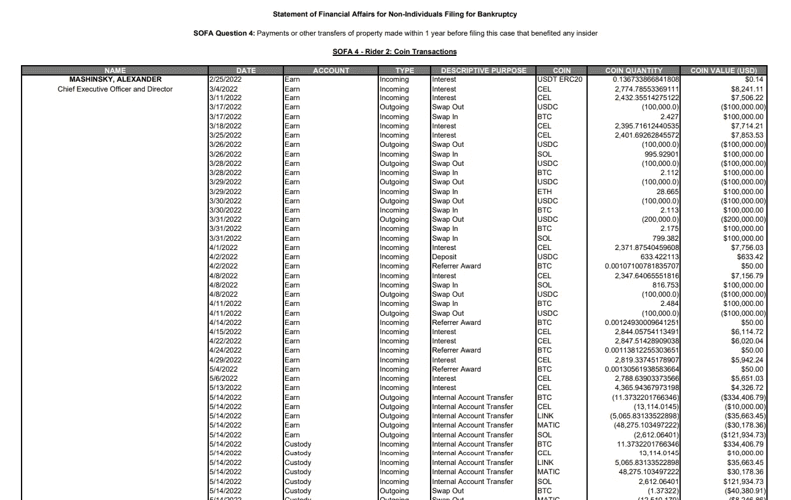

# 摄氏温度更新——检查你是否被 Doxxed

> 原文：<https://medium.com/coinmonks/celsius-updates-check-to-see-if-you-were-doxxed-f3953a912cf9?source=collection_archive---------3----------------------->

嘿，伙计们，如果你关注了我在 Celsius 上的其他文章( [1](/coinmonks/observations-from-celsius-legal-plan-6439620f264c) ， [2](/coinmonks/celsius-updates-can-bitcoin-mining-save-celsius-depositors-45d2c70f3d08) )，你就会知道我一直在尽最大努力关注围绕 Celsius 的新闻，以及这对所有的“无担保债权人”(包括我自己)来说意味着什么，[冻结了他们的代币。](https://www.wsj.com/articles/big-crypto-lender-celsius-freezes-all-account-withdrawals-11655096584)

我不知道马辛斯基一家到底是什么样的，但我发誓，我觉得跟踪他们就像看一场真人秀。令我惊讶的是，他们似乎没有意识到摄氏人正在经历的痛苦和折磨，这些痛苦是他们无意中造成的。我的账户里没有冻结足以改变生活的钱，但是有这么多人拥有这笔钱，想想就有点不知所措。

如果你像我一样，正在等着看接下来会发生什么，这里有一些自从我的上一篇文章[以来发生的更新:](/coinmonks/celsius-updates-can-bitcoin-mining-save-celsius-depositors-45d2c70f3d08)

# Celsius 的许多高管在锁定其他人的代币之前，提取了价值数千万美元的代币

10 月 5 日，一份[财务报表](https://cases.stretto.com/public/x191/11749/PLEADINGS/1174910062280000000005.pdf)被归档，详细记录了许多人的交易历史，以及在最终关闭前有多少人从 Celsius 中取出了代币。也许最大的名字包括前首席执行官亚历克斯·马辛斯基，他收回了价值超过 1000 万美元的代币，前战略主管丹尼尔·莱昂，他收回了价值近 700 万美元的代币。

好的，所以我完全理解为什么人们想要这么做的动机——如果你知道你的数百万美元将被冻结，除非你点击一个按钮…你可能也会这么做，对吗？但是，马辛斯基关于信任和社区的所有言论，对我来说是非常令人沮丧的。多少次我听到——“我们都在一起”——显然我们不是。有些人可以取出他们的资金，有些人不行。如果 Celsius 认为，当我们将代币交给 Celsius 时，我们都放弃了对代币的权利，这难道不应该适用于所有人，特别是那些最不负责任的贷款和风险的人吗？

# 这么多漏洞…

如果你还没有在 YouTube 上关注 Tiffany Fong，她已经成为事实上接收和分享消息的人:

在我上一篇关于 Celsius 的文章中，我提到了 9 月份的“[全体会议”](https://www.youtube.com/watch?v=40-w9r7WSKM&t=16s)，但从那以后她分享了更多的泄漏，包括[联合创始人(他也在 Celsius 崩溃前收回了代币)Nuke Goldstein 的恢复计划](https://www.youtube.com/watch?v=5YihvM0USw0)，以及 10 月 5 日 twitter 空间的摘录。

对于那些没有时间听近四个小时音频的人来说，听起来确实像是马辛斯基和/或其他人不顾一切地相信他(或更具体地说是 Celsius)可以再次赢回人们的信任，无论是通过 Celsius 采矿还是通过某种形式的 IOU 令牌。无论你认为这两个想法好还是不好，简单来说，似乎不会很快有任何类型的统一计划出台。马辛斯基在一件事上是正确的——人们不团结的时间越长，整个过程在法庭上拖得越久——将更多 Celsius 不断减少的资金投入法律费用。

# 马辛斯基脱离接触

因此，上个月，几件 t 恤上市销售，其中巧妙地提到了 Celsius 的关闭:

这里有争议的是，这家名为 usastrong.io 的商店归前首席执行官亚历克斯·马辛斯基的妻子克里斯·马辛斯基所有。更有争议的是，当被指出对因亚历克斯·马辛斯基的不负责任而失去资金(有些人失去了毕生积蓄)的数百万客户麻木不仁时，他们基本上加倍了努力:

这些漠不关心的反驳表明，这里有一个关于马辛斯基关心社区和他们想从社区中获利的根本脱节。换句话说，你不仅让一些人失去了他们的钱，而且你还从你让他们失去钱的事实中获利，同时还取笑他们。但是回到我的第一条，也许她不明白，因为她从来没有在同一条船上。根据 Coffeezilla 的说法，她也在 Celsius 关闭前兑现了 270 万美元:

再说一次，我不能责怪人们试图保护自己的钱，我只是希望他们能尊重那些不能做到的人。又一次，有人真的威胁要自杀，并在这里失去了他们一生的积蓄…

# 检查你是否被 doxxed(也检查你的索赔是否正确)

我不完全确定这是一个漏洞，还是由 Celsius 的法律团队故意为之，但一份大约 [14，532 页的文件](https://ia601401.us.archive.org/28/items/celsius/celsius.pdf)已经发布，其中似乎有每个 Celsius 申请人的 KYC 全名，包括我的！谢天谢地，似乎所有的个人地址都被修改了，但互联网侦探已经开始着手此事，揭示了一些人是如何偶然地(或可疑地)在正确的时间取出他们的钱:

尽管围绕这份文件发生了这么多戏剧性的事情，我还是建议再次核实一下你是否真的在名单上，以及你持有的资产是否准确——因为如果你不在名单上，那么我的猜测是，你可能没有被正确地列为索赔人。

# **结论**

老实说，事情似乎变得越来越糟糕，这让我感到惊讶，我想知道在未来的几周/几个月里还会有更多的事情被披露出来。

按照这种速度，我对这个问题解决的时间表变得非常悲观。考虑到 [Mt. Gox hack](https://buybitcoinworldwide.com/mt-gox-hack/) 发生在 2014 年，8 年后它们仍未修复，在这一点上，如果 Celsius 的过程更顺利，我会感到惊讶。

感谢你阅读我的意见，请一如既往地在 twitter 上关注我，阅读我的最新发现和更新:[https://twitter.com/CryptosWith](https://twitter.com/CryptosWith)

声明:这些信息都不是财务建议，只是我在网上随便找的一个人的推测。请考虑这纯粹是教育和娱乐的目的。像往常一样，请做你自己的研究或联系财务顾问，找到什么投资可能最适合你。

> 交易新手？尝试[加密交易机器人](/coinmonks/crypto-trading-bot-c2ffce8acb2a)或[复制交易](/coinmonks/top-10-crypto-copy-trading-platforms-for-beginners-d0c37c7d698c)