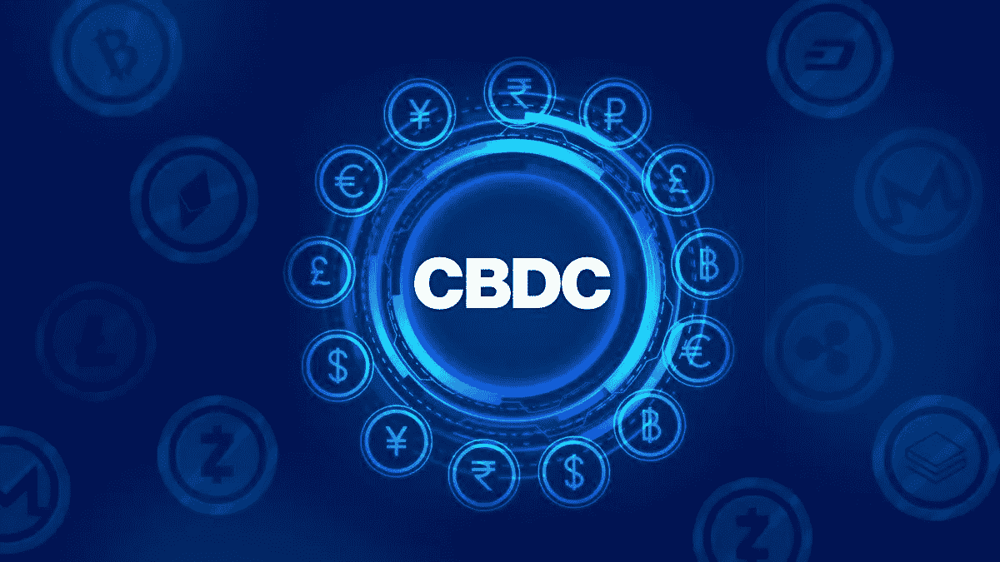
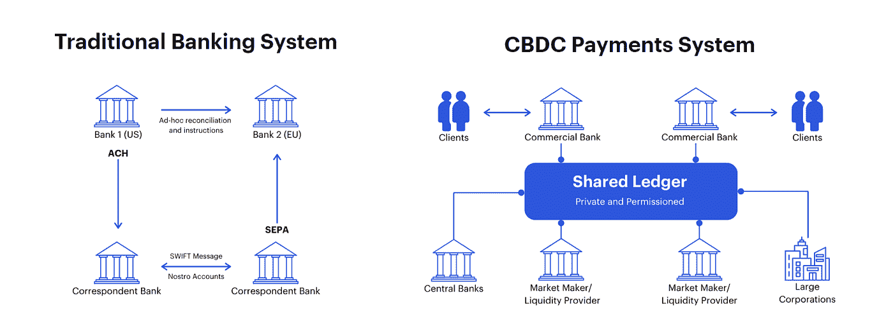
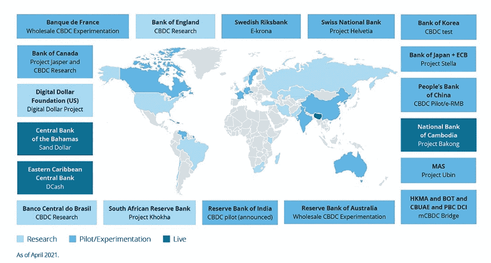
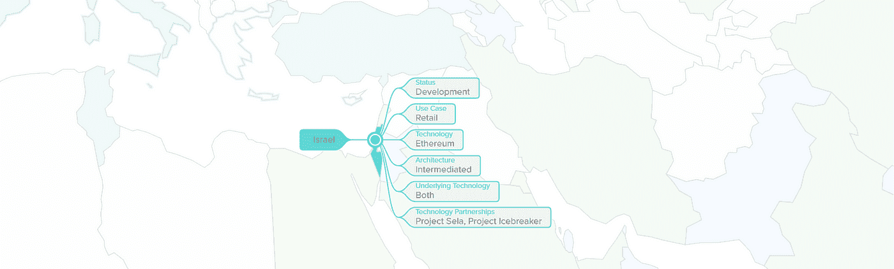
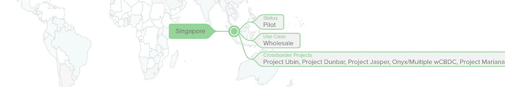
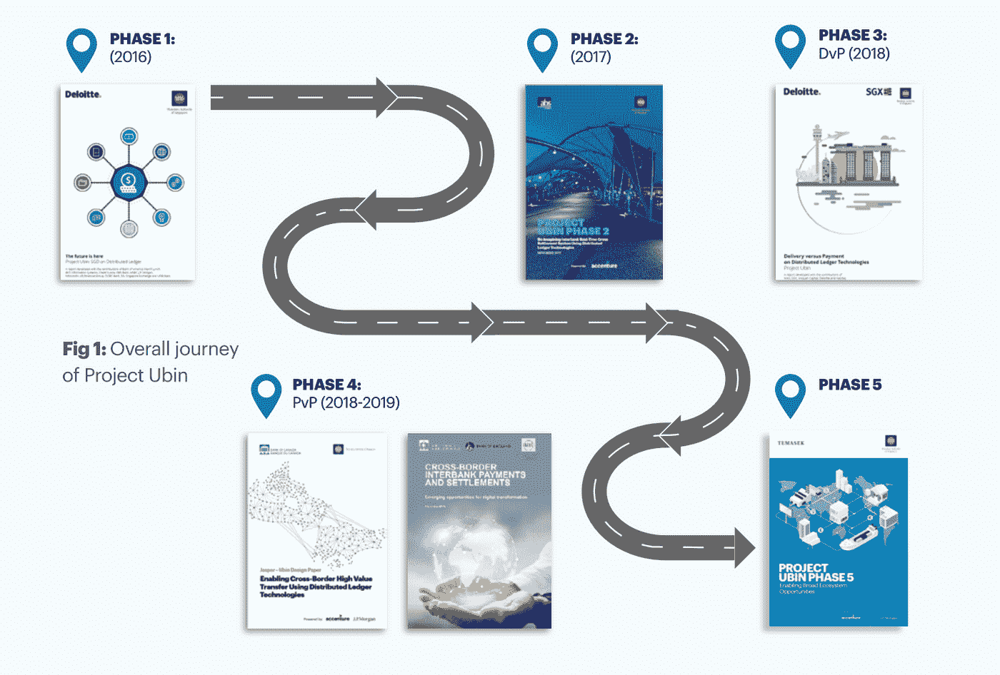
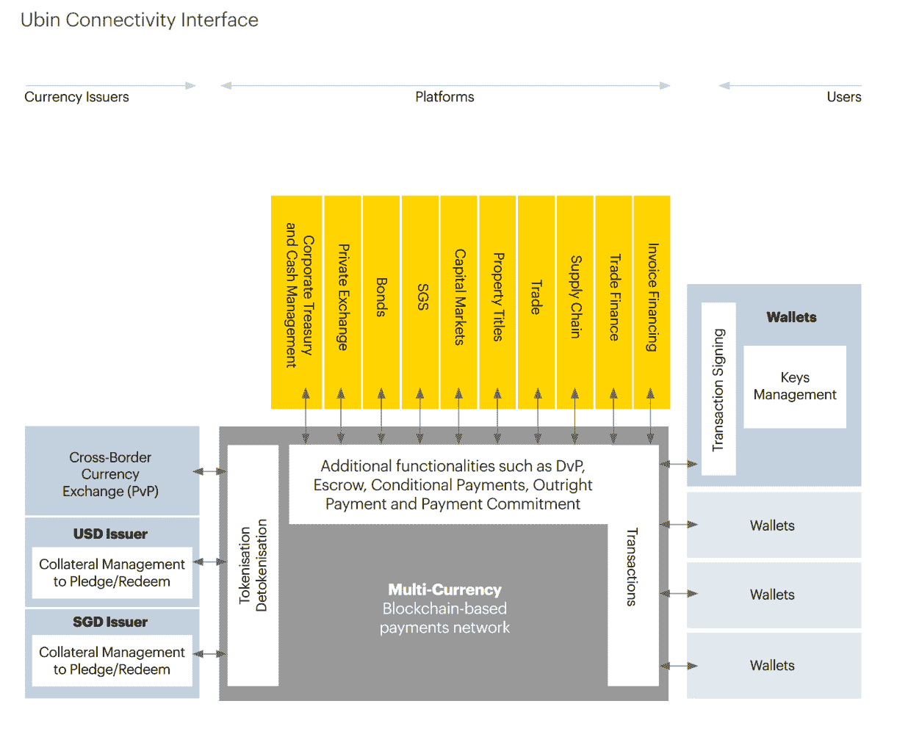
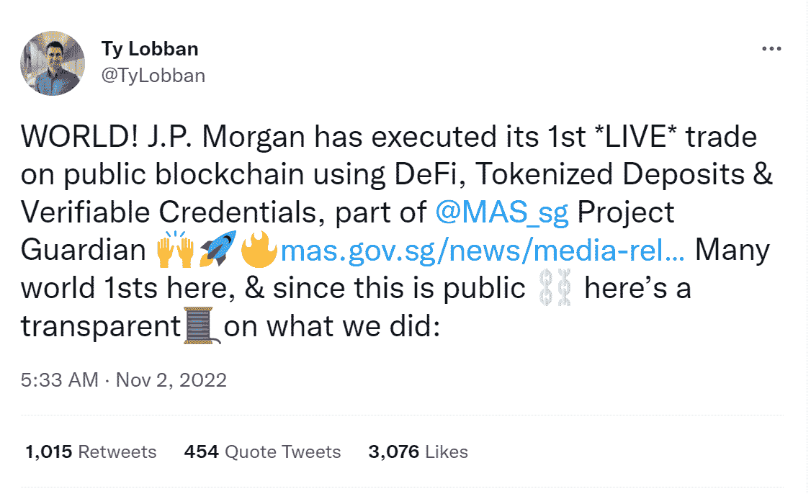
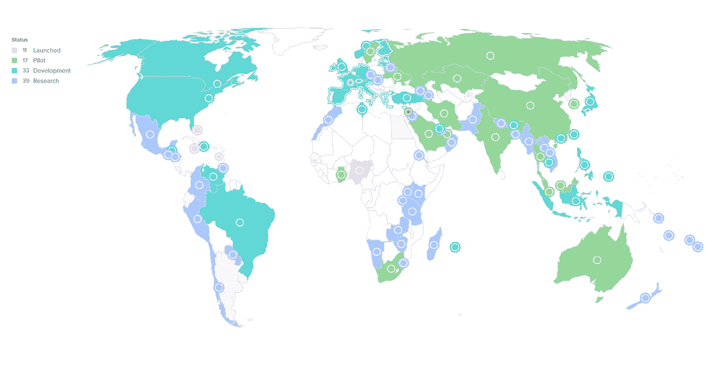

# 以太坊网络上的中央银行数字货币

> 原文：<https://medium.com/coinmonks/central-bank-digital-currencies-on-ethereum-network-822158bcc705?source=collection_archive---------8----------------------->

Flickr

# 介绍

中央银行数字货币(CBDCs)是由中央银行发行并记录在数字分类账中的数字代币。它们被认为是法定货币，由中央银行支持，类似于实物现金。但是，与电子现金不同的是，电子现金是由商业银行发行的，需要中介机构，而 CBDCs 是由中央银行直接发行的，不需要中介机构。

> 从顶级交易者那里复制交易机器人。免费试用。

经济的日益数字化以及对实时支付和结算的需求导致了 CBDCs 的发展，这可以促进更有效的国内和跨境货币交易。

Source: consensys.net

中国的数字货币和电子支付系统(DCEP)是世界上最先进的大规模数字货币之一，在主要城市进行了现场试验。巴哈马群岛、牙买加和尼日利亚也在其金融系统中实施了数字货币。欧洲央行行长克里斯蒂娜·拉加德表示，该机构可能会在不久的将来创造一种数字货币。

中央银行在实现 CBDCs 时可以采取不同的方法，本文将关注那些利用以太坊企业解决方案的方法。

**什么是企业以太坊？**

企业以太坊是公共以太坊代码库的私有或授权区块链版本。顾名思义，许可区块链需要进入的一部分。在许可链中，控制层运行在区块链之上，并监督所有授权参与者采取的行动，因此不会牺牲传统集中式系统中的权威。

有关以太坊企业解决方案的更多信息:

 [## 企业以太坊的发展和采用

### 介绍

medium.com](/coinmonks/growth-adoption-of-enterprise-ethereum-d7b9865717c9) 

# CBDCs 的类型

CBDCs 可用于零售和批发支付。零售 cbdc 是现金的数字版本，用于个人和企业之间的交易，而批发 cbdc 用于促进银行间结算，或银行和在中央银行有账户的其他实体之间的支付。正在测试 CBD 的央行对提供快速、低成本的支付选择特别感兴趣。

Source: Deloitte — An introduction to CBDCs

**零售 CBDC 的好处**

零售 CBDCs 用于个人与企业或其他个人之间的支付，类似于数字银行券。这些类型的 CBDCs 通常每天的交易量超过 1 亿笔。

使用零售 CBD 有几个好处。它们可以通过在移动设备上分发数字货币来增加数字货币的可用性，通过天生数字化和不需要昂贵耗时的对账过程来简化对账，通过降低支付部门新公司的准入门槛来促进数字创新，并通过赋予央行对货币供应的直接影响力来加强货币政策。

**批发 CBDC 的好处**

批发 CBDCs 用于促进银行间结算，或银行与在中央银行有账户的其他实体之间的支付。这些类型的 CBD 通常日交易量少于 100，000 笔。

批发型 CBD 也有一些好处，包括能够通过自动化和分散式净额结算解决方案改善银行间支付结算，通过实现跨境支付交易的支付对支付结算降低交易对手风险，通过提供大规模分散式清算中心和资产登记册参与数字资产市场，以及通过允许最终用户受益于简化的银行基础设施保持竞争力。

**CBDC 的弊端**

使用 CBDCs 也有一些缺点。其中包括货币到期政策，即 CBDC 账户中的钱如果没有在特定期限内用完，就可能到期。根据《华尔街日报》2021 年 4 月的一篇文章，中国已经用自己的 CBDC 测试了到期政策。

负利率也可能由中央银行利用中央银行实施，鼓励人们使用他们的钱或失去它们，以增加消费者支出。CBDCs 可能不允许完全匿名的交易，并可能使用某种形式的私人分类账，为中央银行提供“可控匿名”但可追溯性和透明度，这意味着所有金融活动将对中央银行可见。

央行也可以利用个人支出、储蓄和投资习惯的大数据库以及数字识别基础设施来定制货币政策。

# 以太坊上的 CBDCs

区块链技术给 CBDC 带来了独特的优势。尤其是以太坊是最适合生产的区块链，在可伸缩性和隐私方面支持 CBDC 需求。这是世界上最大的区块链生态系统，拥有超过 350，000 名开发者。

以下是一些目前正在利用以太坊企业解决方案探索、开发和测试他们自己的 CBDCs 的国家。

# 泰国

Source: atlanticcouncil.org

**状态:**试播

**技术:**以太坊——Hyperledger Besu

**时间表:**该试点将于 2023 年年中结束。

**概述:**泰国银行于 2020 年开始探索国内零售 CBDC，项目的早期阶段侧重于有条件支付和不同业务平台的集成。

自 2021 年以来，BOT 一直专注于 CBDC 的发行。2022 年 8 月，泰国确认其国内零售 CBDC 的试点将于 2022 年末开始。试点项目将包括一万名参与者，他们将与三家公司测试钱包的存款、转账和取款功能，这三家公司是 Ayudhya 公共银行有限公司、暹罗商业银行公共有限公司和 2C2P(泰国)有限公司。

# 澳大利亚

Source: atlanticcouncil.org

**状态:**飞行员

**科技:**以太坊——法定人数

**时间表:**在 2023 年初试点零售 CBDC。

概述:澳大利亚储备银行于 2020 年 11 月宣布，他们已与澳大利亚联邦银行、澳大利亚国家银行、永久和 ConsenSys 软件公司合作，探索基于 CBDC 的分布式总账技术。

这种伙伴关系将涉及为发行 CBDC 的令牌化形式创建一个概念验证，批发市场参与者可以使用该令牌化形式在基于以太坊的 DLT 平台上为令牌化银团贷款进行融资、结算和还款。这被称为原子工程。

Atom 项目于 2021 年结束，该报告为批发 CBDC 支付提供了技术和政策建议。2022 年 8 月，澳大利亚央行宣布，将对现有支付系统的缺口以及 CBDC 如何填补这些缺口进行研究。作为研究的一部分，澳大利亚央行将与数字金融合作研究中心(DFCRC)合作，创建一个有限的试点，以探索 CBDC 的创新用例。

在 2022 年 9 月发布的白皮书中，RBA 宣布将在 2022 年 11 月测试用例，并在 2023 年 1 月至 4 月进行试点。11 月，宣布向澳大利亚央行提交用例的开放期延长至 2023 年 3 月，目前已收到 140 份提交。

在州长 Lowe 12 月的一次讲话中，他阐述了 CBDC 的情况，并表示该银行正在研究一些用例，以在明年的试点中取得进展。他还表示，世行将于明年发布一份关于他们实验的报告。

# 以色列

Source: atlanticcouncil.org

**状态:**发展

**技术:**以太坊——法定人数

**时间表:**以色列银行将继续研究有关发行数字谢克尔的各种技术问题。

**概述:**自 2017 年以来，以色列银行一直在考虑发行电子谢克尔。2018 年 11 月，以色列银行的一个团队发布了一份报告，建议在不久的将来推迟发行数字货币。2021 年 5 月，世行宣布将进一步努力研发 CBDC。

2022 年 6 月，以色列银行发布了作为该项目的一部分进行的第一次技术实验的大纲和主要见解。该实验在实验室条件下进行，涉及在云上建立分布式账本技术(DLT)基础设施，以及应用基于以太坊的法定区块链。

以色列银行使用 ERC20 标准“发行”了“数字谢克尔”。在实验中，钱包识别代表数字谢克尔的令牌，并且可以从一个客户向另一个客户转移数字谢克尔。

以色列银行还进行了一个测试案例，研究了一种以出售车辆来换取数字谢克尔的情况。实验执行了一个过程，在这个过程中，汽车的所有权随着付款的转移而同时转移。为此，发行了具有 ERC 721 标准的不可伪造令牌(NFT ),显示售出的车辆，并编写了智能合同，激活三个基本操作:

1.出售车辆:拥有表明车辆所有权的 NFT 的卖方将车辆出售以换取一定金额。NFT 从卖方的钱包转移到智能合约的钱包。

2.购买车辆:持有数字谢克尔的买方同意以卖方提议的金额购买车辆。

3.取消:如果不满足支持交易的条件(例如，买方提供的金额低于卖方要求的金额)，卖方将取消销售，显示车辆所有权的 NFT 将离开智能钱包，将情况返回到开始。

本文档中描述的实验是以色列银行工作团队作为数字谢克尔项目的一部分进行的第一次技术实验。

# 挪威

Source: atlanticcouncil.org

**现状:**发展

**技术:**以太坊——纳赫米

时间表: CBDC 实验计划于 2023 年 6 月结束。

**概述:【2021 年 4 月，挪威银行宣布了未来两年的技术测试计划。2017 年，该行成立了一个内部工作组，研究数字货币。2018 年、2019 年和 2021 年，他们发布了前三个阶段研究结果的报告，主要是检查 CBDC 的目的和后果。**

第四阶段涉及技术测试，挪威银行引入了供应商 Nahmii 来帮助其沙盒项目。现在，开源代码已经可以在 GitHub 上使用，允许测试基本的令牌管理用例，包括铸造、燃烧和转移 ERC-20 令牌。

除了部署适当的智能合同和访问控制之外，Norges Bank 沙箱还包括一个自定义前端和网络监控工具。沙盒网络位于基本身份验证之后，只有具有适当凭证的用户才能访问，这意味着事务是私有的。Nahmii 表示，更复杂和有趣的用例，如批量支付、安全令牌和桥梁将很快出现。

# 新加坡

Source: atlanticcouncil.org

**状态:**试点

**科技:**以太坊——法定人数

**时间表:** **零售 CDBC** —目前新加坡对零售 CBDC 没有迫切需求，但要积极探索 2023 年和 2024 年 CBDC 发展的用例。不排除在不久的将来引入零售 CBDC。**批发 CBDC** —迄今为止，新加坡金融管理局的试验主要集中在涉及金融机构的批发跨境交易上。经过四年的发展，由新加坡 Ubin 合作项目发展而来的区块链本土支付清算和结算平台 Partior 已经上线。

**概述:批发 CBDC—Ubin 项目**

Ubin 项目是新加坡的一项研究，旨在评估区块链和分布式账本技术(DLT)是否可用于支付和证券结算。该项目始于 2016 年 11 月，结束于 2020 年 7 月，研究试验历时近 4 年。

Ubin 项目侧重于区块链和分布式账本技术的潜力，以改善国内交易和跨境支付，分 5 个不同阶段实施。

Source: mas.gov.sg — Project Ubin

**阶段 1:创建标记化的 SGD**

Ubin 项目的第一阶段旨在为进行银行间支付开发一个概念验证。一个基于加拿大银行的项目 Jasper 的原型系统被创建并在一个私有以太网上发布。原型使用新加坡元的数字版本，称为 SGD-on-Ledger，第一阶段结束时确定数字美元可用于支付和交易。

**第二阶段:分布式账本技术(DLT)用于实时结算的可行性**

Ubin 项目的第二阶段侧重于区块链技术维护银行交易隐私的能力及其对日常交易结算的有用性。不同的区块链公司提出了三个软件原型，每个原型都根据六个标准进行了评估:交易隐私、支付数字化、分散处理、支付队列处理、终结性和流动性优化。原型是使用 Corda、Hyperledger Fabric 和 Ethereum 的 Quorum 开发的，它们的功能和性能在隐私、可伸缩性、弹性和终结性方面进行了评估。

**第三阶段:基于分布式账本技术的国内交付与支付(DLT 的 DvP)**

在 Ubin 项目的第三阶段，新加坡金融管理局与新加坡交易所合作，探索在两个独立的平台上使用区块链技术进行国内货银两讫(DvP)结算。DvP 交易包括在证券交付前或交付时对证券进行支付。

为了测试跨不同区块链进行这些交易的可行性，三家公司在各种平台上提出了自己的原型，并根据四个目标进行了评估:现金和证券分类账之间的互操作性，即使它们建立在不同的区块链上；通过收回现金和证券分类账中的资产来降低风险；实现 DvP 结算终结；以及增强投资者信心和用户体验。

安泉资本、德勤和纳斯达克分别使用 Quorum、以太坊和 Hyperledger Fabric 以及 Chain Core 和 Hyperledger Fabric 开发了一个原型。在评估了不同的原型之后，项目的第三阶段得出结论，智能合同可以用来维持一个公平和透明的市场，DLT 可以将结算过程缩短到实时，智能合同可以用作解决争端的仲裁员，区块链可以允许在不暴露当事人身份的情况下核实交易。

然而，它还指出，智能合同的使用可能会影响流动性，因为一旦合同执行，资产就被锁定，在合同到期前不能使用或移动。

**第四阶段:跨境付款交单(PvP)**

在 Ubin 项目的第四阶段，新加坡金融管理局、加拿大银行和英格兰银行与汇丰银行领导的商业银行集团协商，合作探索使用三种推荐模式改善跨境支付和结算的方法。

前两种模式旨在通过改进 SWIFT 报文传送、本地实时支付结算(RTGS)以及 RTGS 运营商作为其成员银行“超级代理行”的能力来增强现有支付系统。

第三种模式侧重于使用分布式分类账技术和 CBDC 来促进跨境支付，并提出了三种可能的情况:创建只能在本国管辖范围内使用的 cbdc，创建可以在本国管辖范围之外使用的 cbdc，以及创建所有参与管辖范围都接受的通用 CBDC。

这项研究没有确定一个单一的模式来进一步发展，但它为评估未来的模式提供了一个起点，并提出了需要修改政策以适应新的数字资产的问题。

该报告还指出，零售和企业支付的跨境支付总价值预计将从 2016 年的 22 万亿美元每年增长 5.5%，到 2022 年达到 30 万亿美元，而活跃的代理行数量在全球范围内每年下降 8%。

**第 5 阶段:实现生态系统协作**

Source: mas.gov.sg — Project Ubin

随着 Ubin V 网络的建立，Ubin 项目在 2020 年结束了它的最后阶段。

新加坡金融管理局(MAS)与摩根大通(J.P. Morgan)和埃森哲(Accenture)合作开发了 Ubin V 网络，该网络于 2020 年在 Ubin 项目的最后阶段完成。

这个区块链网络旨在促进各种货币的支付，并为数字资产提供连接。它建立在以太坊的企业定额区块链层上，选择该层是因为它的高性能、支付终结性的清晰性、交易隐私和基于投票的机制。

Ubin V 允许参与者轻松、开放地访问，包括货币发行者、第三方平台和用户。MAS 的目标是让网络改善用户与其平台之间的支付连接，通过安全的数据交换实现自动化支付和流程，并允许通过智能合同添加更多功能。

【Ubin 项目成果 Partior 发布

Source: partior.com

Ubin 项目于 2016 年首次启动，旨在探索区块链和分布式账本技术在清算和结算服务中的应用。这就是总部位于区块链的本土支付清算和结算技术提供商 Partior 的起源。Partior 是星展银行、摩根大通和淡马锡的合资企业，淡马锡是新加坡的主权财富基金，截至 2022 年 12 月管理着 6710 亿美元的资产。

在 Ubin 项目成功的基础上，它使银行能够使用商业银行数字美元或非零售 CBDCs 结算各种货币的跨境支付。今年内，Partior 计划将其端到端结算货币从目前的新加坡元和美元两种扩大到八种。

虽然该平台目前处于试验阶段，但 Partior 预计将使金融机构和开发商能够创建支持外汇支付对支付(PVP)、交割对支付(DVP)和点对点 escrows 的应用程序，以补充全球金融生态系统。该公司还旨在将服务扩展到其他市场和货币，旨在补充正在进行的 CBDCs 计划和用例。

**以下项目 Ubin**

新加坡推出了多项新举措，进一步推动区块链在支付和结算中的应用。

**Ubin+**

新加坡金融管理局(MAS)正在启动 Ubin+项目，这是一项使用批发 CBDC 进行跨境兑换和外币交易结算的全球计划。

“通过 Ubin+，MAS 将与国际合作伙伴合作，探索更广泛的原子结算解决方案。新加坡金融管理局正在与法国和瑞士的中央银行以及国际清算银行的创新中心合作，探索通过自动做市商进行大宗商品跟单信用证的交易和结算。自动化做市商将使数字资产的交换和结算能够通过智能合约技术自动执行。

MAS 还与超过 18 家央行和全球商业银行一起参与了 SWIFT 的 CBDC 沙盒，以探索基于 DLT 和非 DLT 支付系统的数字货币的跨境互操作性；与美联储合作，利用批发 CBDC 作为结算资产，加强跨境跨货币交易的原子结算设计。

**邓巴项目**

邓巴项目旨在创建一个多货币平台，利用批发 CBDCs 进行跨境运营。该平台将使用分布式分类帐技术开发，如 Corda 和 Quorum，这些技术在 Ubin 项目期间经过了全面测试。

该项目将涉及新加坡货币管理局与澳大利亚储备银行、马来西亚中央银行和南非储备银行以及国际清算银行创新中心的合作，以测试 CBDCs 的国际结算。这是基于 Ubin 项目中提出的跨境支付的想法和建议。

**兰花项目**

新加坡金融管理局(MAS)正在通过一项名为 Project Orchid 的技术计划探索零售 CBD 的潜力。该项目的主要目标是与私营部门合作，开发发行数字新加坡元所需的基础设施和技术专长。根据研究，MAS 决定，目前零售 CBDC 并不紧迫，但将积极探索 2023 年和 2024 年零售 CBDC 发展的用例。金融管理局不排除在不久的将来引入零售 CBDC。

**项目监护人**

MAS 的 Project Guardian initiative 旨在探索传统金融机构如何利用令牌化资产和分散金融(DeFi)协议来执行金融交易以及其他用例。

MAS 的首席金融科技官 Sopnendu Mohanty 表示，由行业参与者领导的现场试点表明，在适当的护栏到位的情况下，数字资产和 DeFi 有可能改变资本市场。

Mohanty 称这是朝着促进“更有效和更一体化的全球金融网络”迈出的一大步，并补充说，监护人项目“加深了”监管机构对数字资产生态系统的理解，并为新加坡数字资产战略的发展做出了贡献。

在第一个测试阶段，JPM 区块链批发支付部门 Onyx 与新加坡星展银行、日本 SBI 数码、新加坡交易所的数字资产平台 Marketnode 和淡马锡联手。参与者用象征性的日元和新加坡元存款进行了一次跨境交易，还进行了象征性的政府债券模拟交易。

Onyx Digital Assets 的负责人 Tyrone Lobban 在推特上证实了这一进展:

Source: twitter.com/TyLobban

Lobban 透露，该银行巨头希望在以太坊开展交易，但选择了 Polygon，因为它的天然气费用便宜。

摩根大通使用以太坊的 Aave 协议来利用其许可池概念，并部署了 Aave Arc 的修改版本来设置某些参数，如利率和外汇汇率。此外，该银行发行了一种象征性的新加坡元(TSD)日元存款。TSD 是一种“本地存款令牌，具有稳定的链上价值，没有困扰 stablecoin 的可扩展性问题。”

# 为什么要对央行数字货币使用分散式分类账？

Source: atlanticcouncil.org

新加坡金融管理局在其 Ubin 项目第五阶段报告中指出，建立跨境支付通用平台的主要障碍之一是治理和所有权问题。在国内环境中，通常有一个可信的中央方，如中央银行，负责发行国内货币并保存交易方持有的资产记录。在国际背景下，该网络将涉及各国央行和银行，在一个共享平台上使用多种货币进行交易。

中央银行可能不愿意让不受其控制的第三方发行和记录代表其负债的货币。这引起了人们对谁有权对网络做出决定以及如何管理网络的关注。

在传统架构中，单个实体控制解决方案堆栈的所有元素，一直到物理硬件层。然而，在分散式分类帐中，解决方案的不同组件由不同方提供，集中控制的概念变得不太相关。

讽刺的是，这一切都归结于比特币网络最初的风气“不要相信，要验证”。

*免责声明:本文包含的信息仅用于教育目的，并不构成 Wheatstones 的任何形式的建议或推荐，用户在做出(或避免做出)任何投资决定时也不打算依赖这些信息。*

> 加入 Coinmonks [电报频道](https://t.me/coincodecap)和 [Youtube 频道](https://www.youtube.com/c/coinmonks/videos)了解加密交易和投资

# 另外，阅读

*   [加密货币储蓄账户](/coinmonks/cryptocurrency-savings-accounts-be3bc0feffbf) | [YoBit 审核](/coinmonks/yobit-review-175464162c62)
*   [Botsfolio vs nap bots vs Mudrex](/coinmonks/botsfolio-vs-napbots-vs-mudrex-c81344970c02)|[gate . io 交流回顾](/coinmonks/gate-io-exchange-review-61bf87b7078f)
*   [CoinFLEX 评论](https://coincodecap.com/coinflex-review) | [AEX 交易所评论](https://coincodecap.com/aex-exchange-review) | [UPbit 评论](https://coincodecap.com/upbit-review)
*   [AscendEx 保证金交易](https://coincodecap.com/ascendex-margin-trading) | [Bitfinex 赌注](https://coincodecap.com/bitfinex-staking) | [bitFlyer 点评](https://coincodecap.com/bitflyer-review)
*   [Bitget 回顾](https://coincodecap.com/bitget-review)|[Gemini vs block fi](https://coincodecap.com/gemini-vs-blockfi)cmd |[OKEx 期货交易](https://coincodecap.com/okex-futures-trading)