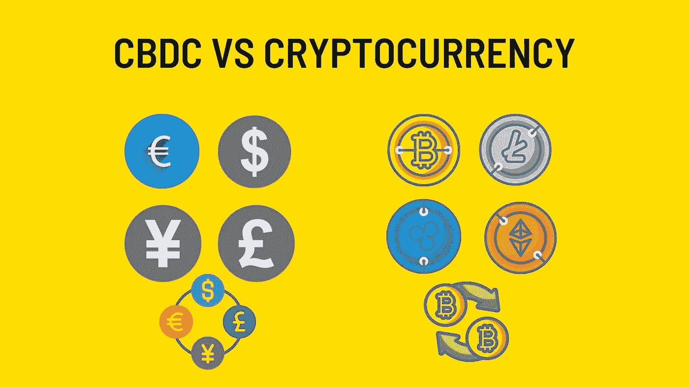

# 中央银行数字货币(CBDC)

> 原文：<https://medium.com/coinmonks/central-bank-digital-currency-cbdc-193c9c6cf905?source=collection_archive---------47----------------------->

这些代币由世界各地的中央银行发行，以数字方式代表发行国的法定货币，通常基于分布式账本技术，被称为中央银行数字货币(CBDC)。用最简单的话来说，CBDCs 是一个国家印刷的代表本国货币的数字货币。当我们说数字货币时，我们可能会想到加密货币，但实际上，CBDCs 与加密货币不同。

**加密货币和 CBDCs 有什么区别？**

两种货币使用的区块链有不同的特点。加密货币使用一个名为公共区块链的系统，所有用户都可以参与网络并记录交易，而 CBDCs 使用一个名为私人区块链的系统，在该系统中，访问和更改由一国央行授权。这完全违背了加密货币去中心化的理念。

像比特币这样的加密货币有一定的供应量，要改变这种供应量几乎是不可能的。每个政府都对国家的货币供应负责，并且可以随心所欲地改变货币供应。我们可以说，这种情况将继续下去，甚至会变得更加容易。

另一方面，像比特币这样的大多数加密货币(stablecoins 除外)并不持有任何储备资产来支持加密货币的价值。相比之下，CBDC 项目是由黄金和外汇储备支持的，因为它们代表法定货币。

**为什么各国都在研究和发展基于商品的发展中国家？**

根据 2020 年 1 月进行的一项调查，66 家央行中有 80%正在研究 CBDC。我们可以说，调查中如此高的百分比证明了 CBDCs 将为政府带来许多优势。

在我们目前使用的系统中，国际汇款可能需要几天时间，交易费用相当高。在 CBDC，这种情况正好相反，交易进行得更快，费用更低。

由于数字账本技术，资金更容易追踪，从而有助于发现欺诈和其他非法活动。

商业银行可能会失去很大一部分业务，因为央行将从银行手中接管资金的管理。在当前形势下，央行会印钞票。有了 CBDC，数字货币也将处于各国央行的控制之下，这样公众就可以直接从央行开户了。这对银行来说是一个负面的情况，也会影响股票市场，因为银行股可能会贬值。

由于资金的控制权将直接掌握在中央银行手中，每一笔交易都受到中央银行的监督，逃税可以完全避免。

**我们的财务自由呢？**

中央银行强大的货币支配权给人民的金融自由带来了巨大的风险。如果 CBDC 设计不当，每笔交易都可能被记录，任何有权访问 CBDC 总账的授权人员都可以看到所有交易。通过在你要创建的数字身份和 CBDC 之间建立联系，中央银行和政府可以直接控制你如何花钱，从而限制你。

哪些国家正在发展 CBDCs？

委内瑞拉在这方面迈出了第一步，于 2018 年 2 月推出了与油价挂钩的 CBDC Petro，但 Petro 在该国的使用率没有达到预期的那么高。

中国是 CBDC 最前沿的国家之一，继续进行数字人民币测试。

俄国是研究 CBDC 问题的国家之一。俄国认为 CBDC 将有益于国家，继续迅速研究。

据估计，欧洲中央银行和土耳其 CBDC 将在未来几年就这一问题做出决定，因为这一问题仍处于研究阶段。

**因此，** CBDC 目前正处于起步阶段，看起来将在未来几年改变我们的生活。如果人们对财务自由的一部分产生怀疑，像比特币这样的加密货币的使用可能会增加，因为人们会寻求隐私。

> 交易新手？试试[密码交易机器人](/coinmonks/crypto-trading-bot-c2ffce8acb2a)或[复制交易](/coinmonks/top-10-crypto-copy-trading-platforms-for-beginners-d0c37c7d698c)