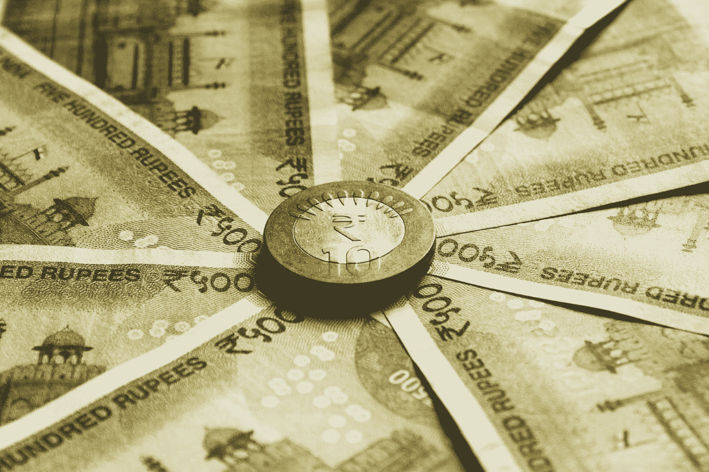

# 中央银行数字货币:eRupee 的崛起(e₹)

> 原文：<https://medium.com/coinmonks/central-bank-digital-currency-the-rise-of-erupee-d7d8ce73d937?source=collection_archive---------4----------------------->

Photo by [rupixen.com](https://unsplash.com/@rupixen?utm_source=medium&utm_medium=referral) on [Unsplash](https://unsplash.com?utm_source=medium&utm_medium=referral)

加密货币正在显著增长。这引起了世界各地许多中央银行对这些货币的安全性、可靠性和可行性的担忧，也引发了对如何保护公民免受潜在欺诈和保护其利益的思考。

除了这些潜在风险，世界各地的央行也开始接受加密货币或数字货币所能提供的优势。本文探讨了印度储备银行提出的 CBDC 概念。

什么是 CBDC？

中央银行数字货币(CBDC)是由中央银行发行的纸币的数字形式，在这种情况下，这将是 RBI。CBDC 有许多实施的激励因素，但对印度来说，有一些独特的要求。

电子卢比是用户现有选择套件中的另一种支付选择。作为主权货币的电子形式，CBDCs 具有实物货币提供的所有特征。

CBDC 可以分为两大类:

*   **零售 CBDC【R-CBDC】**:供各类零售用户使用的通用 CBDC。
*   **批发 CBDC【W-CBDC】**:CBDC，适用于办理跨行转账和批发大宗交易结算的受限金融机构。

CBDC 的主要特色是什么？

随着许多用户专门使用数字形式的支付，纸币的使用在世界范围内一直在下降。CBDC 有以下好处:

*   比现有的实物纸币发行效率更高
*   对货币流动没有限制，特别是有地理障碍
*   易于分发
*   用户对数字支付模式和虚拟货币的需求不断增加
*   降低现金管理成本，尤其是在印度，现金仍然是支付方式的重要组成部分。
*   提高数字支付生态系统的包容性，让无法使用在线模式的偏远地区也能参与进来。
*   CBDC 作为主权货币，确保结算的终局性，并加强风险管理。
*   增强跨境支付并提供实时结算终结。

**数字货币给用户带来的好处**

*   R-CBDC 是中央银行的直接负债，因此可以为支付和结算提供安全的资金
*   W-CBDC 将使结算和支付过程和周期更加高效和透明

**CBDC 发行管理模式**

CBDC 的发行和管理有两种模式

*   直接模式(单层模式) :中央银行承担管理 CBDC 从发行、记账到交易验证的所有责任
*   间接模式(双层模式) :除中央银行外，其他中介机构共同管理 CBDC，每个中介机构管理电子货币管理的不同方面或所有方面。

**CBDC 的控股形式**

可以通过以下方式拥有 CBDC。

**基于令牌- >** 基于令牌的 CBDC 就像拥有一张钞票。持有代币的人拥有代币，类似于纸币。令牌所有者负责验证令牌的所有权和出处。

**基于账户- >** 在基于账户的系统中，CBDC 所有权的所有持有人的余额和交易记录必须由中间人维护。中介还承担验证代币和持有者身份的责任。

**关于数字卢比的最终想法**

拥有一种卢比的数字货币确实是当务之急。这将给用户和金融机构在进行财政和货币交易时带来很大的灵活性。然而，eRupee 将如何应对挑战，提供实物现金所提供的匿名性、流动性和终结性等特征，还有待观察。

你怎么想呢?CBDC 会完全取代现金吗？或者 CBDC 会发展成为一个补充系统，比其他加密货币更具包容性和稳定性，而不是现金的替代品？

请在下面的评论中留下你的想法。感谢阅读！

> 交易新手？尝试[加密交易机器人](/coinmonks/crypto-trading-bot-c2ffce8acb2a)或[复制交易](/coinmonks/top-10-crypto-copy-trading-platforms-for-beginners-d0c37c7d698c)
> 
> 多样化的密码持有，了解[币安替代品](https://coincodecap.com/binance-alternatives)
> 
> 加入 Coinmonks [电报频道](https://t.me/coincodecap)和 [Youtube 频道](https://www.youtube.com/c/coinmonks/videos)获取每日[加密新闻](http://coincodecap.com/)

# 另外，阅读

*   [复制交易](/coinmonks/top-10-crypto-copy-trading-platforms-for-beginners-d0c37c7d698c) | [加密税务软件](/coinmonks/crypto-tax-software-ed4b4810e338)
*   [网格交易](https://coincodecap.com/grid-trading) | [加密硬件钱包](/coinmonks/the-best-cryptocurrency-hardware-wallets-of-2020-e28b1c124069)
*   [密码电报信号](/coinmonks/top-3-telegram-channels-for-crypto-traders-in-2021-8385f4411ff4) | [密码交易机器人](/coinmonks/crypto-trading-bot-c2ffce8acb2a)
*   [最佳加密交易所](/coinmonks/crypto-exchange-dd2f9d6f3769) | [印度最佳加密交易所](/coinmonks/bitcoin-exchange-in-india-7f1fe79715c9)
*   [面向开发人员的最佳加密 API](/coinmonks/best-crypto-apis-for-developers-5efe3a597a9f)
*   最佳[密码借贷平台](/coinmonks/top-5-crypto-lending-platforms-in-2020-that-you-need-to-know-a1b675cec3fa)
*   [免费加密信号](/coinmonks/free-crypto-signals-48b25e61a8da) | [加密交易机器人](/coinmonks/crypto-trading-bot-c2ffce8acb2a)
*   杠杆代币的终极指南