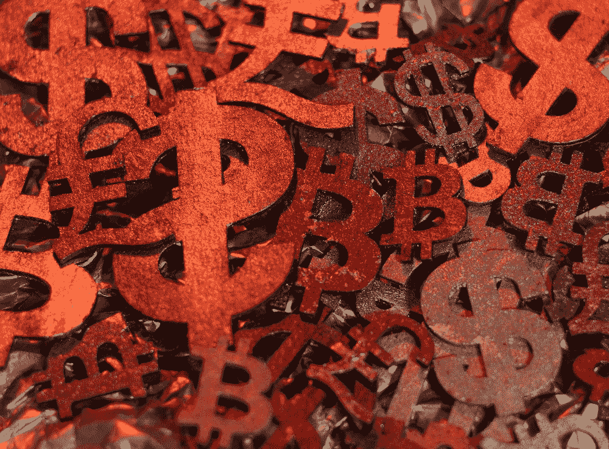

# 各国央行纷纷发行与比特币相对的数字货币

> 原文：<https://medium.com/coinmonks/central-banks-have-issued-digital-currencies-opposed-to-bitcoin-8576103ed304?source=collection_archive---------20----------------------->

世界各地的央行一直对发行数字货币犹豫不决，但这种情况可能正在改变。近年来，一些中央银行已经开始探索发行自己的数字货币(也称为中央银行数字货币)的可能性。