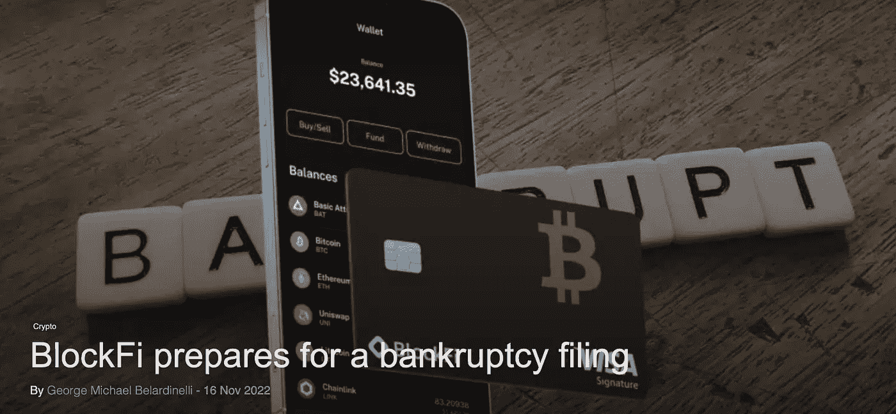

# 中国央行和即将到期的人民币。货币霸权的下一个前沿？

> 原文：<https://medium.com/coinmonks/central-chinese-bank-and-the-expiring-yuan-next-frontier-of-monetary-supremacy-33f0f88a1d3a?source=collection_archive---------26----------------------->

本周的各种新闻，首先是数字尤安:它能取代美元吗？

 [## 俄罗斯可能在 2023 年 1 月 1 日之前使秘密采矿合法化——只要这种情况发生

### 俄罗斯最终将加密采矿合法化——在政府首席加密立法设计师…

cryptonews.com](https://cryptonews.com/news/russia-could-legalize-crypto-mining-by-jan-1-2023-as-long-as-happens.htm) 

俄罗斯正在评估将加密货币开采合法化。这可能会导致加密货币在那里得到更广泛的采用，与试图克服亚洲霸权的美国形成直接竞争。这可以在俄罗斯和美国之间已经在进行的经济战争中发挥另一个关键作用，在那里生成加密货币可能会导致各方面的再平衡。

[https://en . crypto nomist . ch/2022/11/16/block fi-prepares-破产-申请/](https://en.cryptonomist.ch/2022/11/16/blockfi-prepares-bankruptcy-filing/)

FTX 违约后，BlockFi 与 Celsius、Hodlnaut 和许多其他中央金融平台的命运相同。将自有资金依赖于平台，依赖于收益率，依赖于不受监管的市场，这是非常非常危险的。责任会被追究，但钱几乎不会回来。

 [## 由于不良交易所导致 120 万 BTC 退出流通，比特币稀缺程度上升

### 比特币(BTC)区别于法定货币和大多数加密货币的最大因素之一是硬…

cointelegraph.com](https://cointelegraph.com/news/bitcoin-scarcity-rises-as-bad-exchanges-take-1-2m-btc-out-of-circulation) 

人们大量逃离比特币交易所，BTC 的比特币存量降至 2015 年的水平，但币安的比特币存量最高。一些人明白 FTX 到底发生了什么，而其他人只是更加依赖币安。不要忘记，集中化对加密空间没有好处，所以要确保交易所里只有你用来交易的资金。

 [## FTX 惨败看好比特币的 3 个原因

### “比特币已死”团伙又回来了，他们又开始行动了。FTX 加密货币交易所的倒下复活了这些…

cointelegraph.com](https://cointelegraph.com/news/3-reasons-why-the-ftx-fiasco-is-bullish-for-bitcoin) 

3 个很好的观点，解释了为什么 FTX 事件会引领比特币进入新一轮牛市。你对这件事有什么看法？

 [## 币安首席执行官 CZ 开始实施 Vitalik Buterin 的“安全 CEX”理念

### 2022 年众多主要加密生态系统的崩溃揭示了改造加密方式的迫切需要…

cointelegraph.com](https://cointelegraph.com/news/binance-ceo-cz-begins-working-on-vitalik-buterin-s-safe-cex-ideas) 

请停止 Cex。我们受够了他们，币安变得太强大了。让我们开始评估如何创建这种生态系统的替代方案，不那么集中、不那么强大、更民主，甚至具有更少的不需要集中控制器的特性和功能。

[https://en . crypto nomist . ch/2022/11/16/digital-dollar-pilot-project-begins/](https://en.cryptonomist.ch/2022/11/16/digital-dollar-pilot-project-begins/)

数字美元 CBDC(央行数字货币)正在启动。它什么时候会重见天日？以及会带来什么程度的集权？货币控制是霸权的最终目标，因此 CBDCs 将在最强的交换和更集中的货币之间创造一把双刃剑。10 年后我们会回到物物交换吗？
[而即将到期的元呢？](https://www.econ.iastate.edu/ask-an-economist/why-would-chinas-central-bank-want-issue-digital-yuan-expiration-date)

> 交易新手？试试[加密交易机器人](/coinmonks/crypto-trading-bot-c2ffce8acb2a)或者[复制交易](/coinmonks/top-10-crypto-copy-trading-platforms-for-beginners-d0c37c7d698c)