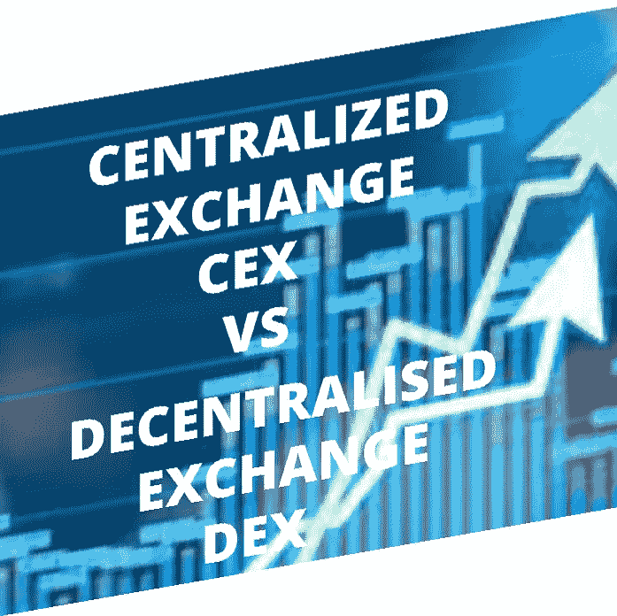
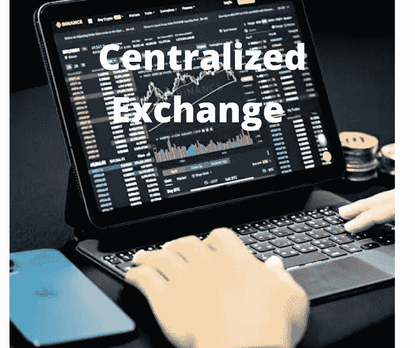

# 集中式交换(CEX)与分散式交换(DEX)

> 原文：<https://medium.com/coinmonks/centralized-exchange-cex-vs-decentralized-exchange-dex-6c4e6e205097?source=collection_archive---------23----------------------->

# 他们有什么不同？

对于一个新手或考虑购买加密货币，然后加密货币交易所，如币安，库币，北海巨妖，uniswap 等。，是您进行购买/交易的确切地点。

如果你也是一名交易者或者是加密货币和区块链的爱好者，那么你很可能听说过 CEX(集中式交易所)和 DEX(分散式交易所)这个词。让我们深入研究这两者，并清楚地解释它们是什么以及它们之间的关键区别。首先让我们从一个交易开始

**加密货币交易所**

加密货币交易所是客户交易(购买或出售)加密货币或数字货币的平台。这些数字货币/加密货币可以在一些交易所转换成法定货币。

其中一些交易所接受信用卡和电汇作为其他支付形式，而其他交易所接受一种数字货币到另一种数字货币的交易作为唯一的支付方式。

加密货币交易所的类型:

*   集中交易所(CEX)
*   分散交换

**集中交易所(CEX)**

集中式交易所是数字市场，客户或用户在这里用加密货币交易(购买/出售)法定货币，如英镑或尼日利亚奈拉，或者在数字货币之间交易，如 Eth 和 sol。

它是一个中介组织，以数字方式促进数字市场中买方和卖方之间的交易，使用数字货币的法定货币或数字货币的数字货币。这些交易所从交易或使用其平台的交易者的交易费用中获利。

集中交换的一些例子包括:

币安

库科恩

火币环球

coinbase

位戳

ftx

北海巨妖。等等

对于交易或使用集中交易所的新用户或客户，他必须创建一个账户，验证他的电话号码/电子邮件，并执行 KYC(了解你的客户)任务。这项任务包括验证您的身份:姓名，国家，州和当地政府的居住地，上传任何政府颁发的身份证件和照片。

**集中交易所的优势**

*   用户友好，尤其是对初学者

集中式交易所开发良好，结构合理，界面简单易用，为新用户提供了大量指南

*   集中式交换具有额外的安全性和可信度
*   流动性高。
*   巨大的交易量

**集中交易的缺点**

*   保管钱包被黑导致资金损失的风险:

保管钱包容易受到黑客攻击和网络安全威胁，导致用户资金损失。

*   可以被控制或中介组织关闭
*   与分散的加密货币交易相比，由于存款和取款费用，交易费用较高
*   由于无法获得私人钱包钥匙，无法控制您的资金

**分散交换(DEX)**

分散交易所是促进交易者之间对等交易加密货币的平台。这些类型的交易不需要将您的资金/加密货币放在中介组织的保管钱包中，也不允许在金融资产和数字加密货币之间进行交易。

**分散交换的一些例子包括:**

*   **1 英寸交换机**
*   **pancakeswap**
*   **Sushiswap**
*   **曲线金融**
*   **伯格斯瓦普等**

由于与集中式交换相关的一些问题，一些用户更喜欢分散式交换，这些问题包括

*   由于保管钱包(中介组织的钱包)被黑而导致资金损失
*   由于使用其平台提供的服务，集中式交易所收取的交易费用高于点对点交易。

**分散交换的优势**

*   **匿名使用**

在分散式 exchange 中，用户不需要执行 KYC(了解您的客户)任务；因此，它为用户提供了高度的隐私和匿名性

*   **最大限度减少因黑客攻击造成的资金损失**

Mt. Gox 是 2011 年和 2014 年被黑客攻击的一家主要加密货币交易所，他们分别损失了价值 875 万美元和 6.15 亿美元的比特币。还有其他集中交易所的例子，它们的资金被黑客窃取，导致此类交易所的用户蒙受巨大损失。使用分散交换可以最大限度地降低这些风险，因为用户不需要将资金转移到任何中介保管钱包。相反，他们是数字钱包中数字资产的唯一保管人。

*   **更便宜的交易费用**

分散的交换促进了点对点之间的交易。不需要任何中介机构收取额外的存取款服务费。因此，与集中交易相比，交易费用更便宜。

**分散交换的弊端**

*   它不接受固定付款
*   难以使用

如果您丢失了密码或登录信息，Centralize exchange 将帮助您找回帐户。你必须做的是点击忘记密码，并按照提示如下。但在去中心化的加密货币交易所，情况并非如此。在这里，您必须记下您的登录详细信息，包括您的密钥和密码，并确保其安全(远离任何未经授权的用户)，因为失去对它的访问权限等同于失去对钱包和其中资金的访问权限。此外，集中式交换更加简单和用户友好，尤其是对初学者而言。

*   流动性供应不足是分散交易所的另一个制约因素。

> 交易新手？试试[加密交易机器人](/coinmonks/crypto-trading-bot-c2ffce8acb2a)或者[复制交易](/coinmonks/top-10-crypto-copy-trading-platforms-for-beginners-d0c37c7d698c)