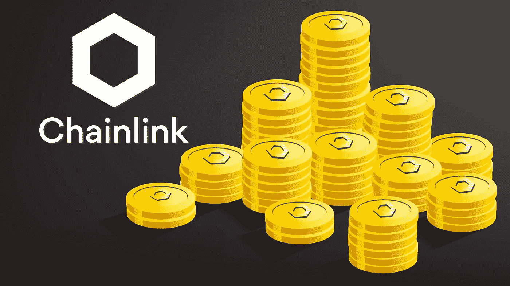

# 2022-2025 年链环价格预测

> 原文：<https://medium.com/coinmonks/chainlink-link-price-prediction-2022-2025-b0712f9bbf7f?source=collection_archive---------17----------------------->

Source photo [chainlink — Bing images](https://www.bing.com/images/search?view=detailV2&ccid=5Tu0AkQ0&id=EF59AD79A702F16E96FF82FD64D873851FABEEA6&thid=OIP.5Tu0AkQ0HgoV0GapSBP2zQHaEK&mediaurl=https%3a%2f%2fwww.forexnewslive.co%2fwp-content%2fuploads%2f2020%2f02%2fChainlink-03.jpg&cdnurl=https%3a%2f%2fth.bing.com%2fth%2fid%2fR.e53bb40244341e0a15d066a94813f6cd%3frik%3dpu6rH4Vz2GT9gg%26pid%3dImgRaw%26r%3d0&exph=1080&expw=1920&q=chainlink&simid=608032790990450443&FORM=IRPRST&ck=AFA9FA11888249C4981A13BC253C06D0&selectedIndex=1&ajaxhist=0&ajaxserp=0)

## 什么是 Chainlink(链接)？

谢尔盖·纳扎罗夫和史蒂夫·埃利斯于 2014 年 9 月推出了 Chainlink network。业务概念的核心是为全球市场开发智能合同。Chainlink 旨在分散互联网，以弥合区块链和现实世界应用程序之间的差距。它有一个分散的神谕网络…