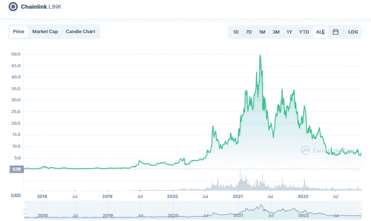

# 链环(link)价格预测 2022–2025，11 月 27 日更新

> 原文：<https://medium.com/coinmonks/chainlink-link-price-prediction-2022-2025-update-27th-of-november-484798594671?source=collection_archive---------15----------------------->

Source photo [Chainlink price today, LINK to USD live, marketcap and chart | CoinMarketCap](https://coinmarketcap.com/currencies/chainlink/)

# 什么是 Chainlink？

Chainlink 由 Sergey Nazarov 和 Steve Ellis 于 2014 年 9 月创建。开发适用于现实世界的智能合同对该公司的战略至关重要。为了更好地将区块链与现实世界的应用连接起来，Chainlink 寻求分散互联网。它有一个分布式 Oracle…