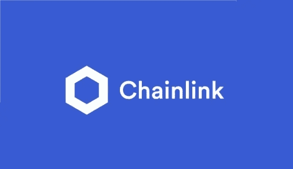

# Chainlink,被低估的协议!

> 原文：<https://medium.com/coinmonks/chainlink-o-protocolo-subestimado-9e7ac7ecaa37?source=collection_archive---------66----------------------->

Chainlink(LINK)由 Sergey Nazarov 于 2017 年创建,它不仅仅是一种在主要交易所交易的加密货币,它是一种超级协议,可以促进企业使用智能合约,并作为区块链内部真实数据的接口。当大公司开始使用其技术时,该协议在市场上变得更加臭名昭著,例如巨头谷歌,WEB3 和连接 200 多个国家的 11,000 家银行和金融机构的 Swift 系统。

Chainlink 平台的主要目标是通过集成所有现有区块链来实现智能合约的使用,这是以分散的方式实现这种机制的唯一可能性。该网络的最大区别在于它可以为其他技术增值,例如外部 API,支付系统,物联网(IoT),云存储系统等。

*   我认为 Chainlink 是最具可扩展性、互操作性以及未来可以添加的协议之一!
    对于那些寻求盈利能力的人来说,这也是一个选择,因为价值增益在上一个周期中被低估,从而在 2024/25 年产生相当大的“高”的可能性。
*   当前报价 **Chainlink** :

市值:$35.69
市值:$16,797,019,336
最大供应量:$1,000,000,000
Chainlink 目前在交易所 Binance,Coinbase,Kucoin,Huobi,Kraken 等进行交易。

你对技术世界感兴趣吗?在 [LinkedIn](https://www.linkedin.com/in/devsaw/) 上关注我!

> New to trading? Try [crypto trading bots](/coinmonks/crypto-trading-bot-c2ffce8acb2a) or [copy trading](/coinmonks/top-10-crypto-copy-trading-platforms-for-beginners-d0c37c7d698c)