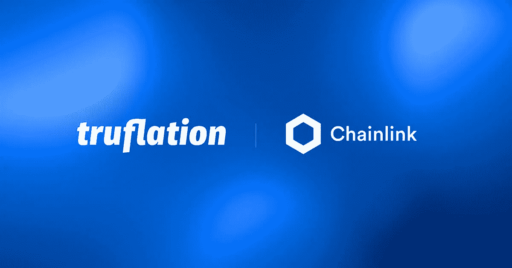

# Chainlink 的加密真相和真相机器——真相解决方案

> 原文：<https://medium.com/coinmonks/chainlinks-cryptographic-truth-and-truth-machine-the-truflation-solution-fc5b200eec86?source=collection_archive---------14----------------------->

这一切都始于 2019 年，当时 Chainlink 协议正式推出，以促进从链外来源到链上智能合同的防篡改数据传输。他们进一步引入了在区块链上确定性运行的混合智能合约，并通过 oracle networks 连接到现实世界的数据。

> 从顶级交易者那里复制交易机器人。免费试用。

去年，当 Sergey nazar ov(chain link 的联合创始人)决定在一次[采访中解释他们任务的潜力时，这个项目得到了更多的关注。他谈到了 Chainlink 的分散式 oracle networks 的进一步可能实施、不断增长的混合智能合约用例，以及将有助于实现由加密真相支持的有保证的真相的真相机器。](https://www.coindesk.com/markets/2021/05/21/an-interview-with-chainlinks-sergey-nazarov/)

# 什么是真理机器？

真理机器主要是 oracle 网络，它与区块链结合在一起，由私钥控制。上述三大支柱的结合使得真理机器有可能改变世界。甲骨文网络专注于生成确定性的密码保证的真理。然后是区块链，用来储存和给人们提供通道。最后，私钥允许人们对协议进行直接和完全的实时控制。

# 真理机器的真实用例

创建真理机器的目的是提出一个公正、分散、高度可靠的系统，最终提供跨行业(包括金融、技术、法律和航运)的权威、密码验证的真理。真理机器似乎有很好的能力来保证与同伴关系中的真理，但当时被大多数人低估了。

Chainlink 阐明了概率保证和确定性保证的本质区别。他们专注于实现依赖于加密和具有确定性保证级别的私钥的真理机器。

加密保证已经存在于我们的日常生活中。一些消息应用程序使用加密保证，保证端到端的加密，以保持您的通信隐私，在很大程度上给你一种舒适感和心理安全感。

WhatsApp 就是一个很好的例子。社交媒体消息巨头[的官方网站声明](https://faq.whatsapp.com/general/security-and-privacy/end-to-end-encryption/?lang=en):“”*当你使用 WhatsApp Messenger 与另一个人聊天时，会使用 WhatsApp 的端到端加密。端到端加密确保只有你和你的交流对象可以阅读或收听发送的内容，而中间没有人，甚至是 WhatsApp。'*

真理机器的作用是通过利用那些密码保证来解决与重要的日常生活协议相关的问题，包括密钥交易、传统社会如何工作以及各种其他问题。

在 web 3.0 世界中实现加密保证可以解决几个问题，并改变确保真实性的传统方式。DeFi、NFTs 和令牌化所有权是加密真理的早期例子。

Chainlink 提出的 Truth Machine 利用了混合智能合同，这些合同实际上是存储在区块链上的完全分散的数字协议。Oracle networks 用于在某些预定义的条件下监视和控制协议。

# 区块链甲骨文问题

阻止真理机器实现在各种市场和用例中实现大规模采用的唯一问题是区块链 oracle 问题。这是由于区块链系统的局限性，因为它不能自动将数据拉入或推出任何外部系统。原因是区块链系统是孤立的网络，没有互联网连接。

在密码真理或真理机器的情况下出现的一个重要问题是如何确保数据质量或确定性地验证真理。有几种方法可以保证数据质量，比如找到实际数据创建者的直接数据源。例如，你可以从苹果官方获得 iPhone 的价格，或者你可以收集并比较来自数百个不同来源的数据。另一种确保数据质量的方法是将数据验证工作分散和外包给社区。这就是我们试图在 Truflation 上实现的。

**阅读更多:** [Truflation 通过 Chainlink 提供定制的美国通胀指数数据](https://chainlinktoday.com/truflation-delivers-custom-u-s-inflation-index-data-on-chain-via-chainlink/)

# Truflation 提供的解决方案

Truflation 正在研究一种解决方案，通过在扩展数据源的同时使数据集多样化和冗余，来确保数据质量和自动化质量控制。他们的目标是创建一个管理索引的数据 DAO。在 TRU 令牌模型的帮助下，Truflation 正在开发一个多步骤、半自动、基于社区的质量控制协议。他们通过寻找多个独立的数据源来验证和恢复指数。

下面是我们的 Truflation 白皮书中的一个简短的[片段:*“Truflation Oracle 是一个免费的每日数据馈送，提供用我们的客户 tru flation 指数衡量的当前美国通胀水平。任何项目和产品都可以用它来推广和发展 DeFi 空间。但是，在 Chainlink 上部署合同以咨询 Oracle 需要支付 link 的本地费用。'*](https://whitepaper.truflation.com/the-truflation-index/data-sources)

他们正在尝试自动化，并希望分散质量控制，多样化数据点，制作复杂的算法来组合冗余数据集，自动化质量，并在可能的情况下将自动化质量放在节点上。Truflation 的最终目标是为所有 DeFi 产品提供无偏见的、数据驱动的、真实的市场通胀率。

> 加入 Coinmonks [电报频道](https://t.me/coincodecap)和 [Youtube 频道](https://www.youtube.com/c/coinmonks/videos)了解加密交易和投资

# 另外，阅读

*   [加密货币储蓄账户](/coinmonks/cryptocurrency-savings-accounts-be3bc0feffbf) | [YoBit 评论](/coinmonks/yobit-review-175464162c62)
*   [Botsfolio vs nap bots vs Mudrex](/coinmonks/botsfolio-vs-napbots-vs-mudrex-c81344970c02)|[gate . io 交流回顾](/coinmonks/gate-io-exchange-review-61bf87b7078f)
*   [CoinFLEX 评论](https://coincodecap.com/coinflex-review) | [AEX 交易所评论](https://coincodecap.com/aex-exchange-review) | [UPbit 评论](https://coincodecap.com/upbit-review)
*   [AscendEx 保证金交易](https://coincodecap.com/ascendex-margin-trading) | [Bitfinex 赌注](https://coincodecap.com/bitfinex-staking) | [bitFlyer 审核](https://coincodecap.com/bitflyer-review)
*   [Bitget 回顾](https://coincodecap.com/bitget-review) | [双子座 vs BlockFi](https://coincodecap.com/gemini-vs-blockfi) cmd| [OKEx 期货交易](https://coincodecap.com/okex-futures-trading)