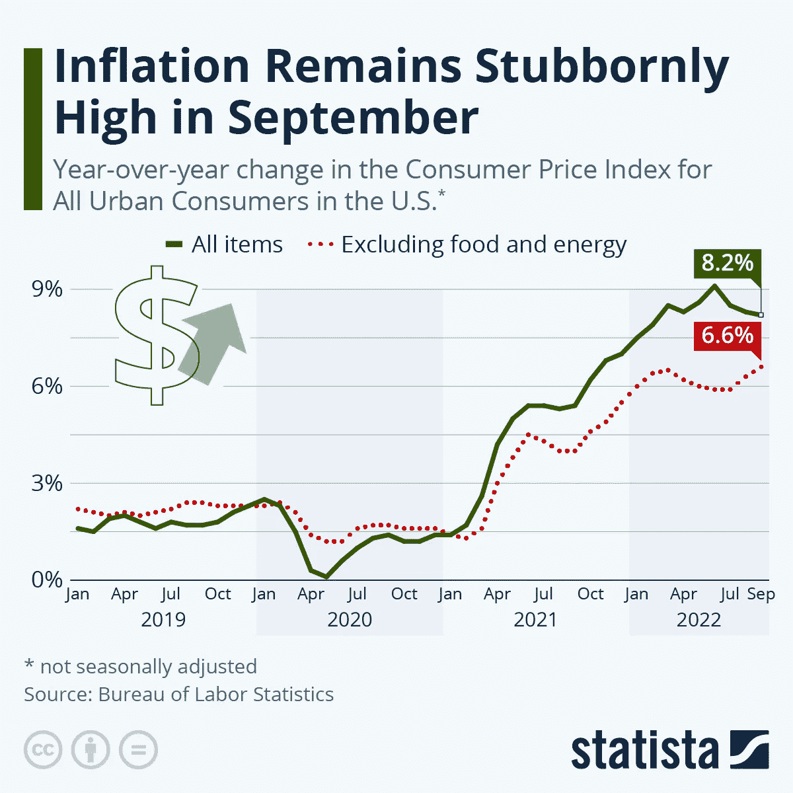
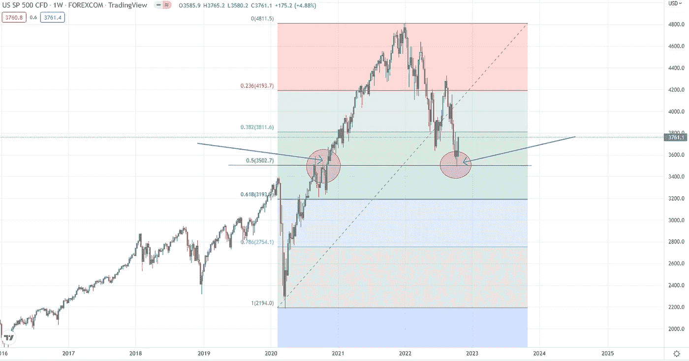
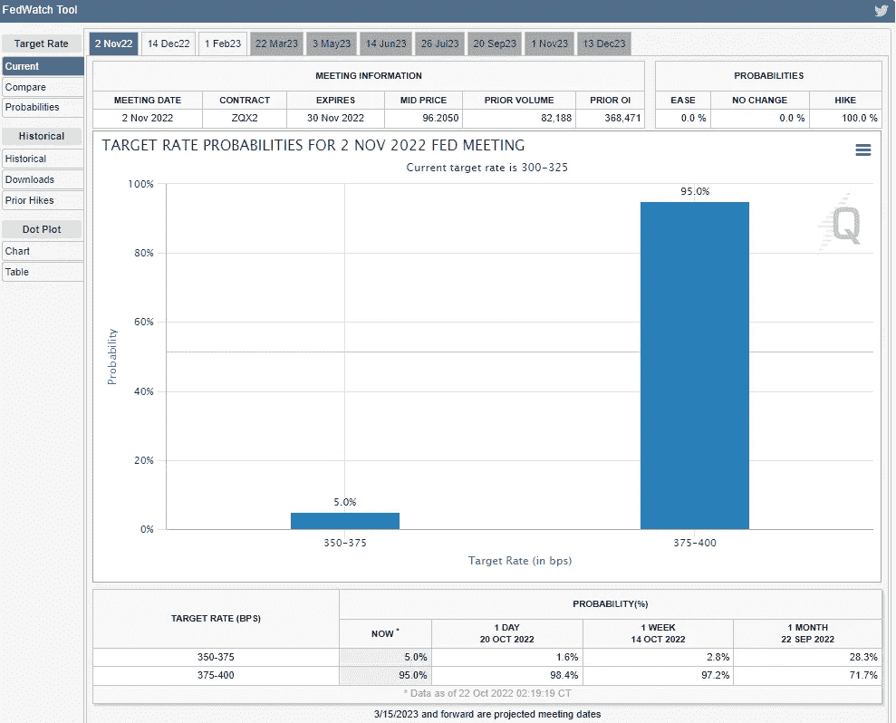
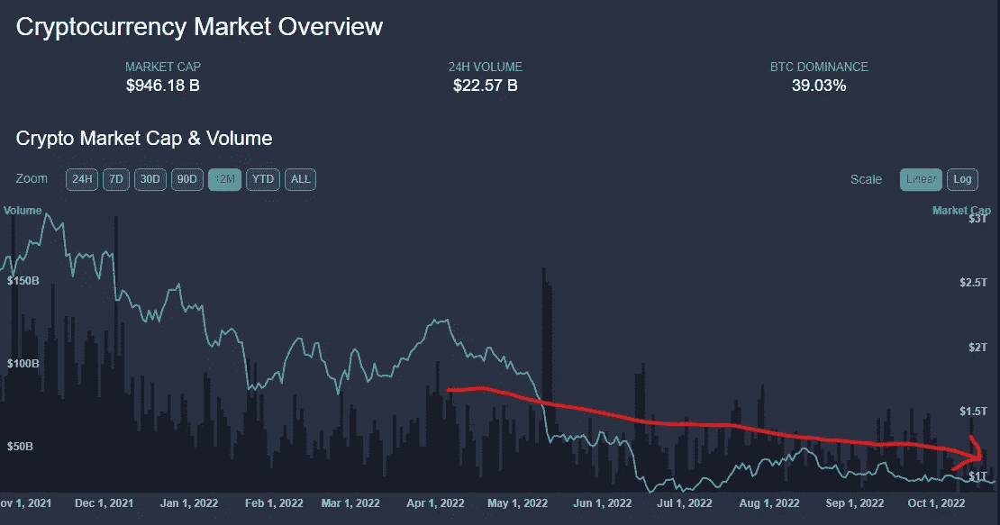
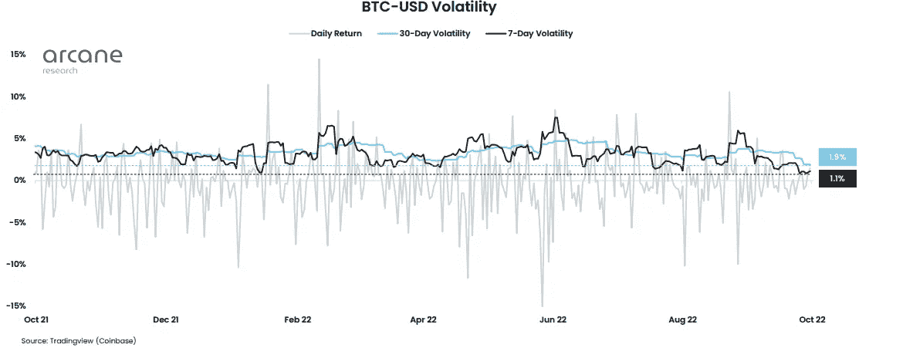
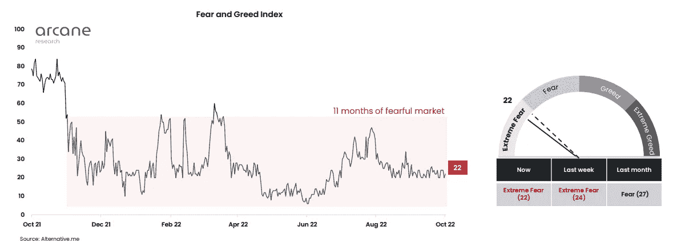

# 挑战投资者的耐心。我们能抵抗多久？

> 原文：<https://medium.com/coinmonks/challenging-test-of-investors-patience-how-long-can-we-resist-4a93390a141a?source=collection_archive---------30----------------------->

上周是有趣的一周，在 CPI 发布后，波动性再次飙升，但 CPI 仍然顽固地保持粘性。投资者预计整体通胀率为 8.1%，结果为 8.2 %。预期的轻微延迟加上不断增长的 MoM 核心 CPI(不包括食品和能源)导致市场反应激烈。

最初市场盘中下跌，但标准普尔 500 收盘时上涨 2.6 %。一天内市场波动超过 5%,这是一个非常疯狂的举动。

Figure 1- Core inflation remains stubborn, and hit a new high in September 2022

那么，尽管通货膨胀顽固不化，是什么导致了市场反弹呢？嗯，一些原因可能是交易员和投资者已经基本消化了坏消息，技术水平达到了一个主要支撑——从新冠肺炎低点反弹后的 50%回撤——这可能引发了 algos 在这些水平上购买，投资者可能准备好了美联储的“支点”——我说的支点不是指美联储放松货币政策——我指的是至少从 12 月份开始放缓或暂停加息。

Figure 2- S&P 500 -50% retracement from Covid-19 lows (Major support level)

11 月 1 日至 2 日-根据估计，美联储将在 FOMC 会议上加息 75 个基点，但 12 月份对经济放缓的预测可能导致上周股市部分反弹。

Figure 3- 95% probability that Jerome Powell will announce 0.75% rate increase on November 2

**数字资产**

尽管股市波动很大，但数字资产正变得极其乏味。成交量和波动性在 2022 年降至 2019 年以来未见的水平-2020 年初。低交易量和不显著的价格行为尤其会使散户投资者离场，这可能会导致加密资产空间进一步下跌。

只要美联储的不确定性主导市场，他们的政策没有明确的方向，因为他们在很大程度上依赖于通胀，我们可以预计未来会有更多的下行——这是痛苦的。

Figure 3- Daily volume kept decreasing through 2022 alongside total crypto market cap

比特币波动率达到极低水平，30 天波动率 1.9%，7 天波动率 1.1%。这些水平是自 2020 年 7 月、10 月以来未见的。

Figure 4-BTC- Volatility chart, daily, monthly and weekly

11 个月的可怕市场真正考验了投资者的论点、信念和他们的功课做得有多好——那些没有的人我打赌他们离开了这个空间并放弃了。

Figure 5- Fear and Gree index in fearful territory close to 1 year

低日交易量、BTC 低波动性和近一年来极度恐惧的市场可能会引发最终的冲洗/崩溃/抛售——随你怎么说，但从长期来看，可能会带来非常好的设置，那些做了功课的人会得到回报。

祝大家有个愉快的夜晚，照顾好你们所爱的人！！

> 交易新手？试试[密码交易机器人](/coinmonks/crypto-trading-bot-c2ffce8acb2a)或者[复制交易](/coinmonks/top-10-crypto-copy-trading-platforms-for-beginners-d0c37c7d698c)