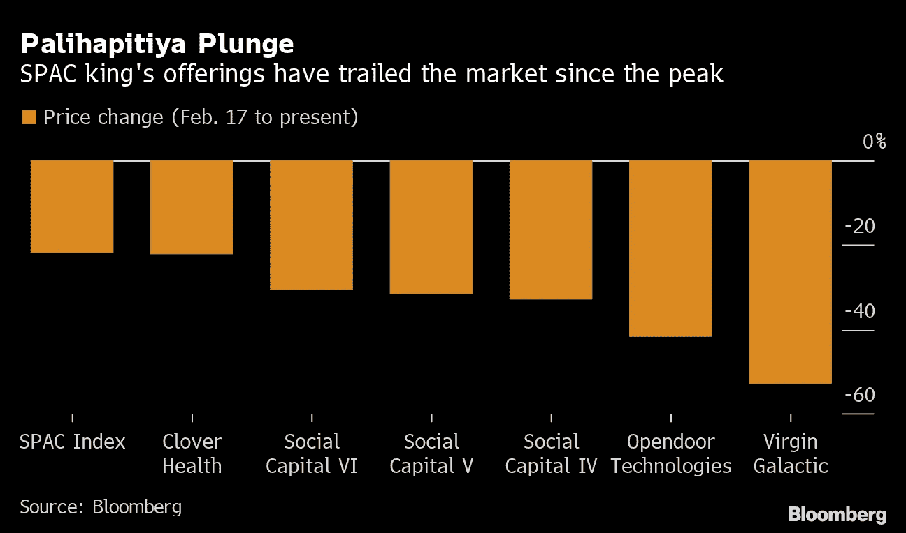

# 查马斯·帕里哈皮蒂亚是你见过的最迷人的邦德反派。

> 原文：<https://medium.com/coinmonks/chamath-palihapitiya-is-the-most-charming-bond-villain-you-would-ever-meet-31e018ea5954?source=collection_archive---------10----------------------->

Chamath is verbose, smooth and very persuasive — all the charms of a Bond Villain.

Chamath Palihapitiya 是你见过的最迷人的邦德反派角色。

他被称为特殊目的收购公司国王。

他身价 12 亿美元。

他在脸书早期就开始赚钱，并在一家风险投资公司工作。

他拥有金州勇士队 10%的股份，现在价值接近 8 亿美元。

他是典型的迷因大师。

他不害怕抨击他的敌人，并扣篮反对者。

众所周知，他直言不讳地谈论不平等、赚钱、支持资本主义以及对脸书和“旧货币”等事物的蔑视。

作为特殊目的收购公司国王，他一定从中赚了很多钱，对吗？

当然啦！

但对其他人来说，也就是在公司 IPO 后和他一起投资的散户投资者，就没那么多了。

他鼓动人们的热情，大肆宣传这些公司，鼓吹能够投资这些公司是多么大的一个机会。

Throwing down the gauntlet and being persuasive is what Chamath excels at.

他本质上是在创造 FOMO(害怕错过)。

据传，FOMO 驱使更多的人去购买任何其他情感的东西。

为什么？

简单。

我们人类天生更容易受到厌恶损失的影响。

换句话说，我们有更强的避免损失的倾向，即使是未来未实现的、潜在的损失。

当 FOMO 达到最高水平时，他会将股票抛售给散户投资者。

至少，反正网友们都是这么八卦的。

维珍银河。

开门。

三叶草健康。

苏菲。

Most of his SPACs have plummeted since their IPO.

所有这些 SPACs 都被 Chamath 炒高了，他卖掉了他的股票，在股价灾难性下跌之前套现。

所有 4 种 SPACs 在 2021 年价格暴跌(这是在市场变得真正糟糕之前)。

从本质上讲，与查马斯所宣扬的相反，他们没有一个人让投资者赚到钱。

Chamath 在特殊目的收购公司的另一笔交易 Metromile 的估值为 13 亿美元，此后一直稳步下跌。

Metromile 目前的市值约为 1.37 亿美元。

Chamath 的社会资本仍有 6 个 SPACs 在寻找收购目标。

多有趣的赚钱机制啊，你不觉得吗？

创建一个像特殊目的收购公司一样的机制，筹集资金并出售一个强大的故事，找到一个好公司进行收购，当散户投资者加入时，在股价见顶时抛售股票。

这完全合法。

没有犯罪。

尽管它可能并不完全透明，但投资者还是睁大了眼睛。

结合查马斯惊人的魅力和能说会道的天赋，这是一个非常成功的从市场中赚钱的方法。

-

你听说过特殊目的收购公司国王 Chamath Palihapitiya 吗？

-

# startups # business # startupx # growth # success # social media # culture # entrepreneur # strategy # chamath #**ChamathPalihapitiya # spac # spacking #亿万富翁# open door # clover health # virgingalic # sofi # IPO # retail investors**

> 加入 Coinmonks [电报频道](https://t.me/coincodecap)和 [Youtube 频道](https://www.youtube.com/c/coinmonks/videos)了解加密交易和投资

# 另外，阅读

*   [币安 vs FTX](https://coincodecap.com/binance-vs-ftx) | [最佳(SOL)索拉纳钱包](https://coincodecap.com/solana-wallets)
*   [比诺莫评论](https://coincodecap.com/binomo-review) | [斯多葛派 vs 3Commas vs TradeSanta](https://coincodecap.com/stoic-vs-3commas-vs-tradesanta)
*   [Capital.com 评论](https://coincodecap.com/capital-com-review) | [香港的加密借贷平台](https://coincodecap.com/crypto-lending-hong-kong)
*   [如何在 Uniswap 上交换加密？](https://coincodecap.com/swap-crypto-on-uniswap) | [A-Ads 审查](https://coincodecap.com/a-ads-review)
*   [WazirX vs coin dcx vs bit bns](/coinmonks/wazirx-vs-coindcx-vs-bitbns-149f4f19a2f1)|[block fi vs coin loan vs Nexo](/coinmonks/blockfi-vs-coinloan-vs-nexo-cb624635230d)