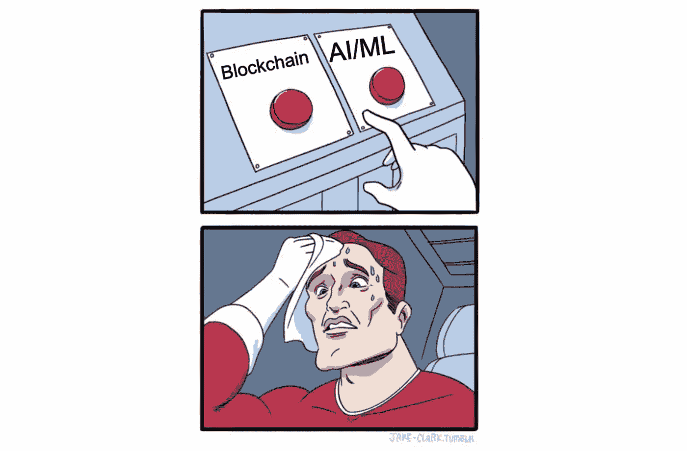
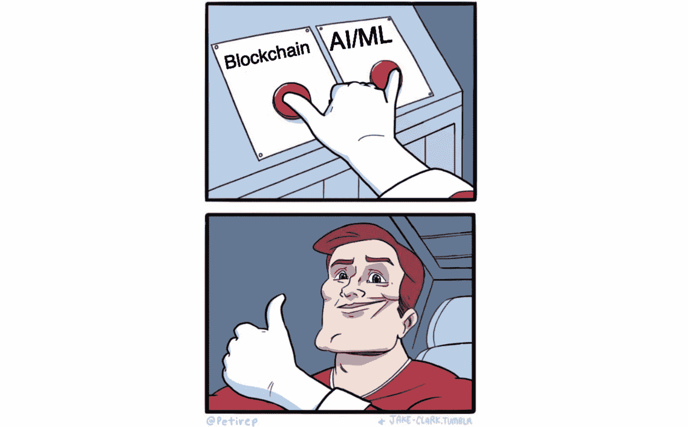
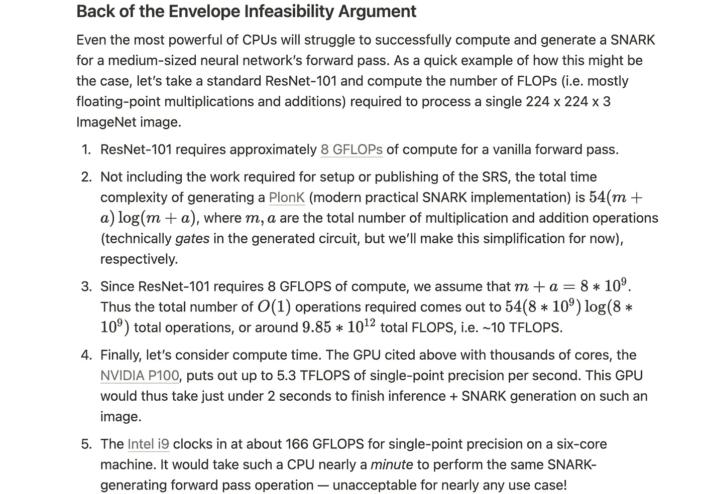

# 第一章:如何让你的人工智能上链

> 原文：<https://medium.com/coinmonks/chapter-1-how-to-put-your-ai-on-chain-8af2db013c6b?source=collection_archive---------0----------------------->

尽管各地有无数人充满热情，但运行一个相当大的人工智能模型的任务继续令人失望。毕竟，对计算的简单需求在历史上使得这两种技术从根本上不兼容——就像 3D 版的《阿凡达》和《不呕吐》——以至于甚至考虑这个想法都足以让任何 Solidity 开发者汗流浃背。

S*tate of on-chain AI circa 2022*

然而，事情变化很快。

首先，开拓性的 rollup 技术准备*显著提高以太坊的交易速度和计算能力，同时降低油价并保护隐私。*尽管每一个主要的加密市场都被一分为二，但更大的加密开发社区已经团结在“构建市场”的背后随着重要的技术基础继续定期被奠定，web3 谦虚地扩展它的产品，人们问这样一个问题是可以原谅的:也许是现在？

我们知道，我们知道——当然，“如果我们把人工智能放在区块链上呢？”听起来像是一个七岁小孩会梦想出来的东西。不过，根据我们的经验，7 岁的孩子可能会出奇的聪明。

这就是为什么我们会对链上人工智能的未来发表我们的想法。我们将从以太坊 L2 卷起空间中看到的一些变化开始(这里主要参与者的演进架构转化为“真正”链上人工智能的非常重要的机会)。然后，带着对计算如何改变密码领域的良好印象，我们将推进一条通往**的道路，一个强大、可验证和透明的人工智能在以太坊**上运行的未来。当我们探索这个空间时，我们也将*标记我们的假设*(那是斜体文本所发出的信号)，然后在我们讨论的最后重新审视它们。

好了，释放你内心的七岁，让我们开始吧！

# 步骤 1:累计累计

以太坊*已经*规模化了。问问 Starkware 那些才华横溢的人就知道了—

> *“STARK ware 以零知识的确凿证据为区块链带来了可扩展性和隐私性。它是一个无许可的、分散的 ZK-罗卷，作为以太坊上的 L2 网络运行。通过离线生成 STARK 证明并在线验证这些证明，它在保持 L1 以太坊安全性的同时实现了规模化。”(* [*来源*](https://www.sequoiacap.com/companies/starkware/) *)*

是的，整个 Technion 毕业班*已经*完成了这个雄心勃勃的任务。StarkNet，他们在以太坊上的 L2 网络，使得 dYdX 这样的 dApps 能够创建“有史以来最快、最强大的分散式交易所”([来源](https://dydx.exchange/))。最重要的是，斯塔克 L2 实现了令人印象深刻的规模([在以太坊主网上结算超过 1 亿笔交易和超过 3800 亿美元的交易](https://starkware.co/starknet/) ) *而没有损害以太坊的可组合性和安全性*。

Starkware 使用的有效性汇总是一个优雅的工具，可以在不降低安全性的情况下获得更多的链吞吐量。关键是，不是将数据直接放在主“第一层”链(以太坊)上，而是将计算的*证明*(即 STARK 或 SNARK)传递到 L1 中。这种缩放来自于这样一个事实，即无论电路大小如何(常数和可能涉及的 log(n)项)，这种证明都是难以置信的快速验证。

StarkNet 和 zkSync 都提到的第 2 层*是处理事务并生成这些证明的计算节点*的网络。随着时间的推移，这些证明被批量处理并发送到 L1(以太坊主网)，在那里每个证明都被验证，状态变化被接受。

然而，Starkware 的卷式解决方案并非没有缺点。与我们最相关的是: **Cairo** (他们的证明生成编程环境) ***只在 CPU*** 上运行(理解:STARKs 只由 CPU 代码生成)，对于任何具有 AI/ML 背景的人来说，这扼杀了任何复杂的建模梦想——更多信息请参见我们最后的信封背面的不可行性论证！

The web3 community awaiting a post zk-rollup Eth

# 第二步:CPU 与 GPU

理论上，*任何计算都可以被有效地验证*(通过 SNARKs/STARKs)，但是到目前为止还没有人把现有的人工智能操作移植到这些自动证明生成语言中。这种状况可能很快会有所改变——例如，Giza 正在致力于将预训练的 ONNX 模型移植到 Cairo 中进行可验证的推理。然而，这种模型将仅限于 CPU 计算(因为 Cairo 不支持基于 CUDA 的 STARK 生成)，尽管大多数现代人工智能模型*必须*在 GPU 上运行。

快速速成班:CPU 根本不是为运行大型人工智能模型而设计的。具体来说，CPU 配备了少量(通常为 4 或 8 个)功能强大的物理内核(每个物理内核可以进一步划分为 2 或 4 个虚拟内核)，每个物理内核通过极快地切换进程来处理大量进程，给人一种许多进程同时运行的错觉。然而，大多数深度学习(和 SNARK 生成)操作未能受益于这种核心的处理速度和通用性，因为这种算法的顺序版本需要数量*巨大*的[原始触发器](https://github.com/albanie/convnet-burden)。

另一方面，GPU 是专门为加速并行处理而设计的。它们配备了[数千个内核](https://www.itcreations.com/nvidia-gpu/nvidia-tesla-p100-12gb-gpu)——这样的内核，虽然远不如它们的 CPU 同类产品强大，但允许完全不同的编程范式。

当然，并不是每个算法都可以轻松并行化，但众所周知，深度学习模型是由大量可并行化的操作(前馈、conv、变压器块等)组成的。)，*虽然控制 SNARK 生成的证明者计算成本的某些密码原语(组幂运算)也显示出 GPU 加速的良好迹象。*

# 第三步:组装

这就引出了我们的中心论点——如果一个汇总服务利用硬件加速的证明者解决方案(例如使用 GPU 或 FPGA)——*这种数学上的突破+加速器支持的证明生成*将是在 chain 上实现*真正的* AI 的关键。换句话说，如果我们可以创建我们(硬件加速的)人工智能推理调用的证明，那么我们就可以证明我们在一组特定的数据上运行了一个特定的模型。这意味着其他人可以验证我们的模型，而不必信任我们，*和*不必自己运行整个计算，只需要检查生成的证明。换句话说，**我们可以在不放弃 crypto 的去中心化和不可信本质的情况下拥有强大的 AI。**

# 步骤 4:“真正的”链上人工智能的含义

The future — shaka to that!

在不损害以太坊的去中心化和不可信本质的情况下，将人工智能模型放入链中的能力*将是 web 3*T3 的巨大飞跃。它使 dApps 在功能上更接近于它们的集中式对手，为 Web3 带来了推荐和匹配算法。它可以用于 NFT 市场，以更好地迎合个人钱包所有者，基于他们目前拥有的 NFT。它可以作为一个自动化的、可信的 Oracle，用于验证离线数据。最令我们兴奋的是，它可以实现新的用例，如果没有链上人工智能的支持，这是不可能的。

也有令牌经济学的可能性，如提高链上模型的质量，并因改进而获得令牌。还有更疯狂的想法，像基于一个 AI 运行一个 DAO，或者基于一个 AI 对参与的评估来分发空投令牌。在尝试之前，很难说这些东西会有多好，但我们喜欢尝试疯狂的想法，我们很高兴看到当人们有工具给链上世界添加更多古怪时会发生什么。

当然，所有这些好处都依赖于可验证的 GPU 加速的人工智能，这就是为什么我们在这篇文章中试图区分基于 CPU 和基于 GPU 的人工智能。你可以把越多的计算转储到你的人工智能中，上面列出的一切将会更好地工作，GPU 只是提供了更多的计算。

# 重新审视我们的假设

1.  卷装显著提高了传送速度和链条吞吐量，同时降低了油价。
2.  汇总提供隐私，同时保留以太坊的分散性和安全性。
3.  L2 计算是一个由物理节点组成的网络，它可以生成证据放在 L1 上。
4.  Cairo (STARKs)只在 CPU 上运行。
5.  在那里*将会有*加速器技术+数学的突破，使人工智能操作能够被编码成一种证明生成语言。
6.  任何计算都可以通过 SNARKs/STARKs 进行有效的验证。
7.  GPU 显著加速了 SNARKs/stark 的生成。
8.  链上人工智能的用例:它们是什么？

> 交易新手？尝试[加密交易机器人](/coinmonks/crypto-trading-bot-c2ffce8acb2a)或[复制交易](/coinmonks/top-10-crypto-copy-trading-platforms-for-beginners-d0c37c7d698c)