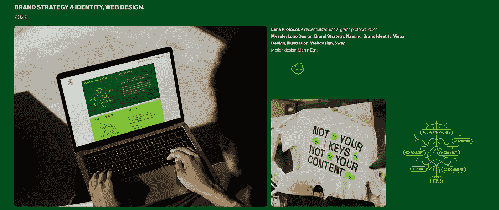
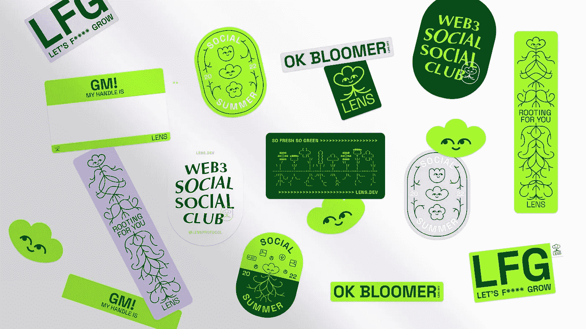
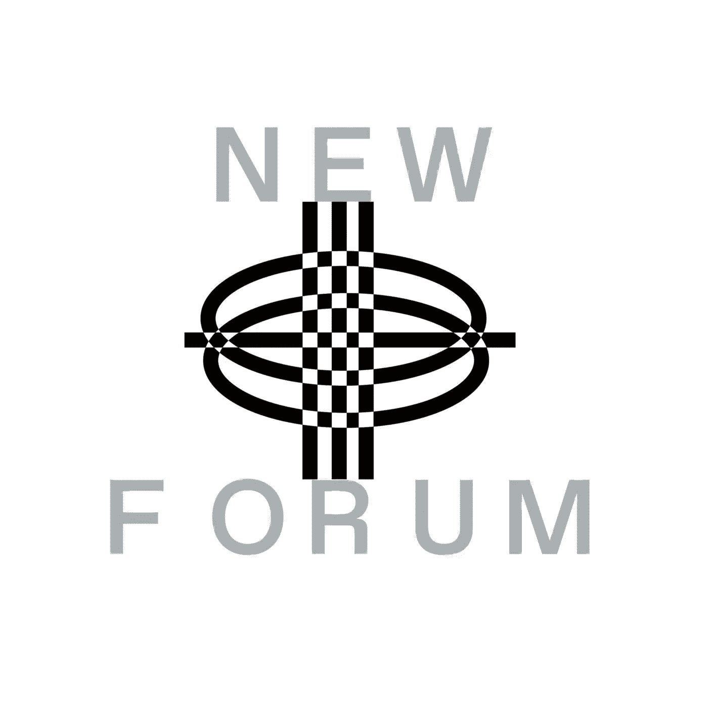

# WE3 的联合创始人 Charlota Blunárová定义了 Web3 的标准设计体验

> 原文：<https://medium.com/coinmonks/charlota-blun%C3%A1rov%C3%A1-co-founder-of-we3-defines-the-standard-design-experience-in-web3-c46143a136ed?source=collection_archive---------10----------------------->

Charlota Blunárová | Co-founder WE3 | Brand + Digital Product Designer in #web3 | ex-IDEO

在 NEWFORUM 的这一集中，我们很高兴与 Charlota Blunárová就 Web3 的标准设计体验以及它与 Web2 品牌设计的区别进行了深入的对话。她讨论了在 Web3 中做品牌和数字产品设计师的好处和挑战。

Charlota 曾是 IDEO 的设计主管，他与他人共同创立了 WE3.co，这是一个社区拥有的设计集体，与 Aave、Delphi Digital、Koodos 和 NEAR Foundation 等 Web3 公司合作。她也是 Lens Protocol 和 Astroport 等品牌的幕后推手，这些品牌是开源的，旨在实现可再混合。Charlota 曾与香奈儿、麻省理工学院、Moncler 和 H&M 等公司合作创造新产品和品牌。除了 Web3，她还对未来工作设计、AI x 创意工具、FemTech 和创造者经济感兴趣。

# 那么她的背景是怎样的，她在 Web3 的第一次经历是怎样的？

Charlota 最初几年忽视了区块链技术和加密货币。感觉更侧重于金融、量化和投机。这不是她最初的兴趣。

> “这种情况在 2020 年底左右发生了变化，当时突然有大量有创造力的人涌入太空，主要是通过 NFT，所以我看到许多创造者进入太空；突然间，我对这个空间的整体感觉变得像是，哇，这更有文化和质量了。”—查洛塔

她开始问这样的问题:这是什么空间？突然，她看到 Dao 以不同的方式出现，供人们协调。在这一点上，Charlota 被说服了，并决定是时候让自己进入 Web3 兔子洞了。

> “很不幸，我不能说我是最早购买以太坊的 OG 人。但是 2020 年左右，我开始深潜。我的第一次经历是购买一些 NFT。我为 MetaFactory 做了一个时尚合并投放——一个创造数字时尚和购买有形时尚产品的不同机会的地方……”——Charlota

# **那次经历之后，Charlota 在入职过程中做了什么？**

她参与了一个项目，这个项目让她结识了 WE3 的联合创始人里德·威廉姆斯。

他们一起获得了 NEAR Foundation 对 NEAR 区块链的资助。他们开始为 DAOs 建立一个平台。

她解释说，基本上，他们正在为分散自治组织(Dao)构建一个工具。为了能够在附近的区块链上找到自己的空间。Charlota 表示，这是她第一次有机会设计数码产品。

她分享了更多关于她设计数字产品的经验，以及这样做如何帮助她了解 Web3/Crypto 空间。

在她的完整采访中，她进一步解释了她如何通过她的第一个 Web3 项目突然意识到——她周围有更多的设计师，一些她的前 IDEO 同事。他们各自独立完成不同的 Web3 项目，并决定——嘿，一起工作是多么好的主意啊。这就是事情的经过。

# Web3 的一个重要组成部分是所有权 Charlota 如何看待设计师需要投资者心态，Web3 如何重塑设计师的工作方式？

> “我认为 Web3 创造了一个转变，因为产品的用户突然变成了产品的所有者和产品的大使，对吗？因此，通过去中心化的协议，人们正在参与协议的管理，成为利益相关者和股东，这就是 Web3。但这是整个社会正在发生的事情的一个重要信号。”—查洛塔

在她的完整采访中，Charlota 从她作为千禧一代的角度解释了她所说的*发生在整个社会中的*是什么意思。

她分享说，现在有一种趋势，人们希望分散他们的收入来源，并在多个事情上下注——分散他们的收入，而不是把所有的鸡蛋放在一个篮子里。

她什么意思？她在完整的采访中详细解释了这一点。

> “我在 IDEO 工作过。我们与大公司合作，开发他们即将推出的产品、服务和创新。我们意识到，虽然我们提供了一点点深入的思考和产品设计工作，但如果产品或服务成功，我们并没有积极参与。我认为，对于那些开始理解如果他们在过程早期增加价值，他们应该在项目、产品和服务中拥有股份的人来说，这种情况正在发生变化。”—查洛塔

在这一集的 NEWFORUM 中，Charlota 从她作为一名自由职业者从 Web2 到 Web3 的设计中获得了更多的见解，以及如何要求她的部分报酬以现金形式存在，但被告知这很复杂；而且不值得，为了一个独立的设计作品去做。

这在 Web3 领域是不同的，因为团队和创始人意识到为人民、与人民、为社区和与社区一起建设，并奖励帮助塑造他们的贡献者，协议和基于协议的产品是至关重要的；Web3 的一部分和设计师的所有权。

> “我们意识到，作为设计师，在 WE3，我们发现自己独自从事不同的 Web3 项目，作为我们薪酬的一部分，我们得到了一些股权。所以我们迅速采取行动，决定将所有的股权放入一个共同的国库。所以我们都分享好处和其他人的工作，但我们分担风险，所以我们分散投资。因为我们唯一能投资的是我们的知识和时间，对吗？”

Charlota 解释了他们现有的模式，他们从 WE3 项目中获得部分报酬，然后以股权形式获得部分报酬。她补充说，这可能是不同类型的未来代币协议，或者如果一个项目在公开市场上有代币可用，他们可以得到一部分。Charlota 解释说，为 WE3 项目工作的设计师获得现金部分的补偿，因为她非常清楚每个人都需要支付账单。虽然，她表示，现金比一个人会得到的略低，收取只为实物货币(现金)工作的普通客户。然后是进入共享国库的股权部分。

> “这件事的神奇之处在于，激励机制与创始人一致，对吗？所以，他们不会因为我们在他们公司有股份而雇佣我们来做这个项目或者提供某种类型的工作。我们受到激励去帮助他们，尽我们所能提供最好的工作。此外，我们还与他们保持联系。因此，我们正在建立投资者的思维模式，即网络 3 传统上一直在帮助他们的投资组合、公司以及设计师……”——Charlota

根据 Charlota 的说法，这是他们如何确保在开始时以及在联系创始人时提供基础设计工作，或者他们正在雇用全职人员或试图让人们对全职机会感兴趣——激励他们照顾整个生态系统。在她的完整采访中，她进一步向我们的社区解释了这一点。

查洛塔在推特上详细阐述道:

> “为 Web3 设计一个品牌更像是游戏设计:创造一个知识，让用户去探索，给他们一个角色、使命和一个工具包来传播(品牌)信息”

# 我们的社区想知道为什么为一个 Web3 品牌设计更像游戏设计，以及她如何将它与她的 Lens Protocol 工作联系起来。

Lens Protocol | Brand Design

> “传统公司有一个品牌部门，负责设计品牌和标志，然后自上而下地进行管理。他们控制着它。这是可口可乐的正确色调吗？营销材料使用了正确的字体吗？这样一切都得到管理和控制。”—查洛塔

Charlota 指出了另一个名为 Headless Brands 的互联网帖子，她解释说，这是一种自下而上出现的新型品牌，由社区管理，在没有自上而下控制的情况下发展。她举的一个例子是比特币。

> “如果你想象比特币，你会看到标志，你会看到橙色，但你也会想到它的叙事，对吗？比特币是什么的说法正在演变；没有一个公关团队或公司的专门部门会告诉人们比特币是什么。比特币正在演变为电子现金，或者是某种抗中心货币或储值货币，或者是与市场上其他金融资产不相关的东西。这仍然是一个不断发展的故事，它已经分叉了几次，或者已经分叉了几次……”——Charlota

关于她发布的推文，Charlota 解释说，设计一个品牌不再是关于这件艺术品，这个故事，然后把它放进 Brand Book，然后把它交出来，说，就像这样，这个，是它吗，用它，或者我会跟着你。现在，你需要思考一个故事，然后你必须选择几个元素，比如你给社区的种子，希望它们中的一些会开始生长，人们会开始使用它们。这就是这个品牌的发展方向。

根据 Charlota 的说法，你无法预见人们会对品牌、故事或资产做什么。

> “以 Lens Protocol 为例，这是一个由 Aave 背后的团队构建的分散式社交图协议。这个想法基本上是，如果你使用 Twitter 或脸书，你有一个社交图，对不对？这是你添加到你发布的帖子中的所有朋友的连接。如果你从脸书转到 Twitter，你不会自动看到你在脸书的所有朋友，这有点像一个个独立的花园。这个想法是——如果我们可以，因为用户拥有那个社交图，这意味着我们可以登录 Twitter、脸书、Instagram 和 Spotify？希望在一些未来的 Web3 社交媒体应用中，不会失去与我们创造的内容或人们的联系？”—查洛塔

Charlota 分享了他们(WE3)如何为面向开发者的 Lens 设计品牌，以及如何通过拥有自己的数字根这一想法激发的精彩隐喻来实现当前的 Lens 协议品牌。

Lens Protocol | Brand Design

Lens Protocol | Brand Design

设计师如何从一个道中获益，是否所有的设计师都需要成为一个道的一部分？观看她完整的一集，听听她深思熟虑的回应。Charlota 分享了她对自己的初创公司 WE3 for Web3 下一步的看法。她表达了她希望看到的，以及她对未来几年 Web3 设计的期望。

与 Charlota 的对话最后分享了她的团队如何在空间中保持灵感和保持心理健康。

在本期 NEWFORUM 中，她还推荐了一些她最近很感兴趣的设计、项目和书籍。

加入 NEWFORUM 社区，与 Charlota Blunárová一起享受这一信息丰富的插曲🔥

[加入社区](https://twitter.com/newforum_nco)了解  [@0xCharlota](https://twitter.com/0xCharlota) 并发现 web3 社区中的其他创始人和远见者！

✨follow·夏洛塔·布兰诺娃！推特:[@ 0x charlota](https://twitter.com/0xCharlota)|[@ we3co](https://twitter.com/we3co)LinkedIn:[charlotablunáROVá](https://www.linkedin.com/in/charlotablunarova/)网站:[blunarova.com](https://blunarova.com)

# new forum # web 3 # design thinking # product design # digital designer # community #区块链# smartcontract # dao #开源#开发者#creatoreconomy

爱 x 新论坛

# Twitter @newforum_nco

不和谐[@加入](https://discord.gg/2K8tvVh8tM)

# 新论坛

[NEWFORUM](https://newforum.notion.site/newforum/Welcome-to-NEWFORUM-48f9661398ec4ec6a1af37fcc96dc926) 由 [Newcoin Foundation](https://newcoin.org/) 提供支持，专注于促进去中心化社交应用的扩展，也被称为 Social 3.0，形成一个生态系统和一个由远见者、创造者和投资者组成的社区。它为思想者提供了一个安全的交流、传播和分享思想的空间，以确保一个新网络的自觉和道德发展，嵌入关怀、自由和创造力的价值观。✨每周新集！在 [Twitter](https://twitter.com/newforum_nco) 、 [Newlife](https://newlife.io/) 、 [Youtube](https://www.youtube.com/channel/UCWvHyau1nIJBffmaaj6FmbQ) 和 [LinkedIn](https://www.linkedin.com/showcase/newforum/) 上关注我们，了解 web3 的更多信息，认识生态系统！加入生态系统[不和](https://discord.gg/DHepA4WTkN)！

> 交易新手？尝试[加密交易机器人](/coinmonks/crypto-trading-bot-c2ffce8acb2a)或[复制交易](/coinmonks/top-10-crypto-copy-trading-platforms-for-beginners-d0c37c7d698c)