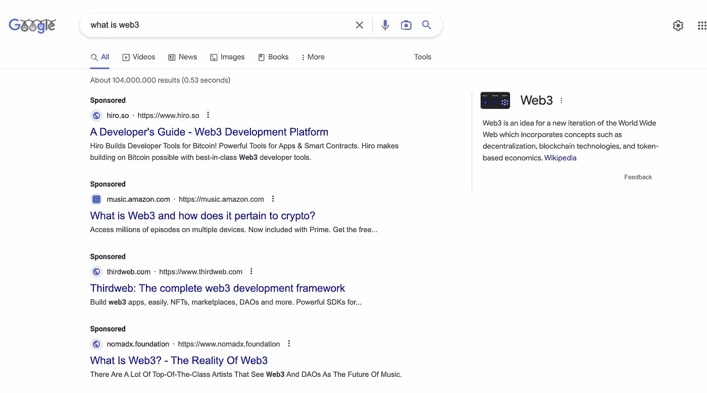
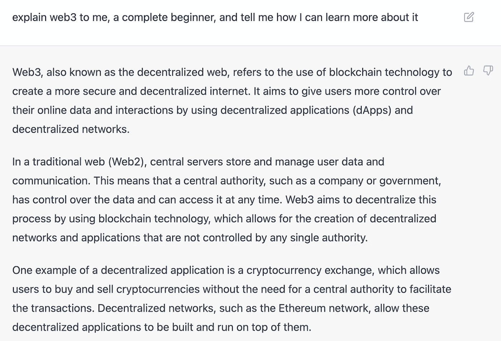
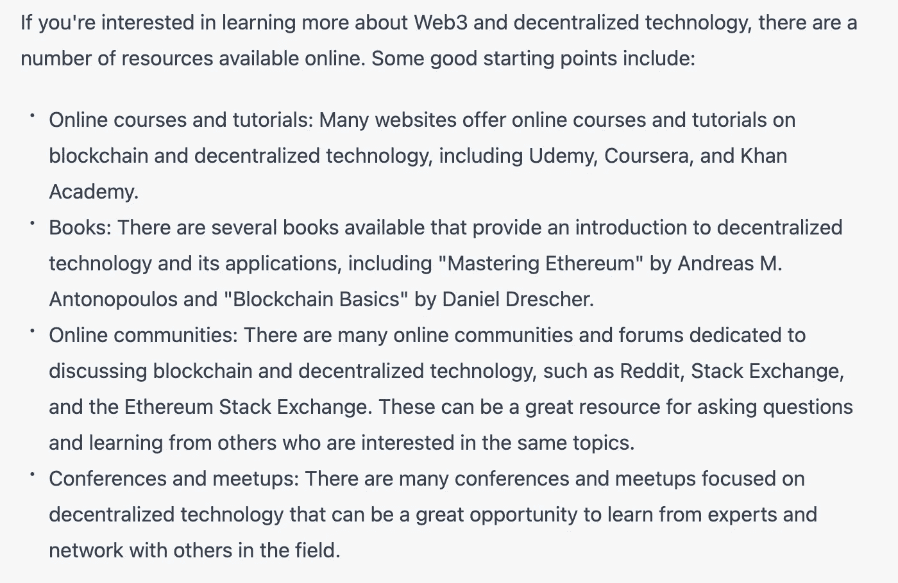
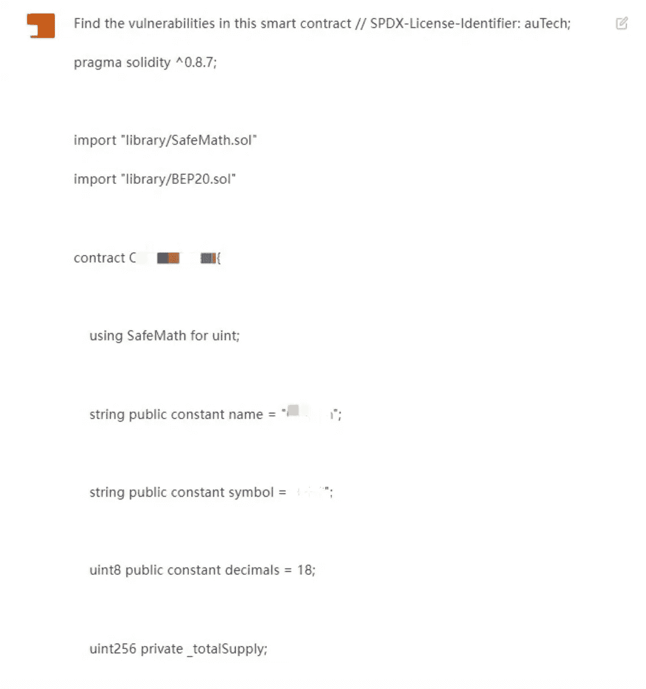
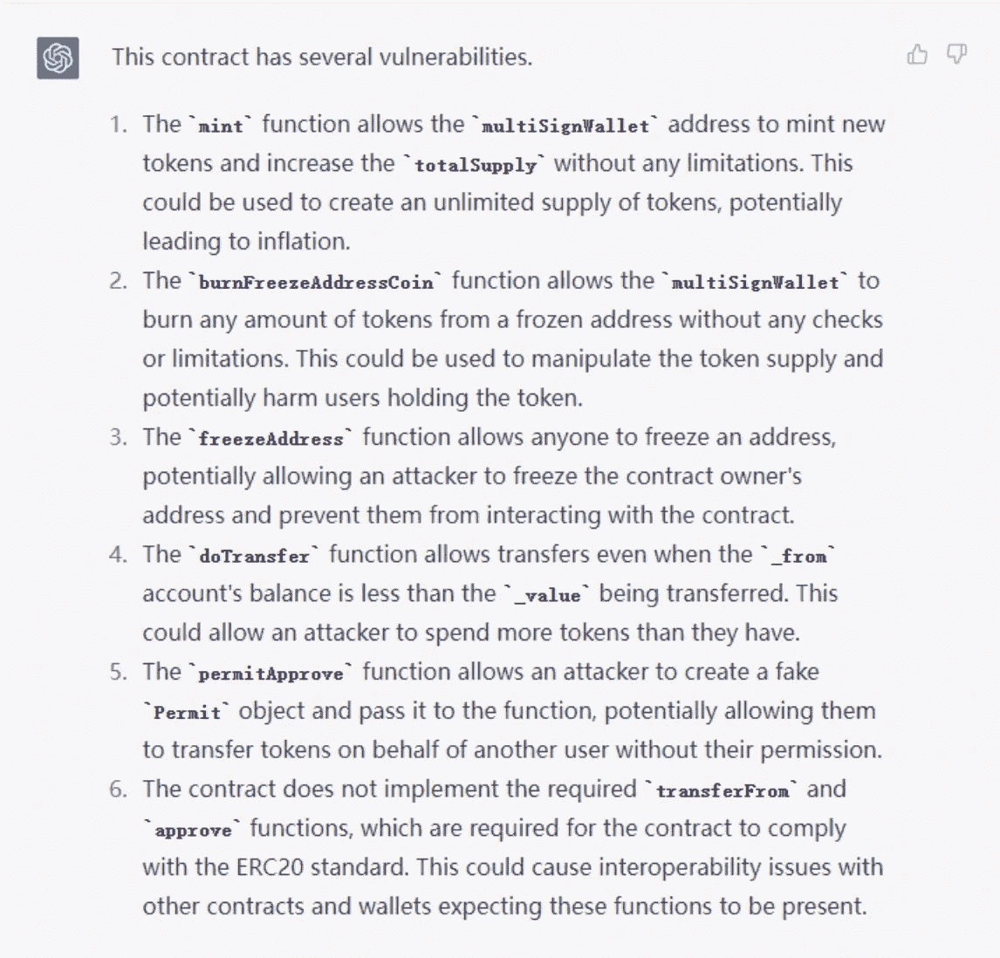

# ChatGPT for Web3

> 原文：<https://medium.com/coinmonks/chatgpt-for-web3-2c320da66af3?source=collection_archive---------7----------------------->

*催化教育、灵感和迭代*

【Web3.com 创投原创研究分析

[0xFishylosopher](https://fishyonchain.medium.com/)


# 介绍

像许多其他人一样，我完全被 ChatGPT 的能力震撼了。虽然我以前玩过 GPT-3 的游乐场 API，也写过更新的图像模型，比如在之前的 DALLE 2 [，但我对 GPT-3 的反应的广度、深度和流动性没有准备。从十四行诗到固体，从哲学到物理学，内容的质量简直令人震惊。](https://fishylosophy.substack.com/p/marx-marcuse-and-modernity)

ChatGPT 仍处于起步阶段，它无疑是包括 Web3 在内的所有行业的潜在颠覆性力量。在这篇文章中，我将努力概述我认为 ChatGPT 将加速行业发展的一些方式，催化 Web3 中的教育、灵感和迭代过程。

# 教育

首先，像 ChatGPT 这样的人工智能系统在教育和帮助用户在 Web 3 的广阔世界中导航方面非常有用。作为一个融合了尖端技术和不透明金融模式的行业，Web 3 的教育问题尤为突出。要在 Uniswap v3 等分散式交易所(DEX)进行单笔交易，用户必须了解钱包、种子短语、集中流动性、流动性池等。所有这些都让新用户的入门变得很糟糕，并且是目前 Web 3 大规模采用的主要瓶颈[1]。

> 交易新手？在[最佳加密交易](/coinmonks/crypto-exchange-dd2f9d6f3769)上尝试[加密交易机器人](/coinmonks/crypto-trading-bot-c2ffce8acb2a)或[复制交易](/coinmonks/top-10-crypto-copy-trading-platforms-for-beginners-d0c37c7d698c)

当然，你可以说网上有无数的资源——博客、视频、课程、游戏——旨在让用户进入这个行业。但是所有这些都有一个巨大的引导问题:你从哪里开始？在谷歌上搜索“什么是 Web3 ”,你会看到一堆广告，然后是一个包含行话的维基百科页面[2]:

> *Web3(也称为 Web 3.0)是万维网的一个新版本，它融合了去中心化、区块链技术和基于令牌的经济学等概念。—维基百科*



Google results for “what is web3.” Source: Google.

什么是“区块链技术”，“基于令牌的经济学”，为什么我们需要一个“万维网的新版本”？对于一个完全的初学者来说，这些都没有任何意义。你需要做一些额外的查询，点击一些不同的链接，然后才能找到你理解的东西。从根本上说，这是因为像谷歌这样的搜索引擎是信息的聚合者和内容的索引器，而不是这些内容的生产者。简单来说，谷歌基本上就是一个数字图书馆员。它不知道如何确切地回答你的问题，只能给你指出它认为会有帮助的资源。如果谷歌策划的内容不符合你的需求，那么运气不好。甚至所有谷歌收集的关于你的个性化信息也没有帮助:它所做的只是试图给你指出它认为可能对你更有帮助的更好的资源。

另一方面，ChatGPT 是典型的不同:它是内容的原创生产者，而不是简单的内容索引器。ChatGPT 不像图书管理员那样给你指出资源，它更像是一个导师或老师，试图教你每件事情的意义，以你告诉它的方式呈现:通过给你类比，通过指引你到合适的博客或资源，或者通过写一首关于它的十四行诗[4]。作为一个原创内容创作者，ChatGPT 不依赖于一个固定的已经制作好的回答语料库，而是根据你的具体情况制作一个新的。这就是为什么 ChatGPT 可以作为绝对初学者的有效一站式商店。



ChatGPT results for explaining web3 and resources to learn more about it. Source: OpenAI ChatGPT.

当然，教育不仅仅是针对绝对的初学者；对于任何想了解 Web3 新领域的人来说，它都是一个有用的工具，无论是 zk-SNARKs 还是区块链内部的通信协议。由于 Web3 既是一个多样化的行业，也是一个技术上具有挑战性的行业，所以总会有新的方面、想法和概念出现。这就是为什么 Web3 非常需要复杂的教育工具，比如 ChatGPT。

# 灵感

ChatGPT 不仅可以教你一门技术的原理；它还能给你一些如何在实践中应用这项技术的想法。从本质上讲，ChatGPT 还可以充当“新鲜的眼睛”，让创新滚雪球。这里有一个例子:

> 问:ChatGPT 可以启用或增强的 dapp 示例有哪些答:ChatGPT 可以启用或增强的 dapp 示例包括:

1.  *社交网络 dApps——ChatGPT 可用于生成对用户帖子的自然语言回复，为用户创造更具吸引力和逼真的体验。*
2.  *游戏 dApps——chat GPT 可用于从游戏中的角色生成类似人类的反应，创造更加身临其境的游戏体验。*
3.  *供应链管理 dApps——chat GPT 可用于自动生成智能合同，以跟踪和管理供应链中的商品和服务流。*
4.  投票 dApps——chat GPT 可用于自动生成区块链投票结果和其他数据的自然语言摘要，使用户更容易理解和跟踪选举结果和其他投票过程。
5.  *预测分析 dApps——chat GPT 可用于根据来自区块链的数据生成自然语言预测和见解，为用户提供更容易访问和直观的方法来分析和理解复杂的数据。* — OpenAI ChatGPT

这里介绍的一些 dApp 想法是我以前思考过的，即(1)社交媒体聊天机器人和(3)智能合同生成。虽然事后看来(2)显然是有道理的，但实际上我并没有马上想到这一点。(4)和(5)是我完全忽略的 ChatGPT 在分析领域的进一步应用。

更重要的一点是，ChatGPT 具有激发灵感的能力:它让你知道在特定领域使用特定技术可以创建什么类型的项目。因为它基本上是在整个互联网上接受训练的，它可以在不同的领域之间进行比较和推理，从而在想法的可能性方面创造组合爆炸。想象一下 ChatGPT 可以带来的力量，对于在学习了特定的技术后准备动手的黑客马拉松团队，或者对于想要解决的问题只有最模糊想法的创始人。

虽然 ChatGPT 的灵感力量在任何领域或行业都是改变游戏规则的，但它对 Web3 的潜在建设者尤其强大。从根本上说，Web3 仍然是一个新兴领域，需要大量的新思想、新模式和新概念来推动它走向成熟和大规模采用。在这个早期阶段，因为没有成功的固定公式，所以在这个行业中，每个实验和想法都很重要。因为 ChatGPT 能够给你原创的内容，它也是一个比网上“10 个可以用来改进你的 Python 的项目想法列表”更好的灵感来源，后者通常是千篇一律的和平凡的。Web3 的独特之处还在于，该领域为这种实验性创新提供了巨大的财政激励，如拨款和黑客马拉松奖励[5]。因此，ChatGPT 有可能成为巨大的催化剂，让人们发现和探索新的项目方向，提供灵感的指导来源，启动破坏性创新的飞轮。

# 循环

尽管如此，可以说 ChatGPT 最令人印象深刻的能力之一是它能够参与创作本身的迭代过程。基本上，ChatGPT 不仅教育和启发，而且允许您以两种重要的方式在代码中具体地实例化您的想法:作为代码的原始创建者，以及作为安全漏洞的健全检查。

下面是第一种情况的例子:

> 问:编写一个智能契约，使用带有 disable_mint 函数的 OpenZeppelin 创建一个名为 GPToken 的 ERC 20 令牌，符号为 GPT，当铸造了 100 万个令牌时会触发 disable _ mint 函数
> 答:

```
pragma solidity ^0.6.0;

import "https://github.com/OpenZeppelin/openzeppelin-solidity/contracts/token/ERC20/SafeERC20.sol";
import "https://github.com/OpenZeppelin/openzeppelin-solidity/contracts/math/SafeMath.sol";

contract GPToken is SafeERC20 {
    using SafeMath for uint256;

    string public name = "GPToken";
    string public symbol = "GPT";
    uint8 public decimals = 18;
    uint256 public totalSupply = 0;
    bool public mintingFinished = false;

    constructor() public {
        // assign totalSupply to msg.sender
        totalSupply = 1_000_000.mul(10**uint256(decimals));
        balanceOf[msg.sender] = totalSupply;
    }

    mapping(address => uint256) public balanceOf;

    function disable_mint() public {
        require(totalSupply == 1_000_000.mul(10**uint256(decimals)), "Minting has not finished yet");
        mintingFinished = true;
    }

    function mint(address _to, uint256 _amount) public {
        require(!mintingFinished, "Minting is disabled");
        require(totalSupply.add(_amount) <= 1_000_000.mul(10**uint256(decimals)), "Cannot mint more than 1 million tokens");

        balanceOf[_to] = balanceOf[_to].add(_amount);
        totalSupply = totalSupply.add(_amount);
    }
}
```

虽然这个智能合约有一些风格和优化潜力，例如删除了使用`decimals`(因为令牌的数量将始终是一个整数)，并添加了一个`if`语句来检查令牌的数量是否等于 100 万，如果等于，则添加`disable_mint`，它获得了智能合约代码的基本要点，并作为一个很好的样板起点。考虑到开发时间的很大一部分用于构建这些样板模板，ChatGPT 可以极大地提高开发速度。当我们考虑到它的输出可以被定制成各种用例(如这里的 100 万令牌 disable-mint)时，它的能力尤其令人印象深刻，这是传统的在线操作指南和编码指南所不能提供的。因此，在创作领域，ChatGPT 极大地减少了开发人员的“写作障碍”，在写作障碍中，您对代码可能的样子有一个模糊的概念，但不知道从哪里开始。

ChatGPT 与实际智能合约代码的第二个用例是检测智能合约代码中的漏洞。即使 ChatGPT 声称它不专门审计智能合同，当你输入一个易受攻击的智能合同时，它也能够就合同的潜在漏洞提供像样的反馈。



ChatGPT finding vulnerabilities in a smart contract. Source: [https://beosin.com/resources/can-chatgpt-the-"most-powerful-ai"-detect-vulnerabilities](https://beosin.com/resources/can-chatgpt-the-%22most-powerful-ai%22-detect-vulnerabilities)

与 ChatGPT 创建代码一样，系统的原始输出可能并不完美，可能会在过程中误检一些错误。因此，虽然它作为人工审计员的完全替代并不可靠，但它代表了一个可以通过的寻找明显漏洞的初步检查工具[6]。

# 结论

ChatGPT 能在多大程度上真正实现 Web3 开发过程的自动化？我相信维塔利克很好地总结了这一点:

> *在这一点上，人工智能远远不是人类程序员的替代品……也就是说，它确实向我介绍了一些我以前没有见过的编码模式，并且它编写基本转换器的速度比我自己编写的速度更快……也就是说，人工智能正在快速改进，我希望它能随着时间的推移继续改进并消除这样的错误。[7]*

像 ChatGPT 这样的高级人工智能的底线是，它通过减少花费在思考如何从零到一和重复编写样板代码上的“死亡时间”来加速 Web3 创新的学习、思考和编码阶段。虽然在未来，特别是随着特定领域的微调，我们可能会看到更加复杂精确的代码自动机，但仍然没有办法将人类从创造过程中解放出来。

🐦@0xfishylosopher

📅2022 年 12 月 28 日

# 参考

[1]有关入职问题的更多信息，请参见:[https://moralis . io/how-to-boost-web 3-user-on boarding-success-rates/](https://moralis.io/how-to-boost-web3-user-onboarding-success-rates/)

[2]https://en.wikipedia.org/wiki/Web3

[3][https://www . nytimes . com/2022/12/21/technology/ai-chatgpt-Google-search . html](https://www.nytimes.com/2022/12/21/technology/ai-chatgpt-google-search.html)

[4][https://www . CNBC . com/2022/12/15/Google-vs-chatgpt-what-happed-when-I-swapped-services-for-a-day . html](https://www.cnbc.com/2022/12/15/google-vs-chatgpt-what-happened-when-i-swapped-services-for-a-day.html)

[https://www.decentralised.co/p/grants-and-web3](https://www.decentralised.co/p/grants-and-web3)

[6][https://BeO sin . com/resources/can-chatgpt-the-“最强大的人工智能”-检测漏洞](https://beosin.com/resources/can-chatgpt-the-%22most-powerful-ai%22-detect-vulnerabilities)

[https://vitalik.ca/general/2022/12/06/gpt3.html](https://vitalik.ca/general/2022/12/06/gpt3.html)

> 加入 Coinmonks [电报频道](https://t.me/coincodecap)和 [Youtube 频道](https://www.youtube.com/c/coinmonks/videos)了解加密交易和投资

# 另外，阅读

*   [Bookmap 评论](https://coincodecap.com/bookmap-review-2021-best-trading-software) | [美国 5 大最佳加密交易所](https://coincodecap.com/crypto-exchange-usa)
*   [加密交易机器人](/coinmonks/crypto-trading-bot-c2ffce8acb2a) | [造币评论](https://coincodecap.com/coingate-review)
*   最佳加密[硬件钱包](/coinmonks/hardware-wallets-dfa1211730c6) | [Bitbns 评论](/coinmonks/bitbns-review-38256a07e161)
*   [新加坡十大最佳加密交易所](https://coincodecap.com/crypto-exchange-in-singapore) | [购买 AXS](https://coincodecap.com/buy-axs-token)