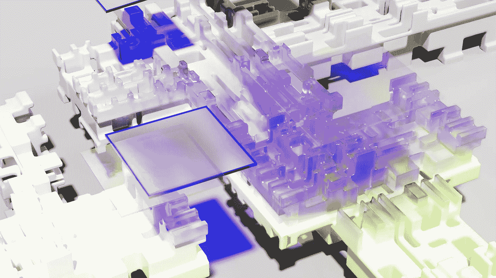

# ChatGPT for Web3

> åŸæ–‡ï¼š<https://medium.com/coinmonks/chatgpt-for-web3-2c320da66af3?source=collection_archive---------7----------------------->

*催化教育ã€çµæ„Ÿå’Œè¿­ä»£*

ã€Web3.com 创投åŸåˆ›ç ”究分æ

[0xFishylosopher](https://fishyonchain.medium.com/)



# 介ç»

åƒè®¸å¤šå…¶ä»–人一样，我完全被 ChatGPT 的能力震撼了。虽然我以å‰ç©è¿‡ GPT-3 的游ä¹åœº API，也写过更新的图åƒæ¨¡å‹ï¼Œæ¯”如在之å‰çš„ DALLE 2 [，但我对 GPT-3 çš„å应的广度ã€æ·±åº¦å’ŒæµåŠ¨æ€§æ²¡æœ‰å‡†å¤‡ã€‚ä»å四行诗到固体，ä»å“²å­¦åˆ°ç‰©ç†å­¦ï¼Œå†…容的质é‡ç®€ç›´ä»¤äººéœ‡æƒŠã€‚](https://fishylosophy.substack.com/p/marx-marcuse-and-modernity)

ChatGPT ä»å¤„äºèµ·æ­¥é˜¶æ®µï¼Œå®ƒæ— ç–‘是包括 Web3 在内的所有行业的潜在颠覆性力é‡ã€‚在这篇文章中，我将努力概述我认为 ChatGPT 将加速行业å‘展的一些方å¼ï¼Œå‚¬åŒ– Web3 中的教育ã€çµæ„Ÿå’Œè¿­ä»£è¿‡ç¨‹ã€‚

# 教育

é¦–å…ˆï¼Œåƒ ChatGPT 这样的人工智能系统在教育和帮助用户在 Web 3 的广阔世界中导航方é¢é常有用。作为一个èåˆäº†å°–端技术和ä¸é€æ˜é‡‘è模å¼çš„行业，Web 3 的教育问题尤为çªå‡ºã€‚è¦åœ¨ Uniswap v3 等分散å¼äº¤æ˜“所(DEX)进行å•ç¬”交易，用户必须了解钱包ã€ç§å­çŸ­è¯­ã€é›†ä¸­æµåŠ¨æ€§ã€æµåŠ¨æ€§æ± ç­‰ã€‚所有这些都让新用户的入门å˜å¾—å¾ˆç³Ÿç³•ï¼Œå¹¶ä¸”æ˜¯ç›®å‰ Web 3 大规模采用的主è¦ç“¶é¢ˆ[1]。

> 交易新手？在[最佳加密交易](/coinmonks/crypto-exchange-dd2f9d6f3769)上å°è¯•[加密交易机器人](/coinmonks/crypto-trading-bot-c2ffce8acb2a)或[å¤åˆ¶äº¤æ˜“](/coinmonks/top-10-crypto-copy-trading-platforms-for-beginners-d0c37c7d698c)

当然，你å¯ä»¥è¯´ç½‘上有无数的资æºâ€”—åšå®¢ã€è§†é¢‘ã€è¯¾ç¨‹ã€æ¸¸æˆâ€”—旨在让用户进入这个行业。但是所有这些都有一个巨大的引导问题:ä½ ä»å“ªé‡Œå¼€å§‹ï¼Ÿåœ¨è°·æ­Œä¸Šæœç´¢â€œä»€ä¹ˆæ˜¯ Web3 â€,你会看到一堆广告，然å是一个包å«è¡Œè¯çš„维基百科页é¢[2]:

> *Web3(也称为 Web 3.0)是万维网的一个新版本，它èåˆäº†å»ä¸­å¿ƒåŒ–ã€åŒºå—链技术和基äºä»¤ç‰Œçš„ç»æµå­¦ç­‰æ¦‚念。—维基百科*


Google results for “what is web3.†Source: Google.

什么是“区å—链技术â€ï¼Œâ€œåŸºäºä»¤ç‰Œçš„ç»æµå­¦â€ï¼Œä¸ºä»€ä¹ˆæˆ‘们需è¦ä¸€ä¸ªâ€œä¸‡ç»´ç½‘的新版本â€ï¼Ÿå¯¹äºä¸€ä¸ªå®Œå…¨çš„åˆå­¦è€…æ¥è¯´ï¼Œè¿™äº›éƒ½æ²¡æœ‰ä»»ä½•æ„义。你需è¦åšä¸€äº›é¢å¤–的查询，点击一些ä¸åŒçš„链æ¥ï¼Œç„¶åæ‰èƒ½æ‰¾åˆ°ä½ ç†è§£çš„东西。ä»æ ¹æœ¬ä¸Šè¯´ï¼Œè¿™æ˜¯å› ä¸ºåƒè°·æ­Œè¿™æ ·çš„æœç´¢å¼•æ“是信æ¯çš„èšåˆè€…和内容的索引器，而ä¸æ˜¯è¿™äº›å†…容的生产者。简å•æ¥è¯´ï¼Œè°·æ­ŒåŸºæœ¬ä¸Šå°±æ˜¯ä¸€ä¸ªæ•°å­—图书馆员。它ä¸çŸ¥é“如何确切地å›ç­”你的问题，åªèƒ½ç»™ä½ æŒ‡å‡ºå®ƒè®¤ä¸ºä¼šæœ‰å¸®åŠ©çš„资æºã€‚如æœè°·æ­Œç­–划的内容ä¸ç¬¦åˆä½ çš„需求，那么è¿æ°”ä¸å¥½ã€‚甚至所有谷歌收集的关äºä½ çš„个性化信æ¯ä¹Ÿæ²¡æœ‰å¸®åŠ©:它所åšçš„åªæ˜¯è¯•å›¾ç»™ä½ æŒ‡å‡ºå®ƒè®¤ä¸ºå¯èƒ½å¯¹ä½ æ›´æœ‰å¸®åŠ©çš„更好的资æºã€‚

å¦ä¸€æ–¹é¢ï¼ŒChatGPT 是典å‹çš„ä¸åŒ:它是内容的åŸåˆ›ç”Ÿäº§è€…，而ä¸æ˜¯ç®€å•çš„内容索引器。ChatGPT ä¸åƒå›¾ä¹¦ç®¡ç†å‘˜é‚£æ ·ç»™ä½ æŒ‡å‡ºèµ„æºï¼Œå®ƒæ›´åƒæ˜¯ä¸€ä¸ªå¯¼å¸ˆæˆ–è€å¸ˆï¼Œè¯•å›¾æ•™ä½ æ¯ä»¶äº‹æƒ…çš„æ„义，以你告诉它的方å¼å‘ˆç°:通过给你类比，通过指引你到åˆé€‚çš„åšå®¢æˆ–资æºï¼Œæˆ–者通过写一首关äºå®ƒçš„å四行诗[4]。作为一个åŸåˆ›å†…容创作者，ChatGPT ä¸ä¾èµ–äºä¸€ä¸ªå›ºå®šçš„å·²ç»åˆ¶ä½œå¥½çš„å›ç­”语料库，而是根æ®ä½ çš„具体情况制作一个新的。这就是为什么 ChatGPT å¯ä»¥ä½œä¸ºç»å¯¹åˆå­¦è€…的有效一站å¼å•†åº—。


ChatGPT results for explaining web3 and resources to learn more about it. Source: OpenAI ChatGPT.

当然，教育ä¸ä»…仅是针对ç»å¯¹çš„åˆå­¦è€…；对äºä»»ä½•æƒ³äº†è§£ Web3 新领域的人æ¥è¯´ï¼Œå®ƒéƒ½æ˜¯ä¸€ä¸ªæœ‰ç”¨çš„工具，无论是 zk-SNARKs 还是区å—链内部的通信åè®®ã€‚ç”±äº Web3 既是一个多样化的行业，也是一个技术上具有挑战性的行业，所以总会有新的方é¢ã€æƒ³æ³•å’Œæ¦‚念出ç°ã€‚这就是为什么 Web3 é常需è¦å¤æ‚的教育工具，比如 ChatGPT。

# çµæ„Ÿ

ChatGPT ä¸ä»…å¯ä»¥æ•™ä½ ä¸€é—¨æŠ€æœ¯çš„åŸç†ï¼›å®ƒè¿˜èƒ½ç»™ä½ ä¸€äº›å¦‚何在å®è·µä¸­åº”用这项技术的想法。ä»æœ¬è´¨ä¸Šè®²ï¼ŒChatGPT 还å¯ä»¥å……当“新鲜的眼ç›â€ï¼Œè®©åˆ›æ–°æ»šé›ªçƒã€‚这里有一个例å­:

> é—®:ChatGPT å¯ä»¥å¯ç”¨æˆ–å¢å¼ºçš„ dapp 示例有哪些答:ChatGPT å¯ä»¥å¯ç”¨æˆ–å¢å¼ºçš„ dapp 示例包括:

1.  *社交网络 dApps——ChatGPT å¯ç”¨äºç”Ÿæˆå¯¹ç”¨æˆ·å¸–å­çš„自然语言å›å¤ï¼Œä¸ºç”¨æˆ·åˆ›é€ æ›´å…·å¸å¼•åŠ›å’Œé€¼çœŸçš„体验。*
2.  *æ¸¸æˆ dApps——chat GPT å¯ç”¨äºä»æ¸¸æˆä¸­çš„角色生æˆç±»ä¼¼äººç±»çš„å应，创造更加身临其境的游æˆä½“验。*
3.  *ä¾›åº”é“¾ç®¡ç† dApps——chat GPT å¯ç”¨äºè‡ªåŠ¨ç”Ÿæˆæ™ºèƒ½åˆåŒï¼Œä»¥è·Ÿè¸ªå’Œç®¡ç†ä¾›åº”链中的商å“å’ŒæœåŠ¡æµã€‚*
4.  投票 dApps——chat GPT å¯ç”¨äºè‡ªåŠ¨ç”ŸæˆåŒºå—链投票结æœå’Œå…¶ä»–æ•°æ®çš„自然语言摘è¦ï¼Œä½¿ç”¨æˆ·æ›´å®¹æ˜“ç†è§£å’Œè·Ÿè¸ªé€‰ä¸¾ç»“æœå’Œå…¶ä»–投票过程。
5.  *预测分æ dApps——chat GPT å¯ç”¨äºæ ¹æ®æ¥è‡ªåŒºå—链的数æ®ç”Ÿæˆè‡ªç„¶è¯­è¨€é¢„测和è§è§£ï¼Œä¸ºç”¨æˆ·æ供更容易访问和直观的方法æ¥åˆ†æå’Œç†è§£å¤æ‚çš„æ•°æ®ã€‚* — OpenAI ChatGPT

这里介ç»çš„一些 dApp 想法是我以å‰æ€è€ƒè¿‡çš„，å³(1)社交媒体èŠå¤©æœºå™¨äººå’Œ(3)智能åˆåŒç”Ÿæˆã€‚虽然事å看æ¥(2)显然是有é“ç†çš„，但å®é™…上我并没有马上想到这一点。(4)å’Œ(5)是我完全忽略的 ChatGPT 在分æ领域的进一步应用。

æ›´é‡è¦çš„一点是，ChatGPT 具有激å‘çµæ„Ÿçš„能力:它让你知é“在特定领域使用特定技术å¯ä»¥åˆ›å»ºä»€ä¹ˆç±»å‹çš„项目。因为它基本上是在整个互è”网上æ¥å—训练的，它å¯ä»¥åœ¨ä¸åŒçš„领域之间进行比较和æ¨ç†ï¼Œä»è€Œåœ¨æƒ³æ³•çš„å¯èƒ½æ€§æ–¹é¢åˆ›é€ ç»„åˆçˆ†ç‚¸ã€‚想象一下 ChatGPT å¯ä»¥å¸¦æ¥çš„力é‡ï¼Œå¯¹äºåœ¨å­¦ä¹ äº†ç‰¹å®šçš„技术å准备动手的黑客马拉æ¾å›¢é˜Ÿï¼Œæˆ–者对äºæƒ³è¦è§£å†³çš„问题åªæœ‰æœ€æ¨¡ç³Šæƒ³æ³•çš„创始人。

虽然 ChatGPT çš„çµæ„ŸåŠ›é‡åœ¨ä»»ä½•é¢†åŸŸæˆ–行业都是改å˜æ¸¸æˆè§„则的，但它对 Web3 的潜在建设者尤其强大。ä»æ ¹æœ¬ä¸Šè¯´ï¼ŒWeb3 ä»ç„¶æ˜¯ä¸€ä¸ªæ–°å…´é¢†åŸŸï¼Œéœ€è¦å¤§é‡çš„æ–°æ€æƒ³ã€æ–°æ¨¡å¼å’Œæ–°æ¦‚念æ¥æ¨åŠ¨å®ƒèµ°å‘æˆç†Ÿå’Œå¤§è§„模采用。在这个早期阶段，因为没有æˆåŠŸçš„固定公å¼ï¼Œæ‰€ä»¥åœ¨è¿™ä¸ªè¡Œä¸šä¸­ï¼Œæ¯ä¸ªå®éªŒå’Œæƒ³æ³•éƒ½å¾ˆé‡è¦ã€‚因为 ChatGPT 能够给你åŸåˆ›çš„内容，它也是一个比网上“10 个å¯ä»¥ç”¨æ¥æ”¹è¿›ä½ çš„ Python 的项目想法列表â€æ›´å¥½çš„çµæ„Ÿæ¥æºï¼Œå者通常是åƒç¯‡ä¸€å¾‹çš„和平凡的。Web3 的独特之处还在äºï¼Œè¯¥é¢†åŸŸä¸ºè¿™ç§å®éªŒæ€§åˆ›æ–°æ供了巨大的财政激励，如拨款和黑客马拉æ¾å¥–励[5]。因此，ChatGPT 有å¯èƒ½æˆä¸ºå·¨å¤§çš„催化剂，让人们å‘ç°å’Œæ¢ç´¢æ–°çš„项目方å‘，æä¾›çµæ„Ÿçš„指导æ¥æºï¼Œå¯åŠ¨ç ´å性创新的é£è½®ã€‚

# 循ç¯

尽管如此，å¯ä»¥è¯´ ChatGPT 最令人å°è±¡æ·±åˆ»çš„能力之一是它能够å‚ä¸åˆ›ä½œæœ¬èº«çš„迭代过程。基本上，ChatGPT ä¸ä»…教育和å¯å‘，而且å…许您以两ç§é‡è¦çš„æ–¹å¼åœ¨ä»£ç ä¸­å…·ä½“地å®ä¾‹åŒ–您的想法:作为代ç çš„åŸå§‹åˆ›å»ºè€…，以åŠä½œä¸ºå®‰å…¨æ¼æ´çš„å¥å…¨æ£€æŸ¥ã€‚

下é¢æ˜¯ç¬¬ä¸€ç§æƒ…况的例å­:

> é—®:编写一个智能契约，使用带有 disable_mint 函数的 OpenZeppelin 创建一个å为 GPToken çš„ ERC 20 令牌，符å·ä¸º GPT，当铸造了 100 ä¸‡ä¸ªä»¤ç‰Œæ—¶ä¼šè§¦å‘ disable _ mint 函数
> ç­”:

```
pragma solidity ^0.6.0;

import "https://github.com/OpenZeppelin/openzeppelin-solidity/contracts/token/ERC20/SafeERC20.sol";
import "https://github.com/OpenZeppelin/openzeppelin-solidity/contracts/math/SafeMath.sol";

contract GPToken is SafeERC20 {
    using SafeMath for uint256;

    string public name = "GPToken";
    string public symbol = "GPT";
    uint8 public decimals = 18;
    uint256 public totalSupply = 0;
    bool public mintingFinished = false;

    constructor() public {
        // assign totalSupply to msg.sender
        totalSupply = 1_000_000.mul(10**uint256(decimals));
        balanceOf[msg.sender] = totalSupply;
    }

    mapping(address => uint256) public balanceOf;

    function disable_mint() public {
        require(totalSupply == 1_000_000.mul(10**uint256(decimals)), "Minting has not finished yet");
        mintingFinished = true;
    }

    function mint(address _to, uint256 _amount) public {
        require(!mintingFinished, "Minting is disabled");
        require(totalSupply.add(_amount) <= 1_000_000.mul(10**uint256(decimals)), "Cannot mint more than 1 million tokens");

        balanceOf[_to] = balanceOf[_to].add(_amount);
        totalSupply = totalSupply.add(_amount);
    }
}
```

虽然这个智能åˆçº¦æœ‰ä¸€äº›é£æ ¼å’Œä¼˜åŒ–潜力，例如删除了使用`decimals`(因为令牌的数é‡å°†å§‹ç»ˆæ˜¯ä¸€ä¸ªæ•´æ•°)，并添加了一个`if`语å¥æ¥æ£€æŸ¥ä»¤ç‰Œçš„æ•°é‡æ˜¯å¦ç­‰äº 100 万，如æœç­‰äºï¼Œåˆ™æ·»åŠ `disable_mint`，它è·å¾—了智能åˆçº¦ä»£ç çš„基本è¦ç‚¹ï¼Œå¹¶ä½œä¸ºä¸€ä¸ªå¾ˆå¥½çš„æ ·æ¿èµ·ç‚¹ã€‚考虑到开å‘时间的很大一部分用äºæ„建这些样æ¿æ¨¡æ¿ï¼ŒChatGPT å¯ä»¥æ大地æ高开å‘速度。当我们考虑到它的输出å¯ä»¥è¢«å®šåˆ¶æˆå„ç§ç”¨ä¾‹(如这里的 100 万令牌 disable-mint)时，它的能力尤其令人å°è±¡æ·±åˆ»ï¼Œè¿™æ˜¯ä¼ ç»Ÿçš„在线æ“作指å—和编ç æŒ‡å—所ä¸èƒ½æ供的。因此，在创作领域，ChatGPT æ大地å‡å°‘了开å‘人员的“写作障ç¢â€ï¼Œåœ¨å†™ä½œéšœç¢ä¸­ï¼Œæ‚¨å¯¹ä»£ç å¯èƒ½çš„æ ·å­æœ‰ä¸€ä¸ªæ¨¡ç³Šçš„概念，但ä¸çŸ¥é“ä»å“ªé‡Œå¼€å§‹ã€‚

ChatGPT ä¸å®é™…智能åˆçº¦ä»£ç çš„第二个用例是检测智能åˆçº¦ä»£ç ä¸­çš„æ¼æ´ã€‚å³ä½¿ ChatGPT 声称它ä¸ä¸“门审计智能åˆåŒï¼Œå½“你输入一个易å—攻击的智能åˆåŒæ—¶ï¼Œå®ƒä¹Ÿèƒ½å¤Ÿå°±åˆåŒçš„潜在æ¼æ´æä¾›åƒæ ·çš„å馈。


ChatGPT finding vulnerabilities in a smart contract. Source: [https://beosin.com/resources/can-chatgpt-the-"most-powerful-ai"-detect-vulnerabilities](https://beosin.com/resources/can-chatgpt-the-%22most-powerful-ai%22-detect-vulnerabilities)

ä¸ ChatGPT 创建代ç ä¸€æ ·ï¼Œç³»ç»Ÿçš„åŸå§‹è¾“出å¯èƒ½å¹¶ä¸å®Œç¾ï¼Œå¯èƒ½ä¼šåœ¨è¿‡ç¨‹ä¸­è¯¯æ£€ä¸€äº›é”™è¯¯ã€‚因此，虽然它作为人工审计员的完全替代并ä¸å¯é ï¼Œä½†å®ƒä»£è¡¨äº†ä¸€ä¸ªå¯ä»¥é€šè¿‡çš„寻找æ˜æ˜¾æ¼æ´çš„åˆæ­¥æ£€æŸ¥å·¥å…·[6]。

# 结论

ChatGPT 能在多大程度上真正å®ç° Web3 å¼€å‘过程的自动化？我相信维塔利克很好地总结了这一点:

> *在这一点上，人工智能远远ä¸æ˜¯äººç±»ç¨‹åºå‘˜çš„替代å“……也就是说，它确å®å‘我介ç»äº†ä¸€äº›æˆ‘以å‰æ²¡æœ‰è§è¿‡çš„ç¼–ç æ¨¡å¼ï¼Œå¹¶ä¸”它编写基本转æ¢å™¨çš„速度比我自己编写的速度更快……也就是说，人工智能正在快速改进，我希望它能éšç€æ—¶é—´çš„æ¨ç§»ç»§ç»­æ”¹è¿›å¹¶æ¶ˆé™¤è¿™æ ·çš„错误。[7]*

åƒ ChatGPT 这样的高级人工智能的底线是，它通过å‡å°‘花费在æ€è€ƒå¦‚何ä»é›¶åˆ°ä¸€å’Œé‡å¤ç¼–写样æ¿ä»£ç ä¸Šçš„“死亡时间â€æ¥åŠ é€Ÿ Web3 创新的学习ã€æ€è€ƒå’Œç¼–ç é˜¶æ®µã€‚虽然在未æ¥ï¼Œç‰¹åˆ«æ˜¯éšç€ç‰¹å®šé¢†åŸŸçš„微调，我们å¯èƒ½ä¼šçœ‹åˆ°æ›´åŠ å¤æ‚精确的代ç è‡ªåŠ¨æœºï¼Œä½†ä»ç„¶æ²¡æœ‰åŠæ³•å°†äººç±»ä»åˆ›é€ è¿‡ç¨‹ä¸­è§£æ”¾å‡ºæ¥ã€‚

ğŸ¦@0xfishylosopher

📅2022 年 12 月 28 日

# å‚考

[1]有关入èŒé—®é¢˜çš„更多信æ¯ï¼Œè¯·å‚è§:[https://moralis . io/how-to-boost-web 3-user-on boarding-success-rates/](https://moralis.io/how-to-boost-web3-user-onboarding-success-rates/)

[2]https://en.wikipedia.org/wiki/Web3

[3][https://www . nytimes . com/2022/12/21/technology/ai-chatgpt-Google-search . html](https://www.nytimes.com/2022/12/21/technology/ai-chatgpt-google-search.html)

[4][https://www . CNBC . com/2022/12/15/Google-vs-chatgpt-what-happed-when-I-swapped-services-for-a-day . html](https://www.cnbc.com/2022/12/15/google-vs-chatgpt-what-happened-when-i-swapped-services-for-a-day.html)

[https://www.decentralised.co/p/grants-and-web3](https://www.decentralised.co/p/grants-and-web3)

[6][https://BeO sin . com/resources/can-chatgpt-the-“最强大的人工智能â€-检测æ¼æ´](https://beosin.com/resources/can-chatgpt-the-%22most-powerful-ai%22-detect-vulnerabilities)

[https://vitalik.ca/general/2022/12/06/gpt3.html](https://vitalik.ca/general/2022/12/06/gpt3.html)

> 加入 Coinmonks [电报频é“](https://t.me/coincodecap)å’Œ [Youtube 频é“](https://www.youtube.com/c/coinmonks/videos)了解加密交易和投资

# å¦å¤–，阅读

*   [Bookmap 评论](https://coincodecap.com/bookmap-review-2021-best-trading-software) | [ç¾å›½ 5 大最佳加密交易所](https://coincodecap.com/crypto-exchange-usa)
*   [加密交易机器人](/coinmonks/crypto-trading-bot-c2ffce8acb2a) | [造å¸è¯„论](https://coincodecap.com/coingate-review)
*   最佳加密[硬件钱包](/coinmonks/hardware-wallets-dfa1211730c6) | [Bitbns 评论](/coinmonks/bitbns-review-38256a07e161)
*   [新加å¡å大最佳加密交易所](https://coincodecap.com/crypto-exchange-in-singapore) | [è´­ä¹° AXS](https://coincodecap.com/buy-axs-token)