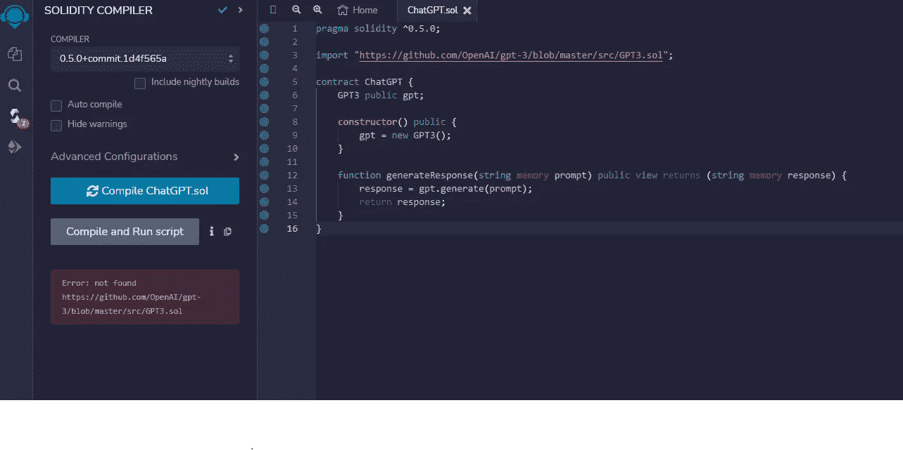
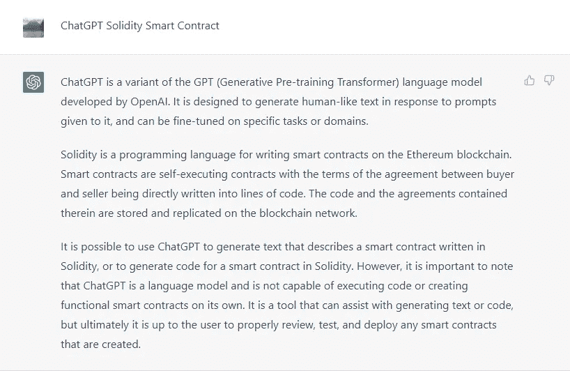

# ChatGPT Solidity 智能合约

> 原文：<https://medium.com/coinmonks/chatgpt-solidity-smart-contract-b7623d455361?source=collection_archive---------0----------------------->

我曾就“ChatGPT Solidity Smart Contract”询问 ChatGPT，我的意图是让 ChatGPT 创建一个 Smart Contract，它将从 Solidity Smart Contract 调用 ChatGPT，我得到的答案是


# ChatGPT 的回答

ChatGPT solidity 智能合约是一种智能合约，它使用 GPT-3 自然语言处理模型来生成对给定提示的响应。它允许 dApps 或应用集成 GPT-3 功能，并为用户提供更具吸引力和自然的对话体验。

要创建 ChatGPT solidity smart 契约，您首先需要导入 GPT-3 契约及其相关库。然后，您需要定义一个函数，它接受一个提示作为输入，并使用 GPT-3 协议生成一个响应。

以下是 ChatGPT solidity 智能合约的一个示例:

```
pragma solidity ^0.5.0;

import "https://github.com/OpenAI/gpt-3/blob/master/src/GPT3.sol";

contract ChatGPT {
    GPT3 public gpt;

    constructor() public {
        gpt = new GPT3();
    }

    function generateResponse(string memory prompt) public view returns (string memory response) {
        response = gpt.generate(prompt);
        return response;
    }
}
```

在这个契约中，`generateResponse()`函数使用 GPT-3 契约来生成对给定提示的响应。它接受一个`prompt`字符串作为输入，并将其传递给 GPT-3 契约的`generate()`函数。然后，该函数将生成的响应作为字符串返回。

这就是 chatGPT 的回答。当我试图在 Remix-ether eum IDE 中运行上述代码时，我得到了这个错误

> 错误:没有找到[https://github.com/OpenAI/gpt-3/blob/master/src/GPT3.sol](https://github.com/OpenAI/gpt-3/blob/master/src/GPT3.sol)



我在 ChatGPT 发布后的 2 到 3 天问了这个问题。

当我今天问同样的问题时，我得到了这样的回答



它分别定义了 ChatGPT 和 solidity 智能合约。

# 结论

ChatGPT 确实是一个很有前途的产品，正如我们在本文中已经看到的，它正在随着时间的推移而改进。人工智能就在这里，在不久的将来或几天内，我们将会看到更多使用人工智能并帮助我们日常工作的惊人产品。

了解更多关于**区块链和坚固性**

[](https://ismailsaleem.gumroad.com/) [## 以实玛利

### ChatGPT | Laravel |区块链|可靠性| JavaScript

ismailsaleem.gumroad.com](https://ismailsaleem.gumroad.com/) 

## 相关文章，帮助您了解更多关于区块链和可靠性

[](https://coinsbench.com/learn-ethereum-blockchain-daily-and-keep-the-knowledge-awake-day-1-6d482ae67ac7) [## 每日学习以太坊区块链，保持知识清醒:)—第一天

### 大家好

coinsbench.com](https://coinsbench.com/learn-ethereum-blockchain-daily-and-keep-the-knowledge-awake-day-1-6d482ae67ac7) [](https://coinsbench.com/1-lets-learn-solidity-helloworld-9629f5b5056e) [## 1#让我们学习 Solidity ~ HelloWorld

### 在这个系列中，我们将学习如何用 solidity 编程语言编写智能合同。

coinsbench.com](https://coinsbench.com/1-lets-learn-solidity-helloworld-9629f5b5056e)