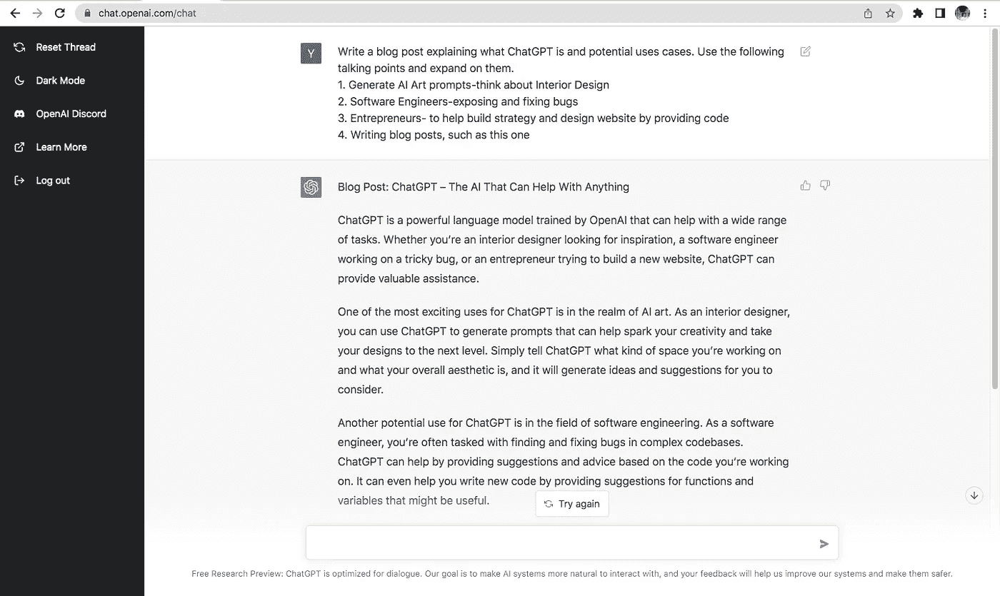

# ChatGPT:万物智能

> 原文：<https://medium.com/coinmonks/chatgpt-the-ai-of-everything-9ae68f023af9?source=collection_archive---------8----------------------->

## 你的工作可能会有危险

Dall-E 2 generated with the prompt: ChatGPT AI in a human form

如果你还没有听说过 ChatGPT，那么让我告诉你，它是一个特殊的工具。我已经编译了该工具的样例用例，向您展示了它的实际应用。事实上，在这一点之外，大多数文本都是由 AI 本身生成的。

## 这是什么？

ChatGPT 是一种自然语言处理(NLP)工具，允许用户以对话的方式与机器学习模型进行交互。它基于 OpenAI 开发的 GPT-3 语言模型，该模型已在大量文本数据上进行训练，以理解和生成类似人类的反应**。**无论您是一名寻找灵感的室内设计师、一名致力于解决棘手问题的软件工程师，还是一名试图建立新网站的企业家，ChatGPT 都能提供宝贵的帮助。

## 如何潜在地使用这个工具

**给创意人员**

ChatGPT 最令人兴奋的用途之一是在人工智能艺术领域。作为一名室内设计师，你可以使用 ChatGPT 生成提示，这些提示可以帮助激发你的创造力，并将你的设计提升到一个新的水平。简单地告诉 ChatGPT 你在设计什么样的空间，你的整体审美是什么，然后**它会产生想法和建议**供你考虑。考虑这个来自盖伊·帕森斯的例子。

**用于编程**

ChatGPT 的另一个潜在用途是在软件工程领域。作为一名软件工程师，你的任务通常是在复杂的代码库中查找并修复 bug。ChatGPT 可以根据您正在处理的代码提供建议和意见。它甚至可以通过提供可能有用的函数和变量的建议来帮助你编写新代码。Amjad Masad 给 AI 一个复杂的提示，并且能够得到一个彻底的解释以及准确的错误修复。

**针对创业者**

企业家也可以从 ChatGPT 的能力中受益。无论你是想建立一个新的网站还是开发一个商业战略，ChatGPT 都可以提供有价值的见解和建议。它甚至可以帮助您为您的网站编写代码，为您提供一种快速而简单的方法来启动您的项目。事实上，这个博客的大部分也是由人工智能写的。

ChatGPT 是一个优秀的写作工具。如果你正在为一篇博客文章绞尽脑汁，或者如果你在组织你的想法方面有困难，ChatGPT 可以帮助你。简单地告诉它你在写什么，它会提供建议和提示，帮助你把你的想法写在纸上。

简而言之，ChatGPT 是一个多功能和强大的人工智能，可以帮助完成广泛的任务。无论您是室内设计师、软件工程师、程序员、企业家、营销人员还是作家，ChatGPT 都可以提供宝贵的帮助，让您的工作更轻松、更高效。它能够理解和产生类似人类的反应，这使它成为更快地自动化任务和改善沟通的重要工具。

*别忘了* [*关注 m*](/@agarwalyash) *e 关于媒体更多这样的内容！*

*推特*:[https://twitter.com/_yashagarwal](https://twitter.com/_yashagarwal)

> 交易新手？尝试[加密交易机器人](/coinmonks/crypto-trading-bot-c2ffce8acb2a)或[复制交易](/coinmonks/top-10-crypto-copy-trading-platforms-for-beginners-d0c37c7d698c)