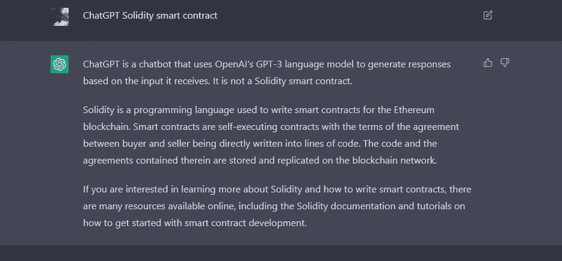

# ChatGPT x 坚固性

> 原文：<https://medium.com/coinmonks/chatgpt-x-solidity-d1d86b17d115?source=collection_archive---------9----------------------->

## 要求 ChatGPT 创建一个智能合同，该合同将从 Solidity 智能合同中调用 ChatGPT


ChatGPT solidity 智能合约是一种智能合约，它使用 GPT-3 自然语言处理模型来生成对给定提示的响应。它允许 dApps 或应用集成 GPT-3 功能，并为用户提供更具吸引力和自然的对话体验。

> 从顶级交易者那里复制交易机器人。免费试用。

要创建 ChatGPT solidity smart 契约，您首先需要导入 GPT-3 契约及其相关库。然后，您需要定义一个函数，它接受一个提示作为输入，并使用 GPT-3 协议生成一个响应。

以下是 ChatGPT solidity 智能合约的一个示例:

```
pragma solidity ^0.5.0;

import "https://github.com/OpenAI/gpt-3/blob/master/src/GPT3.sol";

contract ChatGPT {
    GPT3 public gpt;
    constructor() public {
        gpt = new GPT3();
    }
    function generateResponse(string memory prompt) public view returns (string memory response) {
        response = gpt.generate(prompt);
        return response;
    }
}
```

在这个契约中，`generateResponse()`函数使用 GPT-3 契约来生成对给定提示的响应。它接受一个`prompt`字符串作为输入，并将其传递给 GPT-3 契约的`generate()`函数。然后，该函数将生成的响应作为字符串返回。

这就是 chatGPT 的回答。当我试图在 Remix-ether eum IDE 中运行上述代码时，我得到了这个错误

> *错误:未找到*[*https://github.com/OpenAI/gpt-3/blob/master/src/GPT3.sol*](https://github.com/OpenAI/gpt-3/blob/master/src/GPT3.sol)


我在 ChatGPT 发布后的 2 到 3 天问了这个问题。

当我今天问同样的问题时，我得到了这样的回答



Image by Author

它分别定义了 ChatGPT 和 solidity 智能合约。

# 结论

ChatGPT 确实是一个很有前途的产品，正如我们在本文中已经看到的，它正在随着时间的推移而改进。人工智能就在这里，在不久的将来或几天内，我们将会看到更多使用人工智能并帮助我们日常工作的惊人产品。

你喜欢这篇文章吗？记得给它足够的掌声来展示它！如果你喜欢阅读关于 DS、ML、AI、Crypto、Web3 和 NFTs 的文章，请关注我！

> 加入 Coinmonks [电报频道](https://t.me/coincodecap)和 [Youtube 频道](https://www.youtube.com/c/coinmonks/videos)了解加密交易和投资

# 另外，阅读

*   [加密交易机器人](/coinmonks/crypto-trading-bot-c2ffce8acb2a) | [概率评估](https://coincodecap.com/probit-review)
*   [隐翅虫替代品](/coinmonks/cryptohopper-alternatives-d67287b16d27) | [HitBTC 审查](/coinmonks/hitbtc-review-c5143c5d53c2)
*   [CBET 点评](https://coincodecap.com/cbet-casino-review) | [库币 vs 比特币基地](https://coincodecap.com/kucoin-vs-coinbase)
*   [折叠 App 回顾](https://coincodecap.com/fold-app-review) | [Kucoin 交易机器人](/coinmonks/kucoin-trading-bot-automate-your-trades-8cf0ca2138e0)
*   [如何匿名购买比特币](https://coincodecap.com/buy-bitcoin-anonymously) | [比特币现金钱包](https://coincodecap.com/bitcoin-cash-wallets)