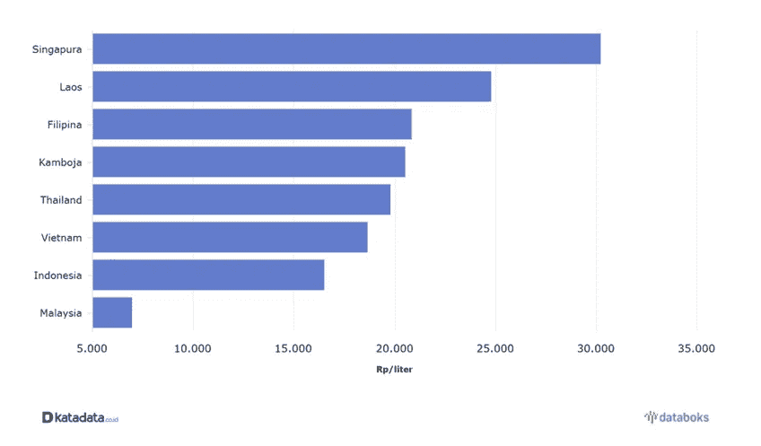
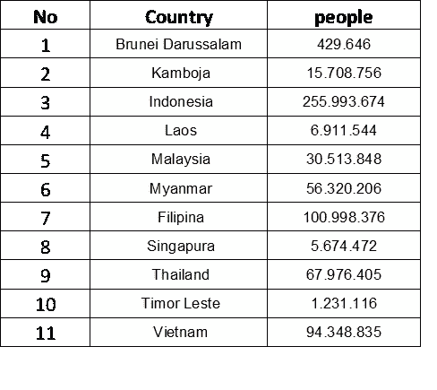
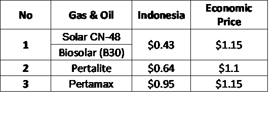

# 便宜的价格不好

> 原文：<https://medium.com/coinmonks/cheap-price-is-bad-9b6bf9963c22?source=collection_archive---------43----------------------->

长久以来，一切都太便宜了。

**消费逐年增加，随之而来的是商品价格的上涨。**通货膨胀也加剧了该国的经济形势，导致商品价格上涨。抱怨是很自然的事情，因为用于需求的金额也大幅增加。

然而，当商品和消费品的价格长期变得便宜时，这将对国家产生负面影响/问题

一种在许多方面都有影响的商品是燃料(燃料油)。**当石油价格上涨时，随之而来的是其他基本商品价格的上涨。**在本文中，我以印度尼西亚的燃油价格为例

上表显示了东盟国家燃油价格的比较。《全球汽油价格报告》显示，东南亚燃油均价**最低的国家是马来西亚**，为每升 6965 印尼盾(0.45 美元)。印度尼西亚的燃油价格为每升 16500 印尼盾(1.06 美元)。同时，**新加坡是东南亚平均燃油价格最贵的国家**，每升 30208 印尼盾(1.94 美元)。

看看东南亚各成员国的总人口。印度尼西亚是世界上人口最多的国家，这也将导致燃料使用量的增加。在 2.55 亿人口的情况下，每天的燃料消耗量为 140 万桶/天。如果价格发生变化，这种非常大的油耗会极大地影响日常活动或商务活动。

**由于国债补贴，印尼的燃油价格仍然很便宜。**

印度尼西亚的燃料价格仍然受到政府债务补贴的支撑，这些补贴用于石油和天然气进口支出。为了不给国家财政增加负担，燃料价格应该上涨。

> 交易新手？尝试[加密交易机器人](/coinmonks/crypto-trading-bot-c2ffce8acb2a)或[复制交易](/coinmonks/top-10-crypto-copy-trading-platforms-for-beginners-d0c37c7d698c)