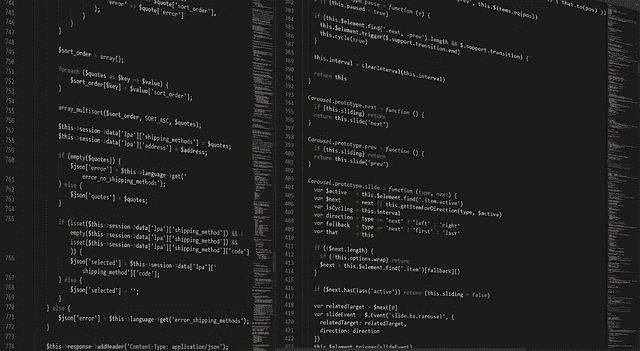

# 使用 React JS 检查 CSC 网络

> 原文：<https://medium.com/coinmonks/checking-csc-network-using-react-js-be27a0a88afe?source=collection_archive---------25----------------------->

您是否有针对 dapp 前端的 react 项目，并希望强制用户使用特定网络？在本教程中，我们希望使用 react 来创建 dapp 的前端，并检查 csc 网络是否为所选网络。



Image by Boskampi from Pixabay

## 反应

[React](http://reactjs.org) 是一个免费开源的前端 JavaScript 库。用于基于 UI 组件构建用户界面。它由 Meta(以前的脸书)和一个由个人开发者和公司组成的社区维护。React 可以作为使用 Next.js 等框架开发单页面、移动或服务器呈现的应用程序的基础。但是，React 只关心状态管理并将状态呈现给 DOM，因此创建 React 应用程序通常需要使用额外的路由库以及某些客户端功能。

## 要求

*   节点`latest`版本
*   npm `latest`版本

## 装置

首先，我们为项目创建一个目录:

```
mkdir react
cd react
```

为了安装 react js，我们使用 npm 包管理器:

```
npm install -g create-react-app
```

将 react 和 ethers js 导入我们的项目。将此代码放在代码的上方:

```
import React, { useEffect, useState } from “react”; import { ethers } from “ethers”;
```

## 检查元掩码

要检查浏览器上的元掩码安装，我们应该确保能够访问 window.ethereum:

```
const checkIfWalletIsConnected = async () => {                                                              const { ethereum } = window;                                                               if (!ethereum) {                                   console.log("Make sure you have MetaMask!");                                   return;                                 } else {                                   console.log("We have the ethereum object", ethereum);                                 }
```

检查我们是否有权访问用户的钱包:

```
const accounts = await ethereum.request({ method: “eth_accounts” });
```

现在我们检查链 id:

```
const chainId = await ethereum.request({ method: “eth_chainId” }); setNetwork(networks[chainId]); ethereum.on(“chainChanged”, handleChainChanged);
```

当他们更改网络时重新加载页面:

```
function handleChainChanged(_chainId) { window.location.reload(); } };
```

是时候将网络切换到 csc 了:

```
const switchNetwork = async () => {                                 if (window.ethereum) {                                   try {                                                                         await window.ethereum.request({                                       method: "wallet_switchEthereumChain",                                       params: [{ chainId: "0x35" }],                                     });                                   } catch (error) {                                                                        if (error.code === 4902) {                                       try {                                         await window.ethereum.request({                                           method: "wallet_addEthereumChain",                                           params: [                                             {                                               chainId: "0x35",                                               chainName: "Coinex Smart Chain Mainnet",                                               rpcUrls: ["https://testnet-rpc.coinex.net/"],                                               nativeCurrency: {                                                 name: "CET",                                                 symbol: "CET",                                                 decimals: 18,                                               },                                               blockExplorerUrls: ["https://testnet.coinex.net/"],                                             },                                           ],                                         });                                       } catch (error) {                                         console.log(error);                                       }                                     }                                     console.log(error);                                   }                                 } else {                                                           alert("MetaMask is not installed. Please install it to use this app: https://metamask.io/download.html");                                 }                               };
```

在上面的代码中，我们检查 coinex 智能链链 id，如果 csc 不在网络列表中，它会自动将 csc 添加到 metamask。如果需要，您可以设置其他节点 rpc。

我们将链 id 和网络名称存储在 **network.json** 中。我们从 **network.json** 读取网络信息:

```
const networks = {                               "0x1": "Mainnet",                               "0x3": "Ropsten",                               "0x2a": "Kovan",                               "0x4": "Rinkeby",                               "0x5": "Goerli",                               "0x61": "BSC Testnet",                               "0x38": "BSC Mainnet",                               "0x89": "Polygon Mainnet",                               "0x13881": "Polygon Mumbai Testnet",
"0x35": "coinex smartchain mainnet",                               "0xa86a": "AVAX Mainnet",                             }                                                           export { networks }
```

让我们实施 dapp 的前端:

```
const renderInputForm = () => {                                 if (network !== "Coinex Smart Chain Mainnet") {                                   return (                                     <div className="connect-wallet-container">                                       <p>Please connect to the Coinex Smart Chain</p>                                       <button className="cta-button mint-button" onClick={switchNetwork}>                                         Click here to switch                                       </button>                                     </div>                                   );                                 }
```

上面的代码将检查链，如果网络不等于 coinex 智能链 mainnet，屏幕上将显示一条消息“请连接到 Coinex 智能链”

现在我们可以使用 npm 开始我们的 react 项目了:

```
npm start
```

该应用程序将运行在 [http://localhost:3000](http://localhost:3000)

祝贺🥳

现在我们可以为我们的 dapp 实现网络检查器。这类作品可以查看 **Neutronium 名称服务**:

 [## Neutronium 名称服务

### 作为 CSC 上的 nft 的薄荷域

neutroniumcc.org](https://neutroniumcc.org/cns) 

> 交易新手？尝试[加密交易机器人](/coinmonks/crypto-trading-bot-c2ffce8acb2a)或[复制交易](/coinmonks/top-10-crypto-copy-trading-platforms-for-beginners-d0c37c7d698c)