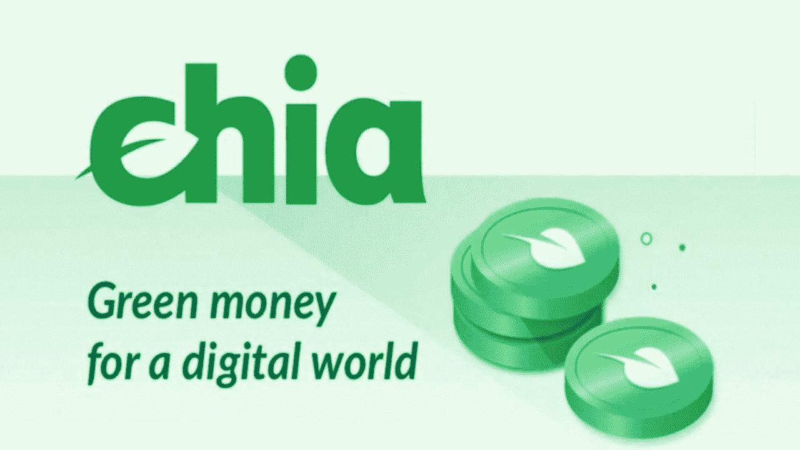

# Chia:保护环境的绿色加密货币

> 原文：<https://medium.com/coinmonks/chia-green-cryptocurrencies-for-the-environment-4743dffbffd8?source=collection_archive---------26----------------------->

加密货币经常因能耗而受到批评，有些人选择低能耗路线来证明事实并非如此。其中之一是由 Chia Network 开发的 Chia(XCH ), Chia Network 是一家总部位于加利福尼亚州三藩市的私营公司。

Chia (XCH) logo

它是由美国计算机科学家布拉姆·科恩在 2017 年创建的，他在 2001 年创建了一个点对点文件共享平台 BitTorrent。他还是 CodeCon 的联合创始人和旧金山湾区 P2P-黑客会议的组织者。

Bram Cohen

该团队包括 eMusic.com 和温迪夏公司的前创始人兼首席执行官吉恩·霍夫曼，我报告了他的声明:“中国是数字世界的绿色货币。我们正在建立一个基于空间和时间证据的区块链，以制造一种更少浪费、更分散、更安全的加密货币。”

Gene Hoffman

Chia 已经获得了相当大的兴趣，其投资者包括 Andreessen Horowitz、Richmond Global Ventures、Naval Ravikant 和 Galaxy Digital。Chia 的目标是建立一个更好的区块链和智能交易平台，更安全，更可持续和更强大。Chia 使用一种叫做*空间和时间证明*的算法，该算法利用大量过度分配的硬盘空间来创建自 2009 年比特币以来的第一个新的*中本聪共识*。通过*空间证明*农民证明他们将未使用的硬盘空间分配给网络，而*时间证明*通过在大多数情况下将我们共识的抗攻击性提高到 51%，提高了区块链的整体安全性。Chia 有自己的编程语言，叫做 Chialisp。这是一种智能契约兼容的链上编程语言，其独特的特性使其完全沙箱化、可组合并具有高度的互操作性。与其他加密货币相比，Chia 能耗更低，包容性更强，同时至少同样安全。

Chia, green money for a digital world.

根据[白皮书](https://www.chia.net/whitepaper/)，象征经济学如下:预耕 2100 万 XCH，以帮助建立和管理 Chia。在 Chia pre-farm 之后，Chia 提供每 10 分钟 64 chia 的农耕奖励。在前 12 年里，农业奖励将在第三年末减半。从第 13 年开始，奖励将保持不变，每 10 分钟 4 个金币，导致通货膨胀率不断下降。在 mainnet 推出 22 年后，中国的通货膨胀率降至 0.50%。

在官网上可以下载[白皮书](https://www.chia.net/whitepaper/)和[绿皮书](https://www.chia.net/greenpaper/)。

Chia (XCH)

2021 年 10 月 13 日，Chia 与硬件加速加密领域的领导者 Supranational 合作，进一步保护和扩展硬件，使交易像工作证明一样安全，但能耗却很低。这种合作关系进一步巩固了 Chia 的区块链，重申了其作为加密领域最佳加密货币之一的地位。

2022 年 5 月 18 日，Chia 宣布加入[区块链协会](https://theblockchainassociation.org/)，通过展示安全性、可持续性、公平准入和包容性来建立监管和机构信任。

请在下面留下评论，告诉我你对中国的看法，加密货币在环境保护中的作用，可以改进的方面，以及你是否知道其他值得注意的绿色加密货币。把这个空间当成一个没有审查的谈话场所。

胜利者是永不放弃的梦想家。

**免责声明** : *我不知道所用图片的任何第三方权利。如有任何资料来源，我保证予以引用，如有要求，我将调整立场。*

**免责声明** : *交易加密货币具有很高的风险，可能不适合所有投资者。在决定交易加密货币之前，你应该仔细考虑你的投资目标和你的经验水平。自己做研究。此处表达的所有观点归各自作者所有，不应被视为任何形式的财务建议。*

> 交易新手？尝试[加密交易机器人](/coinmonks/crypto-trading-bot-c2ffce8acb2a)或[复制交易](/coinmonks/top-10-crypto-copy-trading-platforms-for-beginners-d0c37c7d698c)