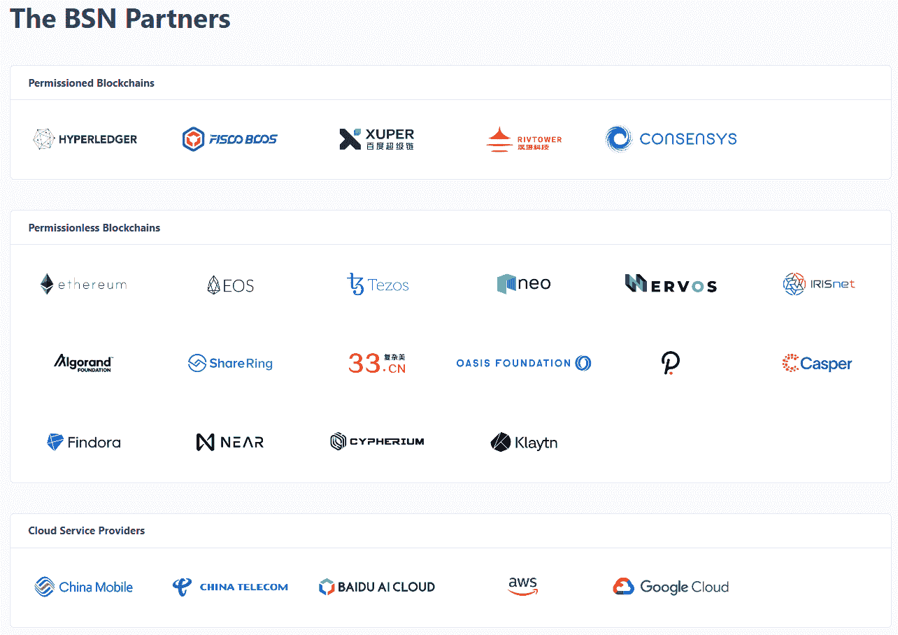
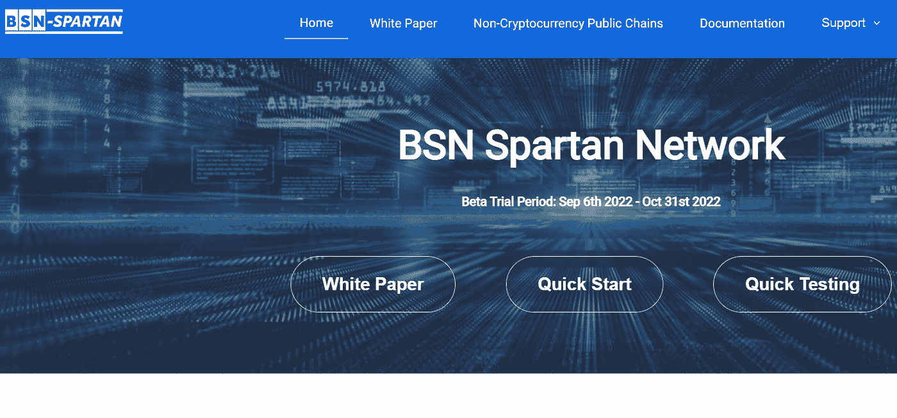
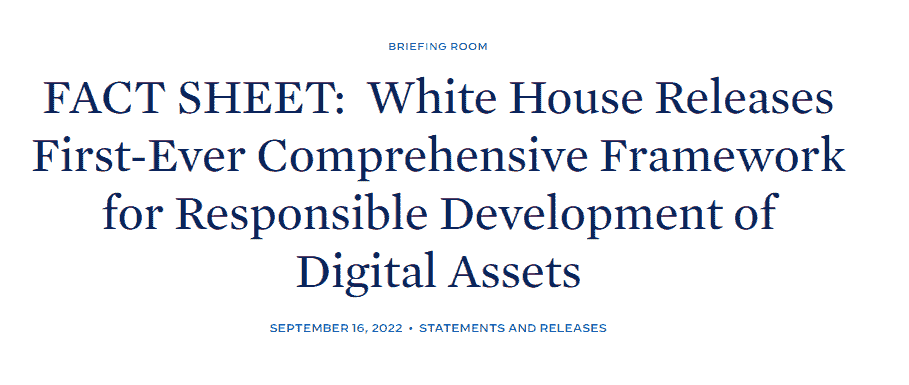

# 中国与 BSN 的区块链雄心:没有加密货币的区块链中心

> 原文：<https://medium.com/coinmonks/chinas-blockchain-ambitions-with-bsn-blockchain-hub-without-cryptocurrency-9c0dca61c0e5?source=collection_archive---------22----------------------->

根据中国工业和信息化部(MIIT)的数据，中国区块链专利申请占全球所有区块链专利申请的 84%。在 2021 年的前一年，中国占 63.2%，其次是美国和韩国。

毫无疑问，中国正在大力发展区块链技术。专利的数量不一定是质量的标志，但很明显，中国非常重视区块链的技术。

而在中国区块链的中心，有 BSN；基于区块链的服务网络。

# 什么是基于区块链的服务网络？

基于区块链的服务网络或 BSN 得到了中国政府的支持，它一直在建立一个平台，旨在促进企业部署区块链技术。

据 [BSN 网站](https://bsnbase.io/g/main/index)称，他们将自己定义为“一个跨云、跨门户、跨框架的全球公共基础设施网络，用于部署和运营所有类型的区块链分布式应用(DApps)。”

我有几种方法来定义 BSN；通用区块链、区块链奇点、无加密货币的无权限区块链。

> *通用区块链*
> 
> *为了成为区块链网络的一站式商店或中心，BSN 的目标是接纳几乎所有类型的区块链；包括私有、公共、混合和联合区块链。*
> 
> *区块链奇点*
> 
> 使用 BSN 作为通用协议似乎是个好主意，但另一方面，这意味着 BSN 可以成为他们网络下区块链发展的中心点，最终成为区块链支持的下一个互联网。
> 
> *没有加密货币的区块链。*
> 
> *BSN 网络在没有加密货币的情况下运行。相反，它使用菲亚特(美元)作为网络费用。通过这种方式，您可以利用公共区块链的优点，同时避免围绕令牌的任何可能的欺诈问题。*

# BSN 的生态系统

为了实现 BSN 的宏伟目标，他们需要一个庞大的合作伙伴生态系统。有许多私人的(许可的)和公共的(无许可的)区块链生态系统已经加入了 BSN 生态系统的合作伙伴。

此外，BSN 的产品面向公司，特别是那些运营云计算基础设施的公司，因为许多区块链节点和应用程序都在云上运行，因此像谷歌、亚马逊这样的合作伙伴是显而易见的扩张对象。

[Source](https://bsnbase.io/)

关于他们的合作伙伴 github 和技术规范的详细文档，请查看[此链接](https://bsnbase.io/g/main/documentation)。

# 进化:BSN 斯巴达网络

为了进一步进化，将他们的计划付诸行动，他们在本月推出了斯巴达网络。

[Source](https://spartan.bsn.foundation/)

他们声称 BSN 斯巴达网络是一个使用开源的公共和独立的基础设施网络。由于**加密货币从公共链的第一层中移除，非加密货币公共链在数据中心内可用，并由全球所有 IT 系统访问。**

他们的区块链梦开始在现实世界中实现，而这仅仅是个开始。

# 同时…

与此同时，代表美国政府的白宫第一次[发布了一个提议的数字资产框架](https://www.whitehouse.gov/briefing-room/statements-releases/2022/09/16/fact-sheet-white-house-releases-first-ever-comprehensive-framework-for-responsible-development-of-digital-assets/)，这激怒了密码行业的许多人。

[Source](https://www.whitehouse.gov/briefing-room/statements-releases/2022/09/16/fact-sheet-white-house-releases-first-ever-comprehensive-framework-for-responsible-development-of-digital-assets/)

与封锁加密货币的中国类似，美国正在加强保护框架，支持 CBDCs 作为监管加密的一种方式。

我相信中国在区块链正在前进，但是在技术上还有很多挑战。除了技术问题，这是一个由反对西方民主的独裁社会主义政府支持的非常集中的网络。

虽然美国政府认为中国的区块链是一个国家安全问题，但他们还没有发布一个明确的区块链技术计划。美国政府是否打算通过做一些类似于中国的事情来促进区块链的发展，还是将此事留给私营部门去做？你对此有什么看法？加入 BSN 并开发一个应用程序值得吗？请随意分享你的想法。

> 👉或者，通过社交渠道关注我们，支持我的区块链项目。GearChain 是一款面向 SCM 的零编码区块链 App Builder。

> 交易新手？尝试[加密交易机器人](/coinmonks/crypto-trading-bot-c2ffce8acb2a)或[复制交易](/coinmonks/top-10-crypto-copy-trading-platforms-for-beginners-d0c37c7d698c)