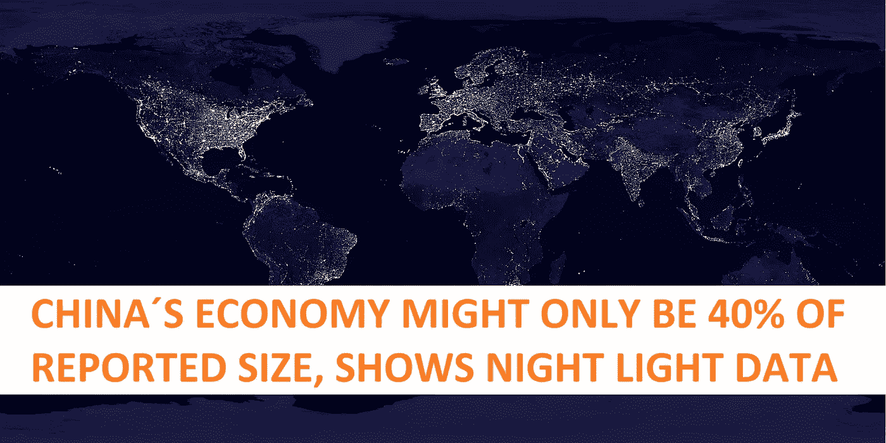

# 中国的 GDP 实际上可能比他们报告的要少 60%

> 原文：<https://medium.com/coinmonks/chinas-gdp-might-actually-be-60-smaller-than-what-they-are-reporting-d54ac1fe4539?source=collection_archive---------12----------------------->

由于这个消息只有密邻，所以我还是觉得很有意思，值得分享。出于正常的原因，中国和其他专制国家似乎在夸大 GDP 数字。

# 这项研究

在芝加哥大学路易斯·马丁内斯教授最近发表的研究论文中。他查看了 1992 年至 2008 年的卫星数据。将他们公布的国内生产总值数据与从太空中看到的夜光增长进行了比较。

这背后的想法是，数字是可以捏造的，特别是当涉及到专制国家，他们控制着所有转发和检查数字的实例。但是不能捏造的是独立可证实的数据。比如夜灯或者用的电。

利用这些数据，他发现在这一时期，专制国家的平均 GDP 比夜晚的灯光所支持的要高出 35%。

Youtube 频道《货币与宏观》(Money & Macro)随后利用这些数据，将中国带入了当代。他们随后发现的是中国的经济规模，尽管仍是第二大经济体。远远小于官方数字。事实上，它比报道的要小 60%。

为什么这很重要？嗯，首先，中国目前正处于金融困境中，其建筑泡沫正处于破裂的边缘。他们的银行有全国性的问题。这些问题变得越来越大。因为如果中国的国内生产总值小得多，这意味着它处理金融和经济反弹的能力比预期的要弱得多。

*China’s economic mussels might sound scary, but when you see them in real life, not so much. Source:* [*https://caliberstrong.com/blog/what-is-synthol/*](https://caliberstrong.com/blog/what-is-synthol/)

中国仍然是第二大经济体。但这也意味着他们一直在展示的经济肌肉越来越像合成肌，而不是你在健身房里得到的东西。

如果你想仔细看看这项研究，下面是官方论文的链接。在 Money & Macro 的视频中，他们覆盖了数据以及为什么它看起来站得住脚。此外，他们还联系到他们对中国当前 GDP 的计算。

让我知道你对此的看法，以及你认为这可能会对 crypto 产生什么影响。一如既往，评论区对你们开放。如果你想支持我和我制作的内容，请考虑关注我，阅读我的其他帖子，或者为什么不两者都做。

网络上见！

图片提供:[https://pixabay.com/](https://pixabay.com/)

资源

1.  https://www.journals.uchicago.edu/doi/10.1086/720458

> 交易新手？试试[密码交易机器人](/coinmonks/crypto-trading-bot-c2ffce8acb2a)或[复制交易](/coinmonks/top-10-crypto-copy-trading-platforms-for-beginners-d0c37c7d698c)