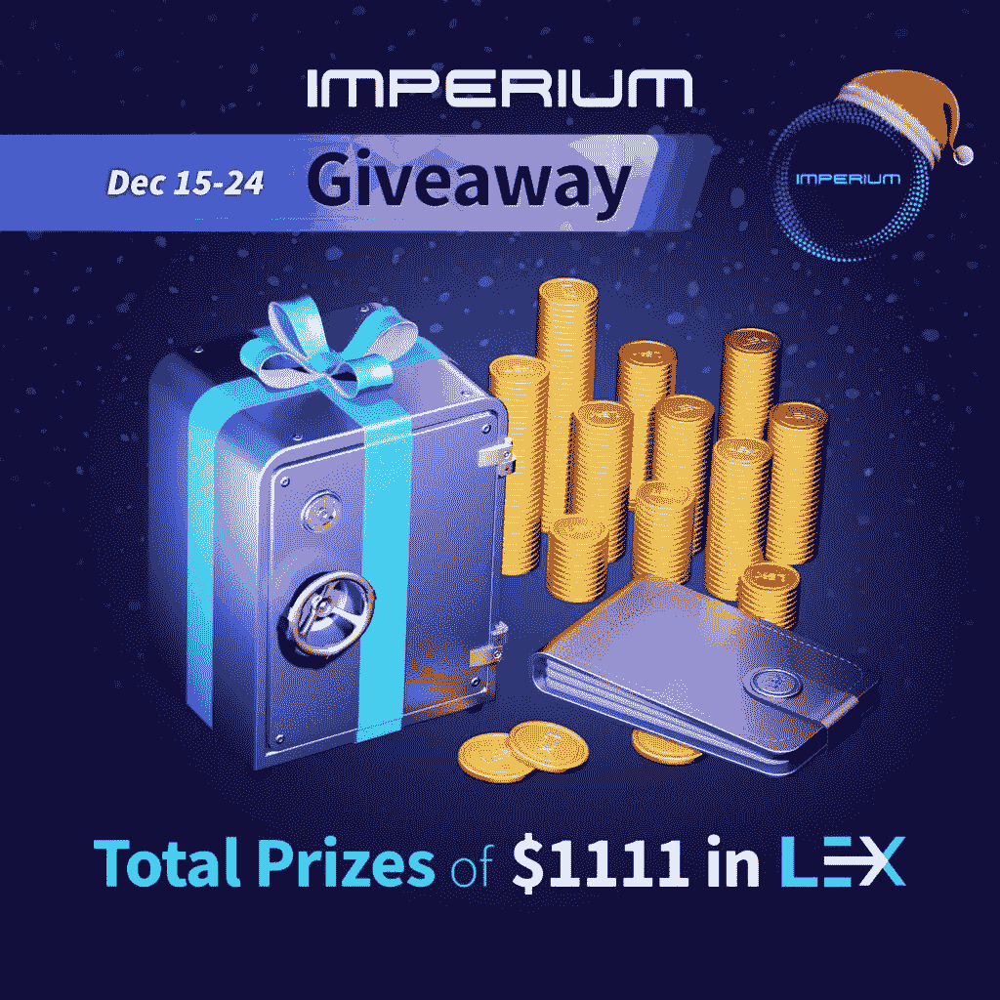
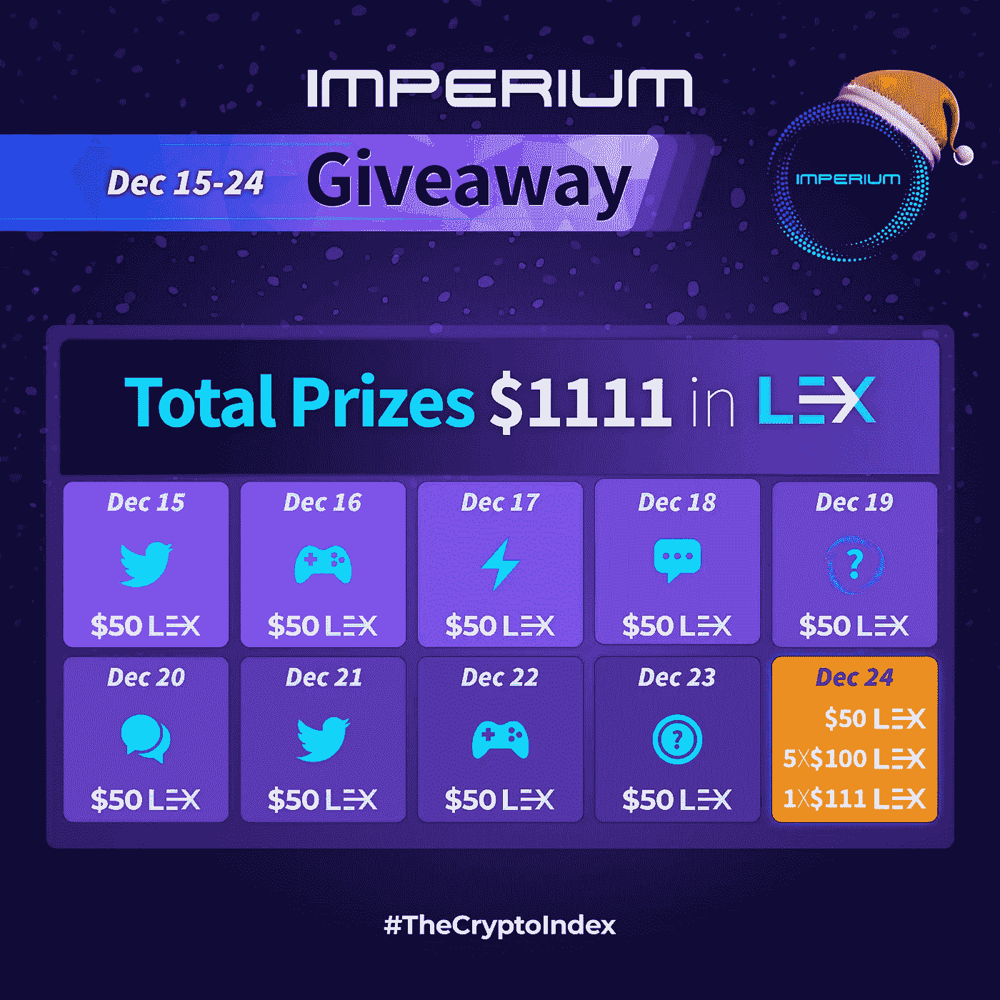

# 圣诞节赠品—价值 1111 美元的 LEX 奖品

> 原文：<https://medium.com/coinmonks/christmas-giveaway-prizes-of-1111-in-lex-f23762630b8e?source=collection_archive---------7----------------------->

吼-吼-停！

今年，圣诞老人拜访了帝国办公室，给所有优秀的交易者和投资者留下了一堆礼物！

今年圣诞节，在我们的圣诞赠品之际，总计 1111 美元的 LEX 奖品等待着您！

它由两部分组成:

1.  每日挑战，直到 12 月 15 日至 24 日的平安夜
2.  圣诞节赠品，12 月 25 日

"我怎样才能得到一些莱克斯？"人们可能会想。

嗯，这里是如何…

# 竞赛规则

## 日常挑战

**时间线:**2022 年 12 月 15 日至 24 日

**奖品:**$ 50/天 x 10 天

**如何取胜:**

1.参加每天的挑战。

2.每项挑战及其具体规则和奖金分配将在当天公布。

3.挑战的持续时间各不相同(几分钟、几小时甚至一天)——请密切关注我们的社交活动，不要错过！

## 圣诞节赠品

**时间线:**

参赛时间:世界协调时 2022 年 12 月 15 日至 12 月 24 日 14:00

抽奖时间:2022 年 12 月 25 日

**奖品:**5 x 100 美元，1 x 111 美元

**如何取胜:**

1.进入 Gleam 竞赛:[https://Gleam . io/92g QQ/Christmas-give-away-awards-of-1111-in-lex](https://gleam.io/92GQQ/christmas-giveaway-prizes-of-1111-in-lex)

2.完成必要的行动，赢取赠品入场券。

3.强制操作— 1 张罚单

关注我们的推特[https://twitter.com/imperiumindex](https://twitter.com/imperiumindex)+加入我们的电报[https://t.me/ImperiumIndex](https://t.me/ImperiumIndex)

4.可选操作—邀请您的朋友参加比赛，并获得多达 15 张额外门票！

❗To 解锁下线，你必须先完成强制动作！

❗In 为了邀请您的朋友，您必须使用 Gleam 页面中的推荐代码。请务必在 Gleam 上参加比赛并查看最后一个动作——❤️！

❗Your 朋友必须点击你的推荐链接，并完成强制性的行动，才能被认为是一个有效的推荐！

**直接推荐(您直接推荐的人):**

3 次推荐的 1 张票

5 次推荐的 2 张门票

7 次推荐的 3 张票

9 次推荐的 4 张门票

10 次推荐的 5 张门票

最大值。5 张直接引荐的门票

**间接引荐(你的引荐的引荐):**

1 张 10 次推荐的门票

18 次推荐的门票 2 张

25 次推荐的 3 张票

30 次推荐的 4 张门票

50 次推荐 10 张票

最大值。10 张间接引荐票

5.奖品:

幸运的——5 x 100 美元——中奖者是从所有彩票中随机抽取的。1 张票= 1 次中奖机会！

努力工作的人赢得最多的门票。如果有两个或两个以上的参与者打成平手，将随机抽取获胜者。

…

祝你好运！我们祝你圣诞快乐，新年吉祥！

> *交易新手？试试* [*密码交易机器人*](/coinmonks/crypto-trading-bot-c2ffce8acb2a) *或* [*复制交易*](/coinmonks/top-10-crypto-copy-trading-platforms-for-beginners-d0c37c7d698c)
> 
> *分散密码持有量，了解* [*币安替代品*](https://coincodecap.com/binance-alternatives)
> 
> *加入 Coinmonks* [*电报频道*](https://t.me/coincodecap) *和* [*Youtube 频道*](https://www.youtube.com/c/coinmonks/videos) *获取每日* [*加密新闻*](http://coincodecap.com/)

# 另外，阅读

*   [复制交易](/coinmonks/top-10-crypto-copy-trading-platforms-for-beginners-d0c37c7d698c) | [加密税务软件](/coinmonks/crypto-tax-software-ed4b4810e338)
*   [网格交易](https://coincodecap.com/grid-trading) | [加密硬件钱包](/coinmonks/the-best-cryptocurrency-hardware-wallets-of-2020-e28b1c124069)
*   [密码电报信号](/coinmonks/top-3-telegram-channels-for-crypto-traders-in-2021-8385f4411ff4) | [密码交易机器人](/coinmonks/crypto-trading-bot-c2ffce8acb2a)
*   [最佳加密交易所](/coinmonks/crypto-exchange-dd2f9d6f3769) | [印度最佳加密交易所](/coinmonks/bitcoin-exchange-in-india-7f1fe79715c9)
*   面向开发人员的最佳加密 API
*   最佳[密码借贷平台](/coinmonks/top-5-crypto-lending-platforms-in-2020-that-you-need-to-know-a1b675cec3fa)
*   [免费加密信号](/coinmonks/free-crypto-signals-48b25e61a8da) | [加密交易机器人](/coinmonks/crypto-trading-bot-c2ffce8acb2a)
*   [杠杆代币的终极指南](/coinmonks/leveraged-token-3f5257808b22)