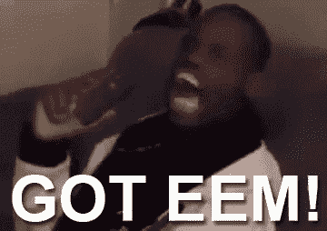

# 有东西闻起来像麝香

> 原文：<https://medium.com/coinmonks/chucklemusk-e2427063b6bf?source=collection_archive---------31----------------------->

这将是一篇冗长、详细、技术性的阅读。一些法律分析，一些技术，但它应该是一个伟大的学习经验。所以让我们开始吧。伙计们，这是浴室读物。它很长，由事实驱动，很详细。这是研究模式中的 **Ergo。**

首先——我根本不是埃隆·马斯克的粉丝。从[性骚扰](https://www.autoevolution.com/news/elon-musk-now-has-his-own-sex-scandal-flight-attendant-received-250000-to-sign-nda-189261.html)案件到[起诉自己被贴上创始人的标签](https://www.nbcbayarea.com/news/local/tesla-ceo-settles-for-founder-title/2088887/)，到[盗用特斯拉名称](https://auto.hindustantimes.com/auto/news/watch-tesla-ceo-elon-musk-reveals-how-the-ev-giant-got-its-name-41636181133032.html)并鼓吹[以](https://www.highsnobiety.com/p/elon-musk-colonizing-mars-indentured-slavery/) [yay loans/jobs](https://www.iflscience.com/people-are-not-keen-on-elon-musks-plan-for-workers-on-mars-58309) 为借口把人送上火星，甚至[引发欧盟担忧](https://www.techdirt.com/2021/12/09/eu-us-start-to-realize-letting-elon-musk-dictate-global-space-rules-might-not-be-brightest-idea/)， [公开为种族主义辩护](https://news.bloomberglaw.com/daily-labor-report/tesla-racism-suit-shows-musks-willingness-to-take-on-regulators)面对监管者[不断挑衅 SEC 同时被打压](https://electrek.co/2022/07/25/tesla-tsla-discloses-subpoenaed-by-sec-over-musks-tweets-again/)和[不断诈骗](https://www.techdirt.com/2022/08/15/fcc-officially-rejects-ajit-pais-boondoggle-to-supply-elon-musk-with-nearly-a-billion-dollars-in-subsidies/)，到[公开诽谤他人](https://www.techdirt.com/2018/09/20/elon-musk-may-have-talked-his-way-into-pretty-serious-defamation-lawsuit/)和销售近[软件](https://www.techdirt.com/2021/05/19/elon-musk-makes-it-clear-starlink-wont-have-capacity-to-disrupt-us-broadband/) (Starlink 的能力大多不存在但确实造成[其他](https://www.livescience.com/china-plans-ways-destroy-starlink) [问题](https://observer.com/2020/08/spacex-starlink-satellite-block-observation-scientists/))，马斯克积极代表 Alt 右翼，乔·罗根、[杰夫·贝索斯](https://www.dailydot.com/debug/ftc-amazon-harassment/)也是如此——值得注意的是 修卡！要突出这个人在世界上实施经济恐怖主义的方式确实需要这么多。我认为他充其量是社会的败类，实际上是社会的累赘。无论如何，马斯克的现实检查结束了。他在很多方面都不好，但在很少方面很好——而人们不擅长统计，所以他们认为他很棒。

所以现在，我们有了一个新的。马斯克搞砸了 Twitter 的收购，并试图不断退出(这是众所周知的)。然而，他很擅长误导媒体。看到这样的文章:

 [## 推特告密者声称马斯克对机器人的看法是正确的；联邦贸易委员会审查报告

### Twitter 上公开谈论其如何监控和删除垃圾邮件账户的压力持续上升。报告…

arstechnica.com](https://arstechnica.com/tech-policy/2022/08/twitter-whistleblower-claims-musk-was-right-about-bots-ftc-reviewing-report/) 

听起来像是 ooo，Musk 正在解决 Twitter 的垃圾邮件机器人问题，他说他会首先解决这个问题。干得好，阿瑞斯！很明显！

我想特别强调一下搜索时此类新闻的[第一个链接](https://www.theepochtimes.com/elon-musk-plans-crusade-on-twitter-spam-and-bots-new-data-reveals-the-size-of-his-problem_4443851.html?utm_source=Adventure&utm_medium=Agency&utm_campaign=DSA&utm_adgroup=143784465092&utm_term=08072022&utm_content=article&gclid=EAIaIQobChMIxLisgojg-QIVjrfICh1NsAHPEAAYASAAEgLkmfD_BwE)，这是一个众所周知的俄罗斯[宣传](https://www.theatlantic.com/politics/archive/2021/01/inside-the-epoch-times-a-mysterious-pro-trump-newspaper/617645/) & alt right 网站——大纪元时报，谢天谢地，在做了公然拥抱暴力、种族主义和法西斯主义的事情后，它已经失去了相关性。所以，不，不是一个好的来源。

不出所料,提供了报道，但没有误导。时间几乎和 Techdirt 一样好，掩盖了正在发生的事情背后的现实。

但在我进入这个话题之前，让我们后退一步，总结一下，然后我们会揭穿包括《时代》杂志的文章。为什么马斯克又要收购 Twitter，然后，他又为什么要退出呢？

至于买不买，啊是的右翼比喻: [**言论自由**](https://www.techdirt.com/2022/05/11/elon-musk-has-got-content-moderation-all-figured-out-delete-the-wrong-and-bad-content-but-leave-the-rest-and-reinstate-trump/) **(右翼版的现实:*为川普* )** 。从一个[保守派](https://www.cnbc.com/2022/05/18/elon-musk-says-hell-vote-republican-bashes-democrats.html)(在最终撕掉面具并隐藏多年之后)公开支持言论自由，到[支持中国对言论自由的限制](https://www.techdirt.com/2022/08/23/free-speech-absolutist-elon-musk-pens-column-for-chinese-censorship-agency/)。他唯一希望自由的言论是另类右派，而不是其他任何人。哦，对于因操纵特斯拉股票[达成和解](https://www.sec.gov/news/press-release/2018-226)后[因推特](https://www.cnbc.com/2022/07/14/sec-asked-musk-for-more-information-about-twitter-acquisition-tweet.html)接受 SEC 调查的人来说，这可不太明智。因此，他希望言论自由能够操纵股票，这是传递的信息。比如:“我不想为我的行为负责，我有钱去做这件事！”如果这听起来不像是自恋和糟糕的商业决策，或者特朗普/右翼/保守派，那么我会心甘情愿地失明。没有别的办法了。

 [## 马斯克出价 430 亿美元收购 Twitter，为其建造“言论自由的竞技场”

### 亿万富翁企业家埃隆·马斯克(Elon Musk)周四以 430 亿美元的现金收购要约瞄准了 Twitter 公司

www.reuters.com](https://www.reuters.com/technology/elon-musk-offers-buy-twitter-5420-per-share-2022-04-14/) 

是啊，而且他[签字买了那该死的东西](https://time.com/6170319/elon-musk-buys-twitter/)。然后[试图退出](https://www.techdirt.com/2022/07/08/musks-attempt-to-get-out-of-the-twitter-deal-proceeding-exactly-as-predicted-what-happens-next/)，可想而知。

他是如何试图退出的？好吧，让我们从一些 Techdirt 文章的引用开始:

—开始引用—

> 这一消息一点都不令人惊讶，而且似乎正在上演 [**正如人们一个月前预测的**](https://www.techdirt.com/2022/06/07/elon-trying-to-get-out-of-the-twitter-purchase-claiming-that-because-twitter-wont-share-private-info-it-has-breached-its-agreement/) 一样，埃隆·马斯克已经正式声称 Twitter 违反了其合并协议， [**表示他将退出交易**](https://www.sec.gov/Archives/edgar/data/1418091/000110465922078413/tm2220599d1_ex99-p.htm) 。当然，实际的细节并没有那么简单。这里没有真正的逃生出口。马斯克达成了一项法律协议，要为该公司支付 440 亿美元，不能就这么一走了之。
> 
> 正如我们在 6 月份指出的那样，他似乎已经聘请了一些非常昂贵的律师，想出一些借口离开，这完全是按照描述的方式进行的。在交易之前，马斯克已经明确放弃了他的尽职调查权利，但合并协议**确实**包括了向马斯克提供必要数据以完成交易的承诺。
> 
> 5 月份的大部分时间里，马斯克(他肯定是一个糟糕的扑克玩家)都在抱怨垃圾邮件太多，以此表明他打算放弃这笔交易。这在任何层面上都没有意义。首先，当马斯克宣布这笔交易时，他坚持说他这样做是为了应对平台上的垃圾邮件挑战(这个问题实际上不会影响网站的大多数用户，但会影响像马斯克这样的最受关注的用户)。因此，突然开始抱怨垃圾邮件显然是一个借口。

这与下面这句话密切相关:

> 因此，他想出的第二个借口是声称 Twitter 在其提交给 SEC 的文件中公开向 SEC 撒谎，称有多少垃圾邮件被计入其可货币化的每日活跃用户中。这看起来也很荒谬，因为 Twitter 已经公开报道这些数字有一段时间了，马斯克*本可以*在交易本身之前探索这些数字，但*再次故意选择放弃这些权利。你不能在达成协议的同时，同意不探索这些数据，然后抱怨你没有看到这些数据。*
> 
> 大约在这个时候，马斯克的律师似乎很清楚地向他解释说，这不会让他们摆脱这笔交易，并且(似乎很有可能)建议他们可以编造一些替代的借口，至少有人可以尝试在法庭上辩论——因为很明显，法庭是这一切最终的归宿。
> 
> 因此，看看 Arps Skadden 的律师们胡说八道的才华吧，他们通过专注于交易中需要向马斯克提供完成交易所需信息的部分来赚取大笔薪水。他们只是开始请求大量数据，特别是与整个垃圾邮件/mDAU 讨论相关的数据，因为他们知道他们可以继续请求更多的数据，其中一些数据实际上不可能提供给马斯克，最终他们可以说推特没有提供所请求的数据，因此违反了规定……因此交易被取消了。
> 
> 事情就是这样。

所以这意味着:“垃圾邮件是一个问题”等，基本上是不真实的。这在任何地方都不是诉讼目标。这意味着上面的 ARS 文章基本上什么也没说。干得好，编辑们！👍

哦，还有最后一点。时序:

> 如果你真的想要任何额外的证据证明这一切都是借口，早在 5 月份就已经计划好了，并且在过去的一个月里执行过，马斯克基本上是在他能做到的第一天就这样做了。 [**原合并协议**](https://www.sec.gov/Archives/edgar/data/1418091/000119312522120474/d310843ddefa14a.htm) 包含违约终止条款，并提前 **30 个日历日发出通知**。**马斯克发出这份明显是借口的关于提供数据的投诉已经整整 30 天了。我们赶上了最后期限，现在马斯克说他出局了。**

你现在赶上了吗？是的，这就是马斯克在推特上所做的。逐字预测，播放，逐字记录。基本上:我付钱给律师，律师帮助我，让我摆脱糟糕的交易！我有钱！哈尔普。哈哈。解决我 440 亿美元的问题！这里有一些创新者。请原谅，我会暗自窃笑，并庆幸自己能够倾听那些教会我成为一个真正的领导者的人的意见，而不是一味地嘲笑那些认为我是阿尔法而不是马斯克的人。他的麝香是他的格里夫特恶臭，这是唯一存在的种类。此外，这场诉讼将进展迅速，并且[已经对推特有利了](https://www.techdirt.com/2022/07/19/twitter-wins-round-one-trial-over-musk-purchase-will-happen-this-fall/)。如果你想知道马斯克有多麻烦，看看他同意的所有事情。

我会给你一些选择报价，然后我们就可以了解新的内容。我将复制并粘贴这篇文章的部分摘要:

诉讼的其余部分基本上只是描述了埃隆·马斯克在整个传奇过程中所做的每一件可笑的蠢事。这是白纸黑字写出来的东西，值得一读。它通过曲折和曲折表明，这位世界首富似乎不在乎像理解自己行为的后果这样讨厌的小事，而是专注于**完全根据自己的直觉**进行巨额押注，很少关心事实或细节。

举个例子，在急于完成交易的过程中，**马斯克同意了协议中的几个条款，这些条款对 Twitter 非常友好(在这场诉讼中非常有用):**

> 协议是经过一夜的谈判达成的，在这个过程中，变得对卖家更加友好。在马斯克的提议中没有包含、但在 Twitter 的坚持下被包含的条款中，有一条是包括马斯克在内的被告承诺“采取或导致采取行动”。。。为获得融资(已承诺)以完成交易而采取的所有必要、适当或明智的行动，或促使他人采取的所有必要、适当或明智的行动。1 6.10(a)；对交割的任何融资条件的明确免责声明。6.10(f)；Twitter 有权要求并及时收到马斯克关于融资进展的更新。6.10(d)。**这些条款确保融资不会成为交易的障碍，并且公司有权随时了解马斯克安排融资的进展。**

Twitter 还指出(这对我来说是新的),他们增加的协议部分(马斯克的提议没有)是在宣布交易和马斯克接管之间公司所有级别的雇佣和解雇权利。马斯克原本不希望这样，但后来同意了。这是非常值得注意的，因为马斯克的律师抛出了另一个万福玛利亚借口，即 Twitter 在交易宣布后解雇了几名高管，这在某种程度上违反了交易。然而，正如 Twitter 在这里展示的那样，马斯克明确同意不会这么做。

**哎呀。**

此外，**购买协议似乎非常直接，也有些明确地排除了马斯克现在试图让交易无效的所有理由:**

> 因此，双方同意**任何影响市场或其他社交媒体公司的情况都不能成为被告关闭**的借口。因协议的**存在**或**履行**或**马斯克**的任何沟通而产生的任何情况，“包括上述任何情况的影响”也不会影响 Twitter 与客户等的任何关系。同样，【Twitter 在其 SEC 文件中披露的事项，除了“风险因素”和“前瞻性陈述”部分，不能构成*公司重大不利影响*。Twitter 未能满足财务预测并不能成为关闭的借口，除非该失败是由一个独立的事件导致的，该事件被认为是公司的重大不利影响(考虑到所有明确排除的情况)。

此外，如果他的融资伙伴弃他而去，他甚至无法逃脱:

> 尽管本协议中有任何相反的规定，但股权投资者、母公司和收购子公司均承认并确认，股权投资者、母公司、收购子公司和/或其各自的关联公司为本协议预期的任何交易获得任何融资(包括债务融资)并不是交割或其在本协议项下任何义务的条件。

我是说，天啊，埃隆。你他妈的怎么会同意签这个，然后…两周后就退缩了？这真是令人震惊，令人尴尬的糟糕。我知道你的粉丝想给你贴上超级天才的标签——我自己也有点相信你非常聪明，直到这一切彻底失败。现在你看起来像那种被街头骗子玩三张牌蒙地骗了一把的傻瓜。

回到细节。**该协议再次表明，马斯克不能声称 Twitter 没有与他分享重要信息而反悔**:

> **也没有任何勤勉的条件**。事实上，母公司和收购子公司均表示，其“对公司及其子公司的业务、经营成果、前景、条件(财务或其他)或资产进行了独立的调查、审查和分析，并达到了满意的程度”，并且在决定继续进行合并时，双方在合并协议中“仅依赖其独立审查和分析的结果以及公司的契约、陈述和保证”。身份证。5.11.母公司和收购子公司进一步承认,“无论是公司或其任何子公司，还是任何其他人，都没有对公司或其任何子公司或其各自的业务或运营做出任何明示或暗示的陈述或保证。 除了该公司在第四条中明确给出的内容，“并且他们表示，在同意合并时，他们不依赖于合并协议中关于 Twitter 及其业务和运营的“任何明示或暗示的陈述或保证，或陈述和保证的准确性或完整性”，“除了该公司在第四条中明确给出的内容。”

换句话说， ***即使*——正如许多马斯克粉丝一直坚持的那样——Twitter 误导了美国证交会(几乎没有证据支持这一说法)，在合并协议中，马斯克明确表示，他最初并不依赖这些声明，因此这不会有任何影响。**

我的意思是，**向 Twitter 的律师致敬，他们制定了这份收购协议，因为他们似乎已经预料到了马斯克试图耍的每一个愚蠢的花招。**

—那篇文章的结尾引用—

有什么新鲜事吗？[一个告密者](https://www.techdirt.com/2022/08/24/twitter-whistleblowing-report-actually-seems-to-confirm-twitters-legal-argument-while-pretending-to-support-musks/)。让我们回到更新。这本书将首先收录《时代》杂志的一些精选语录:

> 法律专家怀疑这些指控是否会让亿万富翁埃隆·马斯克在法庭上获得决定性优势，从而退出收购该公司的交易。
> 
> 马斯克几个月来一直表示，Twitter 在该平台的财务健康方面误导了投资者，包括网站上垃圾邮件机器人的比例。

但是，聪明人代替了麝鼠。

> 但是杜兰大学专门研究公司诉讼的法学教授安·利普顿说，这些文件没有阐明关键的法律问题:Twitter 是否误导了马斯克，尤其是在如何统计用户方面。“[揭发者披露]基本上只是声称 mDAU 是错误的指标，”利普顿在发布后告诉《时代》杂志。对于马斯克的情况，“这不是真正的法律问题。”

和

> 加州大学伯克利分校专门研究企业交易的法学教授亚当·巴达维(Adam Badawi)同意，举报人报告对马斯克的诉讼没有太大影响。他告诉《时代》杂志:“我在举报者的报告中没有看到任何与 Twitter 之前声明相矛盾的内容。”。
> 
> 不过，巴达维也指出，马斯克在最初的收购协议中放弃了尽职调查的权利。“说 Twitter 违反了他们的合同是不可能的，”巴达维说。“这是我见过的最有利于卖方的协议之一。”

有什么新鲜事吗？

> **穆奇的爆料报告实际上证实了推特的立场，同时假装并非如此**

如果你想知道是谁弄错了，可能是 Mudge。我迫不及待地想让人们找到穆奇/马斯克的对话。

—报价

Mudge 也承认，Twitter 被鼓励不在 mDAU 中计算垃圾邮件:

> 高管们受到激励，避免将垃圾邮件机器人算作 mDAU，因为 mDAU 被报告给广告商，广告商用它来计算广告的有效性。如果 mDAU 包括不点击广告购买产品的垃圾邮件机器人，那么广告商就会认为广告效果不佳，并可能将广告支出从 Twitter 转移到其他具有更高感知效果的平台。

因此，首先，这与马斯克和他的粉丝的说法相矛盾，即 Twitter 有动力在 mDAU 中报告垃圾邮件时寻找其他方式，因为它有利于数字。正如 Mudge 指出的，Twitter 有激励**而不是**在 mDAU 中统计垃圾邮件。

—结束报价

所以马斯克要怎么样哈哈！垃圾邮件！垃圾邮件是个问题！

现在现实是这样的:他们试图向玛丽致敬，把这件事推到中期政治选举之后:

> 这场法律纠纷将于 10 月份在特拉华州衡平法院进行审判，但法律专家表示，鉴于告密者披露的新信息，法官有可能推迟审判。

马斯克想要二月份的并且正在挖掘他所能挖掘的一切，因为很明显政治。然而:

> 马斯克已经在他的法律文件中对 Twitter 使用 mDAU 提出了质疑，并声称如果 mDAU 被证明不能代表 Twitter 的整体人口，高管们实际上歪曲了公司的价值。

当然，似乎有人会争论任何事情，任何他们可以争论的事情，任何马斯克在这里寻求帮助的事情，任何他可以逃避责任的事情。

我仍然估计他最终会支付 150 万美元到 440 万美元，而且马斯克卖出大量股票和 T2 比特币肯定是个巧合。因此，在 150 亿至 440 亿美元中，大约有 90 亿至 100 亿美元。如果马斯克提出接受 100 亿美元或 150 亿美元，不要感到惊讶，因为这几乎是他所能承受的全部。

但是，嗯，游戏设置匹配麝香。玩得好，我的意思是不是每个人都可以靠本能和直觉赌掉 11 位数。即使是赌场可能也不会经常这么做。

哦，哎呀。这是真正发生在穆奇身上的事情，他真的真的[图谋不轨，因为他被 Twitter](https://www.adweek.com/media/former-twitter-head-of-security-peiter-mudge-zatko-blasts-company-in-sec-complaint/) 解雇了。也就是说，不管出于什么原因，他被多尔西雇佣了，但被现任 CEO 解雇了:

—报价开始

Mudge 然后他提出了他为什么认为 Musk 是正确的论点——尽管它实际上证实了 Twitter 是正确的:

> 然而，有数以百万计的活跃账户不被认为是“mDAU”，要么是因为它们是垃圾邮件机器人，要么是因为 Twitter 不相信它可以利用它们赚钱。这数百万非 mDAU 账户是平台上中位用户体验的一部分。对于大量非 mDAU 活跃账户，马斯克是正确的:Twitter 高管几乎没有或根本没有个人动机来准确“检测”或衡量垃圾邮件机器人的流行程度。

所以…我真的被这一节弄糊涂了，还有“马斯克是正确的”的说法。因为在法庭上，他们没有争论整个平台上有多少垃圾邮件。他们在争论 mDAU 里有多少钱。因此，这一段**并没有支持马斯克，而是简单地证实了 Twitter 在 SEC 文件和法庭上所说的话。**它向美国证券交易委员会报告的是估计有多少垃圾邮件账户通过了其他程序，并被无意中计入了 mDAU。

这是推特以具有法律约束力的方式宣称的全部内容。

在这里，Mudge 证实了 Twitter 不仅仅是完全正确的，而且它被激励着这样做，而完全不是 Musk 所描述的那样。

—结束报价

这就是为什么人们被告知要坚守自己的车道。让专家成为各自领域的专家，不要认为你可以跨领域成为专家。我擅长阅读和总结文章，我连续阅读大量的文本，小时候上过快速阅读课。我在这方面很有经验。但是其他的呢？我将依靠专家，因为那是我正在做的。从法律角度来看，Mudge 并不是 Twitter 的专家，他对安全性很在行(比如，我连蜡烛都拿不稳)。但这两者不是一回事，只有马斯克会试图辩称它们是一回事。

只剩下一个万福玛利亚了，而且不在玛吉手里，虽然看起来很可疑。这是一个联邦贸易委员会和欧盟是为了他们还是为了马斯克而审查的问题，在细节出来之前我们不会知道。—报价

奇怪的是，穆奇的报告可能会帮助马斯克——但是是以一种完全不同的方式

新的举报人报告启动了 FTC 的审查，显然欧盟数据保护监管机构也在调查此事，其他人也可能在调查。那些调查，以及违反同意法令的可能性，可能…实际上…是一个 **MAE** 让他逃脱交易！此外，Mudge 还声称存在欺诈行为(尽管大部分都被编辑过，所以不知道可信度有多高)。如果事实证明也是如此，它也可能是一个 MAE。

—结束引用

所以请原谅，我要去建造比特斯拉的工程师更好的火箭，因为显然我是一个非常稳定的天才，他相信他能做到，因为周围没有人告诉我我是愚蠢的。没错。干得好。👏👏实际上，我会把这个问题留给专家——值得注意的是，他们不是马斯克。SpaceX 有一些非常聪明的人，但这并不意味着马斯克也是其中之一。

即使马斯克以某种方式摆脱了这一点，他仍然有很多要担心的事情。即:SEC 调查他自己的行为，而不顾 [FTC 被掏空](https://www.openmarketsinstitute.org/publications/the-supreme-court-gutted-the-ftcs-power-to-make-cheating-corporations-pay-for-their-crimes)，这也可能阻止整个 MAE。如果 FTC 没有足够的权力以某种方式宣布与上述限制相关的 MAE，这可能是政治上的乌龙目标，因为这是由最高法院完成的。

简而言之，这变得越来越复杂，都怪马斯克尽可能地挖掘所有的丑闻。他试图进一步迷惑人们，但这并不奇怪。

 [## Botometer 的创造者开始媒体之旅，解释为什么埃隆·马斯克关于机器人的说法(使用…

### 你可能还记得，在他回应 Twitter 试图强迫他履行购买条款的诉讼时…

www.techdirt.com](https://www.techdirt.com/2022/08/25/creator-of-botometer-goes-on-media-tour-to-explain-why-elon-musks-claims-about-bots-using-botometer-are-meaningless/)