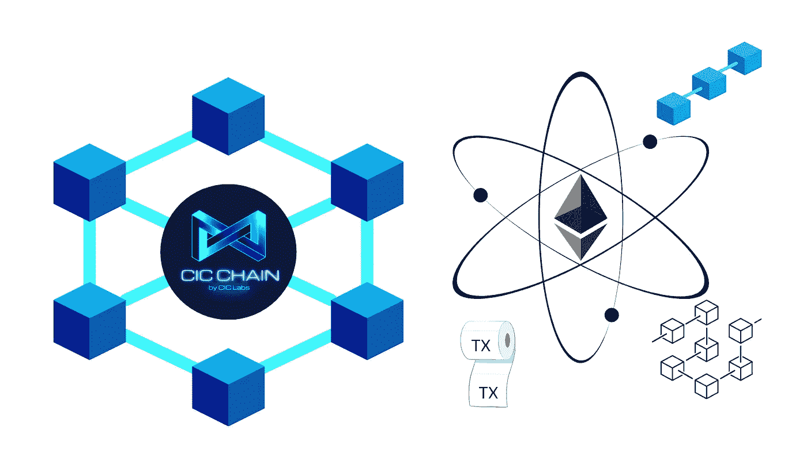

# CIC 链以及第 1 层和第 2 层区块链之间的区别

> 原文：<https://medium.com/coinmonks/cic-chain-and-difference-between-a-layer-1-and-layer-2-blockchain-ee76b4235d93?source=collection_archive---------12----------------------->

什么是一层区块链？

第 1 层区块链是一种网络，它可以在自己的基础设施内完成交易并验证交易，而不需要其他网络的支持。第 1 层区块链网络有自己的本地硬币，用于支付网络上的交易费用。区块链的另一个名称也是智能合约平台。将第 1 层区块链视为初始层，即包含网络架构框架的基础层。当开发发生在网络上，并且项目建立时，这是在结构基础之上完成的。将基础层视为在其上构建的所有 DeFi 和 web3 项目的结算层。CIC 链是第 1 层区块链，第 1 层区块链的其他著名示例包括但不限于…

*   卡尔达诺
*   创
*   索拉纳
*   雪崩
*   近的
*   以太坊
*   比特币

区块链技术多年来发生了巨大的变化。迄今为止，所有区块链都面临的一个共同问题是区块链三难困境。以太坊的联合创始人维塔利克·布特林使这个术语变得流行起来。有三个关键因素构成了区块链三元悖论…

Decentralization, Scalability, and Security

区块链三难困境指的是区块链很难同时实现所有三个属性的最佳水平。当一个被加强时，另一个通常会被削弱。

所有的区块链人都以他们自己的方式，试图解决这个三难问题，并在这三者之间取得平衡。一些网络甚至依赖于建立在他们网络之上的其他技术或网络，如以太坊或比特币。

什么是第 2 层区块链？

第 2 层区块链是一种运行在第 1 层区块链之上的网络，有助于提高其可扩展性和效率。第二层区块链的俗称是扩展解决方案。目前存在几种不同类型的扩展解决方案。比特币是一种流行的第 1 层区块链，而闪电网络是一种第 2 层扩展解决方案，旨在帮助提高交易的可扩展性和速度。以太坊是第一层区块链，有许多不同类型的扩展解决方案。第 2 层扩展解决方案的示例包括但不限于状态通道、侧链、等离子体、乐观汇总和 ZK-汇总。第 2 层不仅可以理解为构建在第 1 层网络之上的网络，还可以理解为运行在区块链协议之上的一种技术，有助于提高可扩展性和效率。

有几种第 2 层解决方案，每种都有自己的优缺点。适用于以太网的流行的第 2 层扩展解决方案包括但不限于…

**乐观汇总**

乐观

离线实验室 Arbitrum 汇总

燃料网络

**ZK 卷**

活套

斯塔克威尔

物质实验室 zkSync

阿兹特克 2.0

**井冈霉素**

斯塔克威尔

物质实验室 zkPorter

**血浆**

OMG 网络

瞪羚

自动网络

利普道

**国家频道**

连接

雷电

佩伦

**侧链**

斯卡莱

POA 网络

**混合解决方案**

SCSC 仲裁实验室

塞勒

这和中投链有什么关系？

自从区块链技术问世以来，一直存在一个难以解决的问题。当你解决了三难困境中的一个因素时，另一个因素通常会变得更糟。区块链三难困境从一开始就困扰着区块链科技。CIC chain 是个例外，它不需要任何第三方技术或网络来帮助它管理交易。CIC 链的架构框架设计有不同的层，每个层都在维护网络的效率、速度和可扩展性方面发挥着关键作用。组成不同层的系统组件考虑到了可伸缩性、速度和分散性，而不会牺牲其中一个。它们在这三者之间保持了完美的平衡，并且能够扩展到许多人曾经认为不可能的高度。

大多数区块链有一层甚至两层，[中投链](https://medium.com/u/f3354b7470ef?source=post_page-----ee76b4235d93--------------------------------)有七层。这七个层次完美地协调工作，确保我们不仅能够满足公共部门不断增长的需求，还能够满足私营部门不断增长的需求，而不会牺牲速度、安全性、可扩展性或分散性。

如果你想了解更多关于中投链的信息，请查看他们的官方媒体账号，[中投链](https://medium.com/u/f3354b7470ef?source=post_page-----ee76b4235d93--------------------------------)。

以下是他们白皮书和网站的官方链接。

[中投白皮书](http://cicchain.gitbook.io/)

[中投公司网站](https://cicchain.net/)

[中投链接树](https://linktr.ee/cicchain)

*任何书面材料都不构成财务建议，也不应被误解为财务建议。在购买或投资之前，请务必咨询财务顾问。本文中的信息仅供参考，不得误解。*

*   如果你喜欢这篇文章，请考虑关注我，留下一个好的评论和一些掌声。谢谢你的时间。

> 交易新手？试试[加密交易机器人](/coinmonks/crypto-trading-bot-c2ffce8acb2a)或者[复制交易](/coinmonks/top-10-crypto-copy-trading-platforms-for-beginners-d0c37c7d698c)