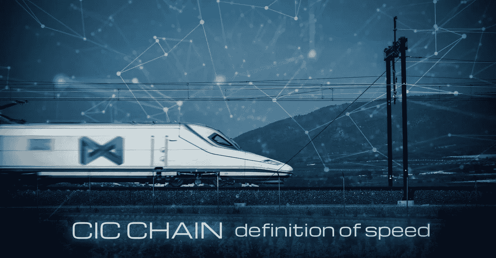
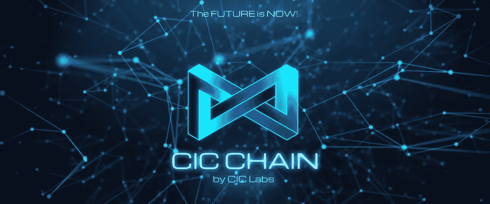

# 中投链与超越世界

> 原文：<https://medium.com/coinmonks/cic-chain-and-the-world-beyond-c0b657314b36?source=collection_archive---------5----------------------->

Pictured above is compliments of Adoswar

如果你读过我之前关于中投链背后的魔力的文章，那么你会意识到他们的区块链背后的技术创新。利用 Imprism 技术将不仅对公共部门，而且对私营部门产生巨大影响。加密货币最著名的是作为一种可用于交易和赚钱的资产，但它也可以在社会中发挥举足轻重的作用。让我们谈谈区块链技术可以简化的几个不同的真实生活用例，以及中投链如何应用。

I do not own the rights to this photo, full credit for it belongs to [https://www.souqalmal.com/financial-education/ae-en/transferring-or-receiving-funds-anticipate-these-bumps/](https://www.souqalmal.com/financial-education/ae-en/transferring-or-receiving-funds-anticipate-these-bumps/)

# 在世界各地转移资金

每个国家都有自己使用的货币。这也可以称为菲亚特。使用传统方法转移资金可能会很昂贵，也很费时间。企业使用电汇或汇款进行大额交易或国际交易。这些转账通常在一天之内完成，并且因为其速度和安全性而受到信任。这是一个很好的例子，说明目前如何利用现有的方法进行转让。想象一下，如果区块链技术被用来代替目前负责这些重要交易的金融机构。CIC Chain 不仅提供必要的企业级安全性和 ISO20022 合规性，还具有 0 秒的终结性和 5 秒的阻塞时间。这意味着交易是即时的，数据块在 5 秒钟内被添加到区块链。如果一个企业利用 CIC 链，他们的交易是安全的、可靠的、负担得起的，并且是即时完成的，可以立即结算。这在目前使用传统的电汇或 ACH 方法是不可能的。

在紧急情况下，亲人出国旅行，他们需要钱，目前的方法不允许他们立即收到钱。使用区块链技术，这个问题将成为过去。由于中投链是 ISO20022 兼容的，这意味着它可以直接与金融机构沟通。你的家人不需要等几天才能得到他们需要的经济援助。多亏了 Imprism 技术，他们可以立即得到它。CIC 链不仅仅是为私营部门服务的，它也是为公众服务的。

# 医疗保健和区块链技术

区块链是不可改变的，它永远不会被改变或更改。一些区块链缺乏提供企业级安全性所需的体系结构。这对于患者数据和医疗记录的安全性至关重要。如果它们需要被储存或转移到不同的地点或医疗机构，那么最重要的是它们受到最高等级的安全保护。

> “区块链可以**促进电子健康记录**在全国范围内的互操作性，这将允许提供商访问患者的病历、当前药物和先前的成像研究。根据一项研究，全面的互操作性每年可以为美国医疗系统节省 778 亿美元。"来源-[https://www . data art . com . ar/news/区块链-医疗保健-复杂-挑战-被炒作掩盖-需要克服/](https://www.dataart.com.ar/news/blockchain-in-healthcare-complex-challenges-overshadowed-by-the-hype-need-to-be-overcome/)

由于无法安全地共享和访问敏感的患者记录和数据，医疗行业深受其害。区块链提供了不同组织之间的成本效益和互操作性，甚至跨边界。医疗提供者将能够在一个安全可靠的环境中即时访问敏感的患者病历。符合 ISO20022 法规的企业级安全性并不是 CIC Chain 应用于医疗行业的唯一属性。由于采用了 Imprism 技术，它们提供了可扩展性，可以处理高吞吐量，留下的碳足迹非常少。这使得 CIC chain 成为医疗保健行业的完美搭档。简化各种类型的数据不仅可以提高护理质量，还可以让患者对自己的敏感信息有更多的控制权。医疗账单、实验室结果或者临床试验都将更有效地处理。

# 航运公司的数据物流

使用区块链将实现数据透明，因为一旦输入数据，区块链将提供不变性。在运输和接收行业中，有许多实体一起工作来获取不同类型的重要数据。他们都面临着类似的问题，如语言障碍，或地理障碍和最大的问题，时间。目前，该行业使用效率低下且过时的纸质方法。利用区块链技术的力量，所收集的数据可以在各种实体之间共享，而不用担心危及安全。精简数据将提高效率，减少日常工作的时间损失。CIC Chain 的速度、可伸缩性、安全性和 Imprism 技术将是航运公司简化必要任务的完美主机。

我们已经讨论了一些适用于日常生活的不同用例。区块链技术适用于无数其他行业和用例。安全性始终是大公司和企业的首要任务。区块链技术允许以透明和安全的方式进行直接交易，这种方式为以对等网络的效率运行的系统创建信任。区块链不仅可以容纳公共使用案例，还可以容纳私营行业。借助 Hyperledger BESU 架构，CIC Chain 对于公共和私有许可网络用例都是友好的。大企业和公司在所有者和用户之间都存在信任问题，这将在以前不存在信任的地方建立信任，并消除低效。这使得适当的安全措施和信任成为企业和组织利用区块链技术所必需的。下面列出了区块链技术可以应用的不同行业。

*   政府
*   零售
*   食物分配
*   贸易(各类货物的进出口)
*   公用事业公司
*   手机公司

可能性是无限的，唯一的限制是你自己创造的。CIC Chain 将站在区块链行业的最前沿，并在使用其 Imprism 技术方面处于领先地位。

Compliments of Adoswar

如果你想了解更多关于中投链的信息，请查看他们的官方媒体账号。

[中投链](https://medium.com/u/f3354b7470ef?source=post_page-----c0b657314b36--------------------------------)

以下是他们 Gitbook(白皮书)和网站的官方链接。

[中投连锁 Gitbook](https://cicchain.gitbook.io/untitled/)

[中投连锁网站](https://cicchain.net)

*任何书面材料都不构成财务建议，也不应被误解为财务建议。在购买或投资之前，请务必咨询财务顾问。本文中的信息仅供参考，不得误解。*

*   我不是核心团队的成员，这是我对他们区块链项目用例的解释。这里提到的都不应该理解为官方对他们区块链的解释。这完全是我的解释，我与你分享。
*   如果你喜欢这篇文章，请考虑关注我，并留下好的评论。谢谢你的时间。

> 交易新手？尝试[加密交易机器人](/coinmonks/crypto-trading-bot-c2ffce8acb2a)或[复制交易](/coinmonks/top-10-crypto-copy-trading-platforms-for-beginners-d0c37c7d698c)