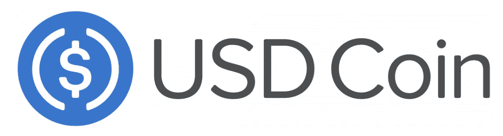
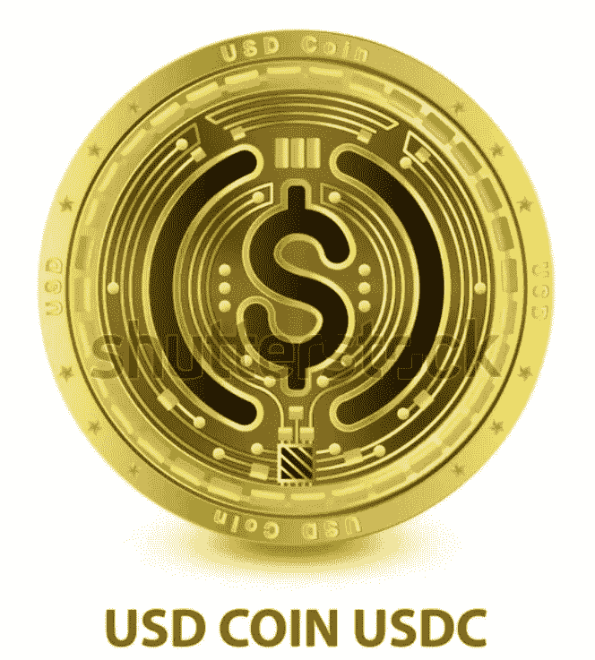

# Circle 继续在 USDC stablecoin 上取得进展。

> 原文：<https://medium.com/coinmonks/circle-continues-to-make-progress-on-its-usdc-stablecoin-3ec61b4a4f6a?source=collection_archive---------44----------------------->

USDC 于 2018 年与美国历史悠久的加密货币公司比特币基地和 Circle 合作，开始了区块链以太坊。比特币基地和 Circle 是声誉卓著的公司，在关注加密货币市场的人当中普遍享有很高的信任度。USDC 已被证明可以在加密货币市场中提供针对剧烈汇率波动的保护，自其成立以来，其受欢迎程度一直在稳步增长。

USDC 受欢迎程度的增长是由 2020 年开始的 Defi 服务的急剧增加以及由此导致的加密货币利率市场的增长，以及围绕另一种受欢迎的稳定货币 Tether 的美元储备的不确定性推动的。2021 年 3 月，支付服务巨头 Visa 宣布将接受 USDC 作为其在线支付的支付方式，这也反映了 USDC 的强大地位和可靠性。
USDC 目前是加密世界中第二大稳定硬币，该硬币目前运行的区块链平台如下:

*   以太坊
*   索拉纳
*   雪崩
*   多边形
*   创
*   阿尔格兰德
*   流动
*   海德拉
*   太棒了。

该公司的首席产品官 Nikhil Chandhok 在 9 月 28 日 Circle 的 Converge22 大会上向现场观众宣布了这一消息。此后不久，该团队也在 Twitter 上宣布了这一消息:
“我们刚刚在 ConvergeSF22 上分享的另一个令人兴奋的公告。我们打算让 USDC 在 Arbitrum、Cosmos、NEAR、乐观和 Polkadot 上可用。”
到 2022 年底，所有四个区块链都将可以交易，只有 Cosmo 计划在明年年初加入。

值得注意的是，它还出现在币安等其他平台上，后者是首批将 USDC 撤出其交易对手的平台之一，声称这样做是为了提高流动性和资本效率。此后不久，印度的 WazirX 也是如此。然而，Robinhood 最近也将 USDC 纳入了其产品，使其成为该公司加密货币平台上的第一种稳定货币。

## 跨链传输协议公布。

该公司还宣布即将发布稳定币的链间转移协议，这将改善其在区块链的移动。目前“支离破碎”的过程将被简化，开发者在创建钱包、应用和金融服务工具时将得到该协议的支持，以促进 USDC 在区块链之间的无缝转移。
Regina to(USDC 产品副总裁)也表示:
“跨区块链转移协议最终允许 USDC 作为跨生态系统的通用美元流动性层，提供最具资本效率的方式在加密生态系统中传输价值。”

## USDC 相对于其他城市的优势和劣势。

这个项目相对于其他 stablecoins 的主要优势是，作为一个 ERC-20 令牌，它在以太坊生态系统中的 DApps 或 DEX 上列出是很常见的。在这一点上，与这些应用程序的兼容性是有保证的，因此，如果有更多的受众能够使用它，它的认知度就会更高，它在市场上的流动性也会更好地得到保证。

ERC-20 令牌很容易与钱包集成，所以你可以在加密世界中的大多数钱包中找到对这些加密货币的支持。

从负面来看，这个项目仍然是一个集中的模式，信任落在一些个人身上，他们可能对硬币储备的管理并不完全透明。当我们谈论数十亿美元时，这是一个非常大的风险，因为传统金融界的任何行动都可能导致数十亿美元随时消失。在决定进入这个稳定的圈子之前，那些在这个项目上下赌注的人应该知道这个风险。

> 交易新手？试试[加密交易机器人](/coinmonks/crypto-trading-bot-c2ffce8acb2a)或者[复制交易](/coinmonks/top-10-crypto-copy-trading-platforms-for-beginners-d0c37c7d698c)