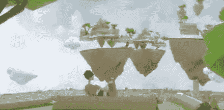

# 要求你的自由元宇宙土地

> 原文：<https://medium.com/coinmonks/claim-your-free-metaverse-land-5ff6065451d6?source=collection_archive---------6----------------------->

声称 10 月 24 日之前免费。

verline 正在推出一个去中心化的无线网络，并将所有权分配给那些在等候名单上注册的人。

[**ū地** :](https://overline.network?a=OAimTXJaTEkA) 第一个无线元宇宙由现实世界中无线地权对应的 NFT 地产组建。

Fox Business “ Mornings with Maria” interview on Overline as a backup for Bitcoin.

Claim ōLand free until October 24th.

## 如何认领你的自由土地？

Overline 向那些报名加入等候名单的人免费赠送 NFT 土地。注册 airdrop，并确认您的电子邮件地址，以接收一个 NFT。每推荐一个人，你还会得到一个 NFT。

## 逐步说明:

1.  查看[跨线空投页面](https://overline.network?a=OAimTXJaTEkA)
2.  提交您的信息并注册。
3.  检查你的电子邮件。
4.  你将得到一片免费的 NFT 土地。
5.  每推荐一个人，你还会得到一个 NFT。

[oLand](https://overline.network?a=OAimTXJaTEkA) 是一个 NFT，在 Overline 的无线元宇宙中代表现实世界的土地和数字房地产。在 Overline 的无线网络中，土地代表一种所有权。土地所有者通过在他们 1.67 英亩的土地上运行的路由器设备获得无线活动的加密奖励。

## 你会在你的房产上发现什么？

1.  和平
2.  沉思
3.  赚$$$
4.  心理健康
5.  新业务。
6.  众神的游乐场
7.  被动创收。
8.  天才永不消逝
9.  朋友和朋友。

## Overline 打算用它的路由器做什么？Starlink 不是已经在做这个了吗？

[Overline](https://overline.network?a=OAimTXJaTEkA) 不仅仅是一个连接的网络，就像比特币不仅仅是一个数字货币网络一样。Overline 的连通性是其与众不同之处，就像比特币的网络去中心化特征是其数字货币与众不同之处一样。那些有幸生活在以下国家的人可能会忽略这一点:a)政府允许 Starlink 运营；b)蜂窝计划容易获得，普通人负担得起；c)蜂窝公司不仅仅是国有实体/代理，它们监控你的几乎所有行为，并审查超出国家认为适当范围的任何事情。然而，世界上的大多数人并没有这么幸运。因此，获得免费的基本连接，不需要蜂窝计划(因此没有个人身份信息)，不能被 ISP/电信公司随意审查，不需要经营许可证，甚至可以为你开采加密货币，是一个非常有用的替代/选择。

## 奥兰 NFT 的费用是多少？

由于变量众多，土地价格是不可能预测的。有些地块可能非常有价值，而有些则可能没有价值。

## 奥兰 NFT 将在哪里上市？

NFT 可在任何跨线支持的链条上铸造和转让。因为费用低，跨线网络可能是最好的选择。

了解更多关于奥兰的信息:

 [## 奥兰元宇宙:跨线网络

### 自由索赔，赚取加密和贸易

medium.com](/coinmonks/oland-metaverse-overline-network-4070d65151a5) 

> 交易新手？试试[加密交易机器人](/coinmonks/crypto-trading-bot-c2ffce8acb2a)或者[复制交易](/coinmonks/top-10-crypto-copy-trading-platforms-for-beginners-d0c37c7d698c)