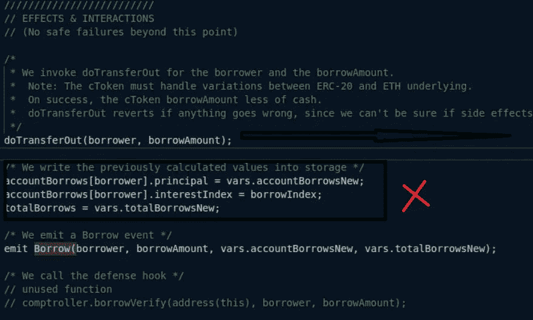
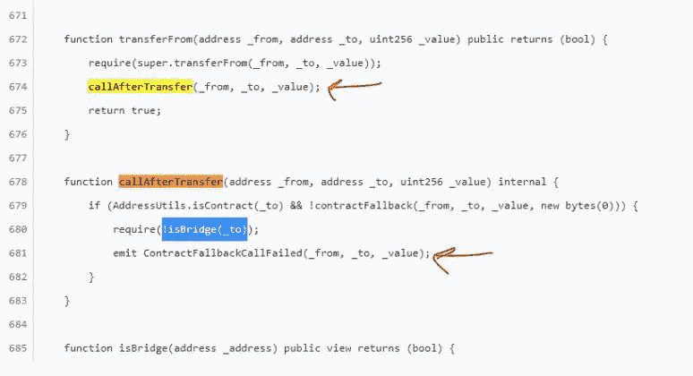

# 再入攻击的经典开局——龙舌兰刀与百财劫

> 原文：<https://medium.com/coinmonks/classic-opening-for-a-reentrancy-attack-agave-dao-and-hundred-finance-heist-4334f495aee9?source=collection_archive---------14----------------------->

## 当 DeFi 变得越来越复杂时，可能会发现涉及来自不同方的合同的可重入性漏洞，每个合同都受到单独保护，但都是系统性的薄弱环节。

在灵知(xDai)网上，龙舌兰道和百财分别是 Aave 和 Compound 的分叉。龙舌兰道和百财都在 2022 年 3 月 15 日被黑，几分钟之内。

Gnosis 上的官方桥接令牌被认为是非标准的，因为在每次传输中调用令牌接收者的钩子使得黑客攻击成为可能，并允许对两个协议进行可重入攻击。

Gnosis 链使用的官方桥生成具有 onTokenTransfer()钩子的令牌。在一个令牌被发送到一个地址后，钩子被调用。现在，当一个令牌被传输到一个地址(契约)时，它会检查契约的 onTokenTransfer()回退是否存在。

如果检测到回退，令牌将调用 contracts onTokenTransfer()函数。因此，被调用的契约获得了对交易的控制权，可以随心所欲。风险开始了！因为控制权已经到了被调用的契约。

这个钩子被设计成由桥契约来工作，以阻止用户无意中向桥发送令牌。

## 百财

*   攻击者由于闪贷而聚集了 209 万 USDC 和 337 万 WXDAI。
*   攻击者合同在链接的合同 2 上工作，并将 120 万 USDC 的闪贷转移到攻击合同 2。
*   合同二在百金融合同中承诺 120 万 USDC。
*   合同二从百财合同借 106 万 USDC，5999 万 hUSDC，16 WBTC，24 WETH。
*   攻击者动用了合同 2 获得的一部分贷款资金；106 万 USDC 被转移到合同 1，6 个 WBTC 和 24 个 wet 被发送到攻击者的钱包地址。
*   这时，共有 196 万 USDC 在契约 1 上受到攻击。

他们借了第一笔资产，在系统记录他们的债务之前，他们又借了第二笔资产。

合同 5 通过合同 5 在百财合同中质押 135 万 USDC 后，从百财合同中借款 120 万 USDC 和 6793 万 hUSDC。

最终，攻击者偿还贷款费用和闪贷。

最后，把刚刚赚到的 362 万 USDC 转到攻击者的钱包里。

袭击者成功获利。

当转移完成时，攻击者的贷款没有记录在全局变量中。

*攻击者利用*[*PermittableToken*](https://dashboard.tenderly.co/tx/xdai/0x534b84f657883ddc1b66a314e8b392feb35024afdec61dfe8e7c510cfac1a098/contracts)*契约的 callAfterTransfer 方法，在本例中由****doTransferOut****调用，回调并激活后续借款的借款方法，即重新进入借款方法并继续借款。*

因为攻击者的贷款的全局变量在贷款转移期间没有更新，所以攻击者可以利用转移方法中的回调来继续贷款给项目的其他贷款池。

## 龙舌兰

龙舌兰是贷款协议 aave 的一个令人敬畏的叉子。它严格遵守 aave 准则。aave 及其代码都是安全的。里面没有已知的 bug。

但是，龙舌兰被无意中以不安全的方式使用。

攻击者用三个可调用的函数建立了这个契约。在区块 21120283 和 21120284 中，他们通过合同直接与龙舌兰通信。

 [## 合同 0xf 98169301 b 06 e 906 af 7 f9b 719204 aa 10 D1 f 160d 6-诊断链浏览器

### 在(Gnosis)上查看 0xf 98169301 b 06 e 906 af 7 f9b 719204 aa 10 D1 f 160d 6 的帐户余额、交易和其他数据

blockscout.com](https://blockscout.com/xdai/mainnet/address/0xF98169301B06e906AF7f9b719204AA10D1F160d6/transactions#address-tabs) 

他们在块 21120284 中将多个交易组合在一起。首先从 sushiswap 获得 wet 的快速贷款，然后购买更多 wet 并存入银行。

如上所述，GC 上的 weth 合同不同于普通的 weth 合同。

为桥上带来的每个新令牌创建一个新令牌契约。

攻击者在存入 Weth 后，可以借尽可能多的 Weth。

*攻击者使用 Agave 的清算功能，该功能通过 callAfterTransfer 功能发起对其合同的回调。*

因为 callAfterTransfer 函数在计算攻击者的债务之前运行(这将阻止将来的借款)，所以攻击者能够多次调用 borrow。

如上所述，全局变量没有更新。

攻击者带走了这些资产:2728.9 WETH 243423 USDC 24563 LINK 16.76 WBTC 8400 GNO 347787 WXDAI

## 结束语

在黑客从著名的 Defi 协议德乌斯金融公司窃取了 300 万美元的加密货币后不到一天，龙舌兰和百金融公司的漏洞被披露。

德乌斯金融渗透者利用可重入问题，以同样的抵押品持续借款。

在这三次攻击之后，消除已知的漏洞是测试部门和开发人员关心的问题。

场景结束后， **Harbor** 强调团队在使用非 ERC-20 令牌合同时应该谨慎，并确保它们是兼容的。

为防止将来出现此类问题，验证是否应在令牌转移之前记录合同金额以及是否必须遵守支票生效-互动规则也至关重要。

> 交易新手？试试[密码交易机器人](/coinmonks/crypto-trading-bot-c2ffce8acb2a)或者[复制交易](/coinmonks/top-10-crypto-copy-trading-platforms-for-beginners-d0c37c7d698c)