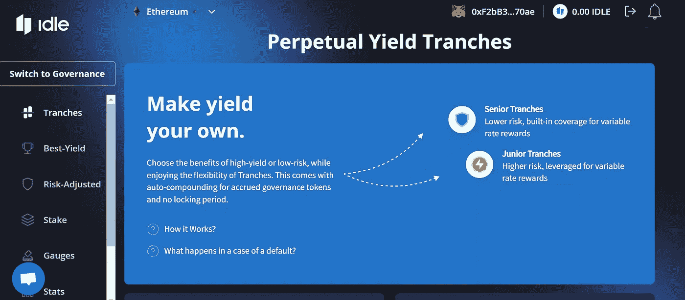
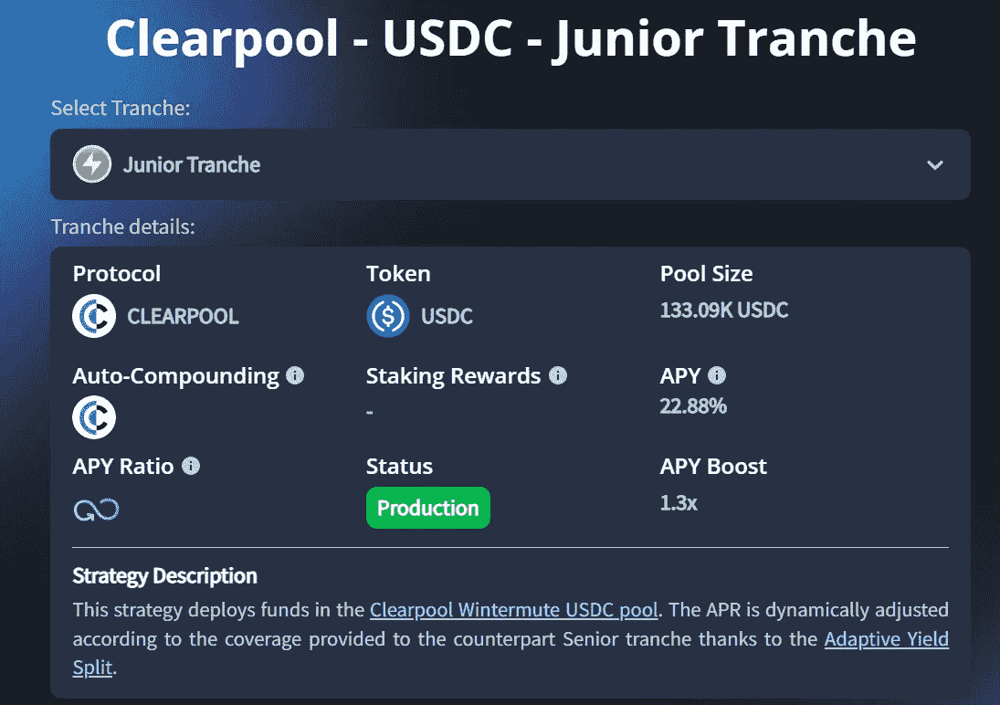
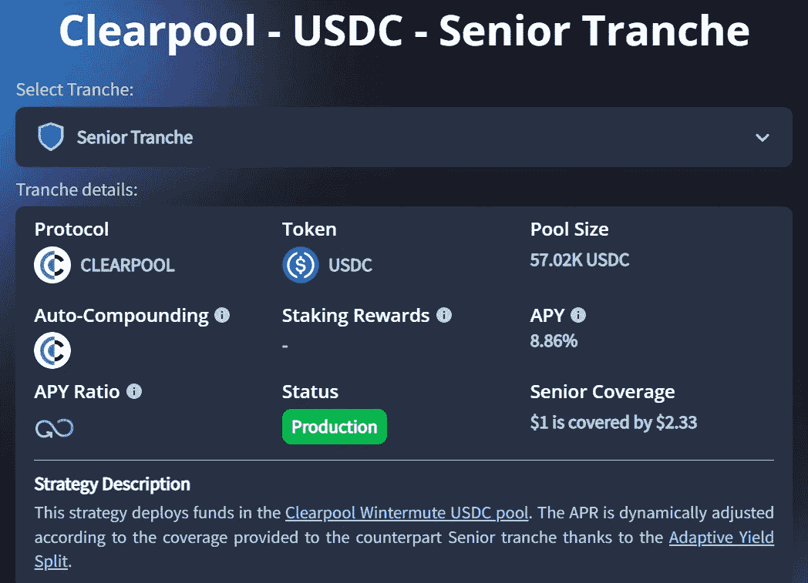

# 带有空闲 DAO 的 Clearpool PYTs

> 原文：<https://medium.com/coinmonks/clearpool-pyts-with-idle-dao-c579f3aea545?source=collection_archive---------44----------------------->

通用汽车的朋友们，2022 年 7 月 21 日，Idle 宣布基于 Clearpool 的 Wintermute 借款池[推出 PYTs](/idle-finance/the-rise-of-risk-hedging-uncollateralized-loans-clearpool-pyts-36d92b343c47) 。那么，这一切对贷方意味着什么呢？

开始之前，让我们先了解一些术语。Idle 是一个基于以太坊的产出聚合和再平衡协议。该协议成立于 2020 年，从 LongHash Ventures、Quantstamp、BlockRock Capital 等知名投资者那里筹集了 120 万美元。他们最著名的策略是永久收益份额(PYTs)，这是一种差异化的流动性挖掘策略，根据不同的风险偏好提供优化的收益。为了简化这个概念，我们可以把它们想象成传统金融中的优先债务和次级债务。次级债务通常风险更高，因为它们构成了第一笔损失资本，然而，这也意味着它们获得了高%的回报。优先债务往往更安全可靠，因为它们通过首先牺牲次级债务来缓冲损失。

Idle DAO 与 Clearpool 合作，在其未抵押的单一借款人池 Wintermute 借款人池:cpWIN-USDC 的基础上建立 pyt。以前，在 Clearpool 的平台上，贷款人只能获得单一收益率，同时还要承受相同的风险。现在，通过 Idle 访问 Clearpool 上的借款人池为规避风险的投资者提供了降低风险和优化收益率的新可能性。

作为借款人，资本成本会根据使用率而波动。随着最近在 Clearpool 上实施[新利率曲线](/clearpool-finance/new-interest-curve-mechanism-9a1a5191977f)机制，它将鼓励借款人的最佳利用，解决利用率低和过度杠杆化等问题。

IDLE 的合作伙伴关系将为借款池提供更多流动性，有利于借款人，并在动荡的市场环境下为保守的贷款人提供一层安全保障。

如何开始:

1.  前往 https://idle.finance/
2.  启动应用程序。
3.  连接钱包

Source: Idle Finance

4.选择份额

5.根据您的风险偏好，您可以选择通过高级部分(风险较低)或初级部分(风险较高)进入。

6.点击 Clearpool 的借款池，然后点击“存款”。

Source: Idle Finance’s Junior Tranche

Idle Finance Senior Tranche

回报是复合的，退出是即时的。

简而言之，Idle 的创新战略模仿了 TradFi 中的当前战略，这是迈向下一波零售采用的一步，风险管理是重中之重。

> 交易新手？尝试[加密交易机器人](/coinmonks/crypto-trading-bot-c2ffce8acb2a)或[复制交易](/coinmonks/top-10-crypto-copy-trading-platforms-for-beginners-d0c37c7d698c)